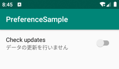

{: .center }

Preferences フレームワーク
----

Android が提供する Preferences フレームワークを使用すると、`SharedPreferences` による設定リソースをベースにした設定画面を簡単に作成することができます。
設定画面の表示は Android が用意している **`PreferenceFragmentCompat`** クラスにより行われるため、ユーザーが使い慣れた UI で設定画面を表示することができます。
設定画面に表示する項目は、**`PreferenceScreen`** 要素をルートにした XML ファイルを作成することで定義できます（コード内で動的に `PreferenceScreen` オブジェクトを構築することもできます）。

- [PreferenceFragmentCompat](https://developer.android.com/reference/androidx/preference/PreferenceFragmentCompat.html) クラス
    - 設定画面を表示するためのベースとなる Fragment クラスです。
- `PreferenceScreen` レイアウトファイル
    - `PreferenceActivity` で表示する設定項目の階層構造を定義した XML ファイルです。ユーザーが選択できる項目のリストを管理したり、`SharedPreferences` のキーを関連付けたりすることができます。

コラム: API level 28 以前は、設定画面用のクラスとして `PreferenceActivity` が使われていましたが、今は `PreferenceFragmentCompat` クラスを使用します。


ライブラリの依存関係の追加
----

`PreferenceFragmentCompat` クラスを使用するには、`androidx.preference:preference` ライブラリへの依存を追加しておく必要があります。

#### app/build.gradle

```groovy
dependencies {
    implementation 'androidx.preference:preference:1.0.0'
}
```

コラム: Preferences 系のクラスは、以前は support ライブラリとして提供されており、名前空間は `android.preference` でした。現在は `androidx.preference` という名前空間で提供されている AndroidX ライブラリの方を使用する必要があります。


設定項目を定義する
----

Android アプリのレイアウトファイルは通常 `res/layout` ディレクトリに配置しますが、Preferences フレームワークを使って設定画面を表示する場合は、**`res/xml`** ディレクトリに XML ファイルを配置します。

ファイル名は任意ですが、ここでは `preferences.xml` とします（プログラム内からは `R.xml.preferences` と参照することになります）。
この XML ファイルのルート要素は `<PreferenceScreen>` にする必要があります。

下記は、2 つのスイッチ項目と、2 つのチェックボックス項目を持つ PreferenceScreen レイアウトの例です。
それぞれを `PreferenceCategory` でグルーピングして表示しています。

#### res/xml/preferences.xml

```xml
<androidx.preference.PreferenceScreen
    xmlns:android="http://schemas.android.com/apk/res/android">

  <PreferenceCategory android:title="スイッチによる設定">
    <SwitchPreferenceCompat
      android:key="switch1"
      android:title="スイッチ1"
      android:summary="1つ目のスイッチだよ"
      android:defaultValue="true" />
    <SwitchPreferenceCompat
      android:key="switch2"
      android:title="スイッチ2"
      android:summary="2つ目のスイッチだよ"
      android:defaultValue="false" />
  </PreferenceCategory>

  <PreferenceCategory android:title="チェックボックスによる設定">
    <CheckBoxPreference
      android:key="checkbox1"
      android:title="チェックボックス1"
      android:summary="1つ目のチェックボックスだよ"
      android:defaultValue="true" />
    <CheckBoxPreference
      android:key="checkbox2"
      android:title="チェックボックス2"
      android:summary="2つ目のチェックボックスだよ"
      android:defaultValue="false" />
  </PreferenceCategory>

</androidx.preference.PreferenceScreen>
```

`PreferenceScreen` 要素以下には、様々な種類の `Preference` 要素を配置することができます。
下記は代表的な `Preference` 要素の例で、すべて `Preference` クラスのサブクラスとして定義されています。

| Preference 要素 | 表示内容 |
| ---- | ---- |
| [SwitchPreferenceCompat](https://developer.android.com/reference/androidx/preference/SwitchPreferenceCompat.html) | ON/OFF の設定（スイッチ） |
| [CheckBoxPreference](https://developer.android.com/reference/androidx/preference/CheckBoxPreference) | ON/OFF の設定（チェックボックス） |
| [ListPreference](https://developer.android.com/reference/androidx/preference/ListPreference) | リストで選択項目を表示 |
| [DropDownPreference](https://developer.android.com/reference/androidx/preference/DropDownPreference) | ドロップダウンで選択項目を表示（ListPreference の拡張） |
| [EditTextPreference](https://developer.android.com/reference/androidx/preference/EditTextPreference) | テキスト入力のダイアログを表示 |
| [PreferenceCategory](https://developer.android.com/reference/androidx/preference/PreferenceCategory.html) | 設定項目をグルーピングして title を表示 |


### 設定項目の key 属性

各 `Preference` 要素には `key` 属性を設定することができ、自動的に **アプリケーションのデフォルトの `SharedPreferences` ファイル** にそのキー名で設定値が保存されるようになります。
設定ファイルのパスは下記のようになります。

```
/data/data/<package名>/shared_prefs/<pacakge名>_preferences.xml
```

上記のサンプルコードを用いた場合、出力は下記のようになります。

#### com.example.myapp_preferences.xml

```xml
<?xml version='1.0' encoding='utf-8' standalone='yes' ?>
<map>
    <boolean name="switch1" value="true" />
    <boolean name="switch2" value="false" />
    <boolean name="checkbox1" value="true" />
    <boolean name="checkbox2" value="false" />
</map>
```

各 `Preference` 要素の `key` 属性の値は、このように、デフォルトの `SharedPreferences` 設定ファイルの `name` 属性にマッピングされるため、その中で一意になるように管理しておく必要があります。
名前にはドットなどの記号を含めることができるので、必要に応じて `display.color.main` のように階層化した名前で管理するとよいでしょう。

ファイルに保存された設定値は、次に設定画面を開くときに自動的に読み込まれます。
アプリケーション内で設定情報を参照したい場合は、下記のような感じでデフォルトの `SharedPreferences` インスタンスを取得します（詳しくは [こちらの記事](./shared-preference.html) を参照）。

```kotlin
// SharedPreference インスタンスを取得
val prefs = PreferenceManager.getDefaultSharedPreferences(context)

// あとは各設定値を参照するだけ
val userName = prefs.getString("userName", "名無しさん")
val userAge = prefs.getInt("userAge", -1)
```

### 設定画面の階層化

XML ファイルのルート要素として配置する `<PreferenceScreen>` は、一画面分の設定項目をまとめる単位です。
以前はこの要素を入れ子構造にすることで、2 階層以上の設定画面を構成する方法がサポートされていましたが、今はこのやり方はサポートされていません。
代わりに、`<Preference>` 要素にフラグメント名を対応付け、その要素がタップされたときに新しくそのフラグメントを起動するように実装する必要があります。詳しくは下記のドキュメントを参照してください。

- [Organize your settings ｜ Android Developers](https://developer.android.com/guide/topics/ui/settings/organize-your-settings)


設定画面を表示する
----

**`PreferenceFragmentCompat`** クラスは、設定項目を表示するためのベース `Fragment` クラスとして使用できます。
このクラスを継承する形で独自の `Fragment` クラスを実装し、上記で作成した XML ファイルを **`setPreferencesFromResource()`** メソッドで読み込みます。
つまり、このメソッドで **読み込む XML ファイルを切り替えるだけで、複数の設定画面を切り替えて表示することができます**。

#### MyPreferenceFragment.kt

```kotlin
package com.example.myapp

import android.os.Bundle
import androidx.preference.PreferenceFragmentCompat
import com.example.myapp.R

class MyPreferenceFragment : PreferenceFragmentCompat() {
    override fun onCreatePreferences(savedInstanceState: Bundle?, rootKey: String?) {
        // res/xml/preferences.xml ファイルに従って設定画面を構成
        setPreferencesFromResource(R.xml.preferences, rootKey)
    }
}
```

この `Fragment` を表示するための `Activity` も作った方がよさそうですが、ここでは `MainActivity` の上に表示してしまうことにしましょう。

#### layout/activity_main.xml

```xml
<?xml version="1.0" encoding="utf-8"?>
<androidx.constraintlayout.widget.ConstraintLayout
    xmlns:android="http://schemas.android.com/apk/res/android"
    xmlns:tools="http://schemas.android.com/tools"
    android:layout_width="match_parent"
    android:layout_height="match_parent"
    tools:context=".MainActivity">
    <FrameLayout
        android:id="@+id/settings_container"
        android:layout_width="match_parent"
        android:layout_height="match_parent" />
</androidx.constraintlayout.widget.ConstraintLayout>
```

#### MainActivity.kt

```kotlin
package com.example.myapp

import androidx.appcompat.app.AppCompatActivity
import android.os.Bundle

class MainActivity : AppCompatActivity() {
    override fun onCreate(savedInstanceState: Bundle?) {
        super.onCreate(savedInstanceState)
        setContentView(R.layout.activity_main)

        // 設定用の Fragment を表示
        supportFragmentManager
            .beginTransaction()
            .replace(R.id.settings_container, MyPreferenceFragment())
            .commit()
    }
}
```


SharedPreferences のデフォルト値
----

Preference XML ファイルの `defaultValue` 属性で設定したデフォルト値は、設定画面を開いたときに初めて使用されます。
でもこれでは、先に `SharedPreferences` オブジェクトの getter 系メソッドを呼び出したときにデフォルト値として取得できません。

### setDefaultValues を使う方法

**`PreferenceManager.setDefaultValues`** 関数を呼び出すと、Preference XML の `defaultValue` 属性の値を読み込んで、`SharedPreferences` オブジェクトの初期値として先回りして設定しておくことができます。
このメソッドは、アプリの `MainActivity` となるクラスで呼び出すべきとされているので、下記のように `Application` クラスや `MainActivity` の `onCreate` で呼んでおけばよいでしょう（I/O アクセスが若干気になりますが）。

```kotlin
class App : Application() {
    lateinit var prefs: SharedPreferences

    override fun onCreate() {
        super.onCreate()

        // Start loading preferences as early as possible to avoid ANR when
        // referring the configuration for the first time.
        PreferenceManager.setDefaultValues(this, R.xml.preferences, false)
        prefs = PreferenceManager.getDefaultSharedPreferences(this)
    }
}
```

このやり方のイケてないところは、`setDefaultValues` 自体の処理が重く、それにもかかわらずメインスレッドから実行することを前提とした実装になっているところです。
コルーチンの中から呼び出していると、`android.view.InflateException` 例外で落ちたりします（少なくとも Android 10 時点では NG）。
なので、デフォルト値を扱うときは下記の方法をオススメします。

### リソースにデフォルト値をまとめる方法（オススメ）

SharedPreferences のデフォルト値を扱うときのオススメの方法は、リソースファイルでデフォルト値を定義し、その値を Preference XML ファイルと、`SharedPreferences#getString()` の両方のデフォルト値として参照する方法です。

例えば、下記のような感じで、リソースファイルに設定画面用の表示ラベルと一緒にデフォルト値を定義しておきます。

#### res/values/settings.xml

```xml
<?xml version="1.0" encoding="utf-8"?>
<resources>
    <string name="settings_fps_key">settings.fps</string>
    <string name="settings_fps_title">FPS</string>
    <string name="settings_fps_summary_on">Show</string>
    <string name="settings_fps_summary_off">Hide</string>
    <bool name="settings_fps_default">false</bool>
</resource>
```

設定画面を構成するための Preference XML ファイルからは、下記のように参照します。

#### res/xml/preferences.xml

```xml
<?xml version="1.0" encoding="utf-8"?>
<androidx.preference.PreferenceScreen
    xmlns:app="http://schemas.android.com/apk/res-auto"
    app:title="MyApp Settings">

    <SwitchPreference
        app:key="@string/settings_fps_key"
        app:title="@string/settings_fps_title"
        app:summaryOn="@string/settings_fps_summary_on"
        app:summaryOff="@string/settings_fps_summary_off"
        app:defaultValue="@bool/settings_fps_default" />
</androidx.preference.PreferenceScreen>
```

プログラムの中からは、下記のようにデフォルト値を参照します。

```kotlin
val prefs = PreferenceManager.getDefaultSharedPreferences(context)
val isFpsOn = prefs.getBoolean(
    context.resources.getString(R.string.settings_fps_key),
    context.resources.getBoolean(R.bool.settings_fps_default))
```

これで、重い `SharedPreferences.setDefaultValues()` を使わずに、初回起動時のデフォルト設定値をうまく扱うことができます。

ちなみに、`res/values` ディレクトリ以下に配置するリソースファイルの名前は何でもよいって知ってました？
ここでは `strings.xml` ではなく、`settings.xml` という名前で作成してみました。
このルールを知っていれば、特定の機能で使うリソースを複数ファイルにバラバラに定義しなくて済みます。


いろいろな Preference 要素
----

### リストから選択 (ListPreference)


`Preference` 要素として **`ListPreference`** を使用すると、いくつかの項目の中からユーザに選択させることができます。

#### res/xml/preferences.xml

```xml
<androidx.preference.PreferenceScreen
    xmlns:android="http://schemas.android.com/apk/res/android">
    <ListPreference
        android:key="fruit"
        android:title="Favorite fruit"
        android:entries="@array/fruit_labels"
        android:entryValues="@array/fruit_values"
        android:dialogTitle="Favorite fruit"
        android:defaultValue="apple" />
</androidx.preference.PreferenceScreen>
```

選択項目ごとのラベルや値は下記のように配列リソースとして定義しておきます。

#### res/values/arrays.xml

```xml
<?xml version="1.0" encoding="utf-8"?>
<resources>
    <string-array name="fruit_labels">
        <item>りんご</item>
        <item>バナナ</item>
        <item>オレンジ</item>
    </string-array>
    <string-array name="fruit_values">
        <item>apple</item>
        <item>banana</item>
        <item>orange</item>
    </string-array>
</resources>
```

ちなみに、数値の配列だとしても、タグは `string-array` を使用する必要があるみたいです（`integer-array` などにすると `ListPreference` が `NullPointerException` で落ちます）。


### 他の Activity を起動する

`Preference` 要素内に `intent` 要素を入れておくと、その設定項目を選択したときにインテントを発行して任意の `Activity` を起動することができます。
下記は、Android のディスプレイ設定画面を起動する例です。

#### res/xml/preferences.xml

```xml
<androidx.preference.PreferenceScreen
    xmlns:android="http://schemas.android.com/apk/res/android">

    <Preference android:title="ディスプレイ設定を起動">
        <intent android:action="android.settings.DISPLAY_SETTINGS" />
    </Preference>
</androidx.preference.PreferenceScreen>
```

### ON 状態と OFF 状態で summary テキストの表示を切り替える




`SwitchPreferenceCompat` 要素の `summary` 属性の代わりに、**`summaryOn`** 属性と **`summaryOff`** 属性を使用すると、設定の ON/OFF に応じて表示テキストを切り替えることができます。

```xml
<androidx.preference.PreferenceScreen
    xmlns:android="http://schemas.android.com/apk/res/android">

    <SwitchPreferenceCompat
        android:key="check_updates"
        android:title="Check updates"
        android:summaryOn="起動時に最新データに更新します"
        android:summaryOff="データの更新を行いません"
        />
</androidx.preference.PreferenceScreen>
```

### EditTextPreference や ListPreference の summary 領域に入力したテキストを自動で表示する


`EditTextPreference` や `ListPreference` の `useSimpleSummaryProvider` 属性を `true` に設定しておくと、ユーザーの入力したテキスト（あるいは選択した値）が自動的に summary 領域に表示されるようになります。

#### res/xml/preferences.xml

```xml
<androidx.preference.PreferenceScreen
    xmlns:android="http://schemas.android.com/apk/res/android"
    xmlns:app="http://schemas.android.com/apk/res-auto">
    <EditTextPreference
        android:key="username"
        android:title="User name"
        android:dialogTitle="User name"
        android:defaultValue="名無しさん"
        app:useSimpleSummaryProvider="true" />
</androidx.preference.PreferenceScreen>
```

ネームスペースは、`xmlns:android="http://schemas.android.com/apk/res/android` ではなく、`xmlns:app="http://schemas.android.com/apk/res-auto` の方を使わないと、「そんな属性はない」と怒られてしまうので注意してください。

この機能は、[anrdoidx.preferences の version 1.1.0-alpha01](https://developer.android.com/jetpack/androidx/releases/preference#1.1.0-alpha01) 以降からサポートされているため、`build.gradle` でそれ以上のバージョンを指定しておく必要があります。

#### app/build.gradle

```xml
dependencies {
    implementation 'androidx.preference:preference:1.1.0-rc01'
}
```

- 参考: [Dynamically update summaries ｜ Android Developers](https://developer.android.com/guide/topics/ui/settings/customize-your-settings#dynamically_update_summaries)


読んでおくべきドキュメント
----

[Android Settings Design Guidelines](https://source.android.com/devices/tech/settings/settings-guidelines)

コーディング方法というより、一般的な設定 UI はこうあるべき、という下記のようなガイドラインが示されています。
こういった知識は Android 以外のアプリ開発にも活用できるので読んでおいて損はないです。

- よく使う項目から並べる
- 1ページに表示する項目は多くても10～15項目
- 多くの設定項目をリスト表示するときはグルーピング機能、区切り線を使う
- 設定画面はコンテキストに応じて複数用意することを考慮する（設定**項目**は複数の設定画面から共有して表示してよい）
- タイトル名の付け方（"General Settings" などは避ける）
- 設定項目に親子関係がある場合、マスター設定項目を用意して、子項目をまとめて Enable/Disable できるようにする
- ラジオボタンは個別の設定画面で表示する（他の設定項目と一緒にリストに並べない）
- ユーザ入力を受け付けるボタンやリンクなどは、アプリのテーマに沿った色で表示する
- ボタンを表示するときは、Positive なアクションはテーマカラーで、Negative なアクション（アンインストールとか）はグレーで表示する
- Advanced な設定はデフォルトでは閉じた状態で表示する
- チェックボックスよりもスイッチを使う。でも項目が多い場合や、Negative な項目（通知ブロック）などはチェックボックスの方がわかりやすいことがある。

