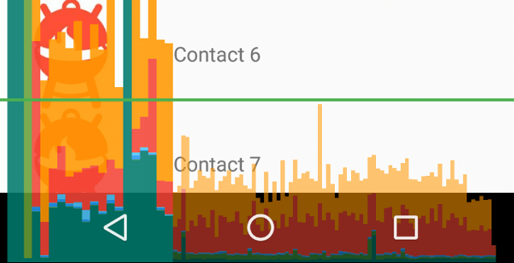

Janky frames 情報を取得する
----

Android デバイス上で実行可能なコマンド __`dumpsys gfxinfo`__ を使用すると、指定したアプリにおける Janky frames（ジャンクフレーム？）の発生率を調べることができます。
Janky frame の説明は「dropped frame」と書かれていたりしますが、60FPS 出ていないフレーム（16.6ミリ秒以上かかったフレーム）だと考えればよいと思います。
アプリの UI が、どの程度ぬるぬるさくさくなアニメーション (60FPS) を達成できているかを定量的に調べたいときに使えるかもしれません。

```
$ adb shell dumpsys gfxinfo com.example.myapp | grep frames
Total frames rendered: 544
Janky frames: 242 (44.56%)
```

本来 `dumpsys gfxinfo` の出力はもっと長いのですが、上記では `frames` という単語で grep してフィルタしちゃってます（Windows なら `findstr` を使えば OK）。
Janky frames の発生率を確認したいのであれば、これが手っ取り早いです。
`dumpsys gfxinfo` の詳細は下記ドキュメントが参考になります。

- 参考: [UI パフォーマンスをテストする｜Android デベロッパー](https://developer.android.com/training/testing/performance?hl=ja)


フレームの計測単位
----

`Total frames rendered` は、アプリを起動してからの総フレーム数です。
60FPS 出ているのであれば、1秒間に 60 ずつ増えていきそうですが、実際には 1 秒間に 2 ずつ増えていきます。
これは、開発者オプションの [Profile HWUI rendering](https://developer.android.com/topic/performance/rendering/inspect-gpu-rendering?hl=ja) を有効にしたときに、画面上にバーが増えていく速度と同じです（このバーも 1 秒で 2 本ずつ増えます）。

{: .center }

Janky frames としてカウントされているのは、このバーが緑色のライン（16.6ミリ秒）を超えているもののようです（太くて濃いバーになっているもの）。
上の図の場合は、最初の30％くらいが緑色のラインを超えているので、Janky frames は約30％ということです。


フレームの統計情報をリセットする
----

何らかのアニメーションのパフォーマンスを計測したい場合は、アプリ起動時からのフレーム統計ではなく、そのタイミングだけでの統計情報が欲しいと思います。
そのような場合は、まずは次のように Android が収集しているフレーム統計情報をリセットします。

```
adb shell dumpsys gfxinfo <PACKAGE_NAME> reset
```

リセットしたいだけでも統計情報がだらだらと表示されてしまうので、Linux なら `> /dev/null`、Windows なら `> nul` にリダイレクトして出力を消した方がいいかもしれません。

その後、何らかのユーザー操作を発生して、再度 `dumpsys gfxinfo` で統計情報を確認すれば OK です。
ちなみに、開発者オプションの Profile HWUI rendering で画面上に GPU バーを表示している場合、上記のリセットコマンドを実行すると、このバー表示もクリアされます（内部で同じ gfxinfo 情報を参照していることが分かります）。


（応用）ユーザー操作 → パフォーマンス計測を自動化
----

次のバッチファイルは、次のような操作を自動化しています。

1. com.example.myapp アプリのフレーム統計情報をリセット
2. 1 秒待つ
3. 下キーを 30 回押す（リスト UI などをスクロールさせることを想定）
4. 1 秒待つ
5. フレーム統計情報 (Janky frames) を出力

#### janktest.cmd

```
@echo off

adb shell dumpsys gfxinfo com.example.myapp reset > nul
timeout /t 1 /nobreak > nul

FOR /L %%A IN (1, 1, 30) DO (
  adb shell input keyevent DPAD_DOWN
)

timeout /t 1 /nobreak > nul
adb shell dumpsys gfxinfo com.example.myapp | findstr frames
```

#### 実行例

```
C:\> janktest.cmd
（自動操作が終わるまでしばらく待つ）
Total frames rendered: 400
Janky frames: 200 (50.00%)
```

うーむ、60FPS 安定までの道のりは長いです。。。

- 参考: [ADB からキー入力やテキスト入力を行う (input text, input keyevent)](../adb/input-keyevent.html)

