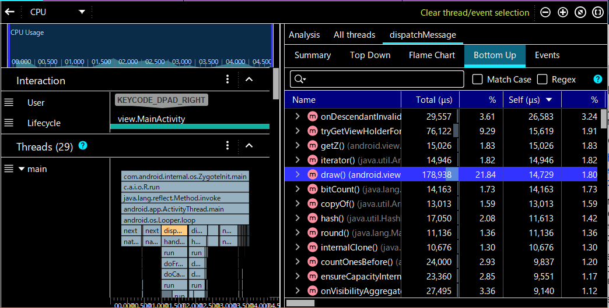

はじめに
----

パフォーマンスの最適化を行うには、__フレームワーク特有の知識と、プロファイラによる計測__ の両面から攻めていく必要があります。
アプリケーションを 60FPS の描画性能で動作させるには、1フレームあたりわずか 16.6 ミリ秒で処理を終えなければいけません。
複雑な計算処理や描画を行うアプリケーションにおいて、常に 60FPS を達成するのは非常に大変で、考えるべきことがたくさんあります。
ここでは、Android アプリのパフォーマンス改善のヒントをまとめておきます。


パフォーマンス可視化自動化のススメ
----

定期的にパフォーマンスに関するプロファイリングを行うのはよいことですが、もっといい方法は、__パフォーマンスに関する計測を自動化＆見える化__ することです。
例えば次のような仕組みを作り、普段の開発では常に有効化しておきます。

1. 各フェーズの実行にかかった時間を、画面上に自動で表示する
2. 画面上に FPS を表示する
3. 各端末のパフォーマンス（メトリクス情報）を自動でサーバーに送り、統計をグラフ化する

このような仕組みを作り込んでおけば、__チームメンバー全員が普段からパフォーマンスを意識__ して開発できるようになります。
アーキテクトだけにプロファイリング作業を任せたり、プロジェクト終盤になってからパフォーマンス計測をはじめたりするのはやめましょう。
コードを作り込んでからデータ構造やスレッド戦略を変更するのはとても大変で、手遅れになることが多いです。

上記の仕組みによって表示された結果は、製品リリースのためのパフォーマンスクライテリアを満たしているかの指標にもなります。


まずは計測
----

1. FPS の確認（1 フレームあたり何ミリ秒かかっているか）
    - 開発者オプションから GPU バー表示を ON にして確認
        - [GPU レンダリング速度のプロファイリング](https://developer.android.com/topic/performance/rendering/inspect-gpu-rendering?hl=ja)
        - [Profile HWUI rendering の設定は ADB で OFF/ON する](../tools/adb-debug-options.html) と素早く切り替えられる
        - 何らかの操作をしているときに、__赤色のライン (16.6ms) を上回ることがないか__ を調べる
    - [Window.OnFrameMetricsAvailableListener](https://developer.android.com/reference/kotlin/android/view/Window.OnFrameMetricsAvailableListener?hl=ja) でフレームごとのメトリクス情報を取得できる
    - [Firebase](https://firebase.google.com/) などを使えるのであれば、メトリクス情報をサーバー集計することが可能
    - [Choreographer を使ってプログラム内で FPS を確認する](../fw/fps.html) 方法もあり
    - `adb shell dumpsys gfxinfo PKG名 | grep frames` で [ジャンクフレーム発生率を調べる](../tools/janky-frames.html)
1. オーバードローの確認（Debug GPU overdraw で何度も重ねて描画している部分がないか確認）
1. レイアウトの確認（[Layout Inspector](https://developer.android.com/studio/debug/layout-inspector?hl=ja) で無駄なネストを確認）
1. 全般的なボトルネックの確認
    - [CPU Profiler](https://developer.android.com/studio/profile/cpu-profiler?hl=ja) でアプリ内のボトルネックを調査（Traceview はサポート終了）
        - 各スレッドのビジー状態や、__どのメソッドに時間がかかっているか__ を調べる → メソッド単位の最適化
        - __GC (Garbage Collection) が頻繁に発生していないか__ を調べる (Perfeto/SystraceAllocation Tracker)。
    - [Perfetto でシステム全体のボトルネックを調査](../tools/perfetto.html)
        - 他のプロセスとの Binder 通信などがボトルネックになっていなかを調べる
        - `adb shell perfetto` で計測開始するか、Perfetto の Web アプリから直接データ取得可能（要 Bluetooth/USB 接続）
        - 昔は [Systrace](https://developer.android.com/topic/performance/tracing/command-line?hl=ja) だったけど、Android 10 以降は Perfetto で。


改善ポイント
----

1. 背景色描画の削減
    - 背景色は、テーマ、Activity、Fragment、View のいずれかのレイヤで一回のみ指定する
    - テーマの背景色が余計なときは、テーマの定義で `android:windowbackground="null"` するか、Activity で __`window.setBackgroundDrawable(null)`__ する
1. カスタムビュー内のオーバードローをチェック
    - `onDraw` 内の描画で重なって見えない部分は __`clipRect`__ でマスクする。カスタムビューの描画内容は Android フレームワークが最適化することができない
1. レイアウトをフラット化
    - ListView → ConstraintLayout / RelativeLayout
1. レイアウトリソースの Inflate 時間短縮
    - Layout XML の Inflate 処理時間が短縮したいなら、__レイアウト情報をハードコード__ する手もあり
    - カスタムビューにして `onDraw` を実装
1. スレッド戦略
    - 各種処理をどのようなスレッド上で実行するか設計する。各メソッドに [スレッドアノテーション](https://developer.android.com/studio/write/annotations?hl=ja#thread-annotations) を付けてみる（Main/UI、Worker スレッド間の呼び出しで警告してくれる）
    - Kotlin のコルーチンで実行スレッドを分ける。
        - `Dispatcher.Main` ... メインスレッド（ここの処理は最小限に）
        - __`Dispatcher.Default`__ ... ワーカースレッド（__ほとんどの処理はここで実行する__）
        - `Dispatcher.IO` ... I/O アクセス、ネットワーク処理など
    - メインスレッドの処理を極小化
        - 例えば、Android のユーザー入力イベントはメインスレッドでハンドルされるので、ViewModel のメソッドをトリガにコルーチン起動 (`viewModelScope.launch`) し、その中から戻り値なしの別コンテキスト（スレッド）処理を呼び出し (`withContext(Dispatcher.Default)`) て、メインスレッドはそのまま抜けるようにする。画面反映は LiveData からの更新通知のタイミングで行えばよい。__ViewModel クラスには戻り値を持つ public メソッド (getter) を作らないということ__（それは同期処理を意味する）。
    - 並列化できる処理を見極める
        - __順序依存のない処理は同時に開始する__ ように書き換える（とくに画面遷移後の初期化処理など）
        - 最後に Join の必要な並列処理は `coroutineScope { ... async { ... }}` など
    - スレッドのキャンセル、間引き処理
        - キー連打や同種のイベントが連続発生する可能性がある場合は、要求をコマンド化してキューイングして間引く（Command パターン）
        - あえてシングルスレッドでキュー処理して (`SingleThreadExecutor`)、新しい要求が来たらキューを空にするとか（最新要求だけ処理）
    - 排他制御のデザインパターン
        - 排他制御によるロック時間を最小化するパターンを学ぶ。例えば、Read-Write Lock パターンでは、Read スレッド同士は排他制御する必要がないことを示している（Java の標準クラスにも `ReadWriteLock` がある）。
1. 頻繁な GC の抑制
    - `onDraw` 内でオブジェクト生成しないようにする（アニメーション中の GC 発生を抑制）
    - ループ内で一時オブジェクトを生成しないようにする
    - Flyweight パターンでオブジェクトを共有する
    - オブジェクトプールでオブジェクトを使いまわす（Android の [Message クラス](https://developer.android.com/reference/android/os/Message) が参考になる (`Message.obtain()` でプールから取得 → `recycle()` でプールに戻す)）
1. その他
    - キャッシュ関連処理は全般的に難しいが重要
        - 時間のかかる関数呼び出し結果はメモ化
        - キャッシュコントロール（いつ消すかなど）は、基本的には HTTP の Cache-Control レスポンスヘッダの stale-while-revalidate 拡張 ([RFC 5861](https://datatracker.ietf.org/doc/html/rfc5861)) を参考にするとよい。簡単にいうと、キャッシュで高速に描画しつつ、背後でキャッシュの更新処理を走らせるという考え方。
    - シーケンシャルサーチ (`indexOf`) 処理はマップ処理に置き換える（`O(n) → O(1)`）
    - ログ出力用のオブジェクト生成（主にテキスト構築）を削除（`if (DEBUG)` で引数生成部分ごと囲む）
    - 画像ファイルに PNG ではなく WebP フォーマットを使用する
    - 起動時 (`onCreate`) での初期化コードは最低限にする（各種処理の遅延化）
        - `onResume` へ遅らせる
        - スレッド起動するだけにする
        - レイアウトの Inflate 処理を遅らせる ([ViewStub](https://developer.android.com/reference/android/view/ViewStub) で次のフレームへ遅らせる）
        - DI による依存注入処理を Dagger/Hilt で遅延させる
    - コールバックオブジェクトの共通化


補足メモ
----

### Android Profiler で関数レベルのボトルネックを探る

- Android Studio の Android Profiler から CPU ペーンを開き、`Record` ボタンを押してレコード開始 → 何らかの操作をしてレコード停止
- レコード中は動作が重くなるので、トレース結果は実時間で速度を見るのでなく、全体時間に対してどの程度の割合で時間がかかっているかで見る
- 正確に呼び出し情報をトレースするために、プロファイルモードで `Trace Java Methods` を選択しておく。`Sample Java Methods` は一定間隔でサンプリングするだけなので、動作は軽いけど正確な呼び出し情報が取れない
- Android Profiler でデバイスを認識しない時は、デバイス側の開発者オプションで USB デバッグが有効になっているかを確かめる
- 本質的に遅いメソッドを見つけるには、__`Bottom Up`__ タブを選択 → __`Self`__ 時間でソートする
- 先に main スレッドのチャート上でメソッドを選択しておくと、右側の分析ペーンの結果をフィルタできる

{: .center }

### Layout Inspector で無駄なレイアウト構成を見つける

アプリ動作中に [Layout Inspector](https://developer.android.com/studio/debug/layout-inspector?hl=ja) を起動すると、リアルタイムに現在のレイアウト構造を確認することができます（Hierarchy Viewer はサポート終了）。
パフォーマンスへの影響を見るときは、主にレイアウトが __深いネスト構造になっていないか__ を調べます。
Layout Inspector は 3D 表示にして角度をずらして、Layer spacing スライダーを調整すると、どれだけ重なっているかがよく分かかります。

### オーバードローされている部分を見つける

開発者オプションから __Debug GPU overdraw（GPU オーバードローをデバッグ）__ を ON にすると、何度も重ねて描画してしまっている部分を確認できます。
不透明な部分を重ねて描画していると完全に無駄です。

- 参考: [GPU オーバードローの視覚化](https://developer.android.com/topic/performance/rendering/inspect-gpu-rendering?hl=ja#debug_overdraw)
- この設定は開発者オプションの深いところにあるので、[ADB で OFF/ON](http://localhost:4000/android/tools/adb-debug-options.html) するのが早い
- 何らかの操作をしているときに、__赤や緑の矩形が表示されることがないか__ を調べる（できれば青の領域もない方がいい）
- オーバードローされている部分は Layout Inspector でレイアウトを確認

### コールバックオブジェクトの共通化

例えば、`RecyclerView.Adapter#onBindViewHolder` の中で次のようにリスナー登録していると、そのビューが表示されるごとにリスナーオブジェクトが生成されることになります。

```
setOnClickListener {
    ...
}
```

リスナー内の処理が共通であれば、共通のリスナーオブジェクトを使うようにします。

```
setOnClickListener(handleClick)
```

