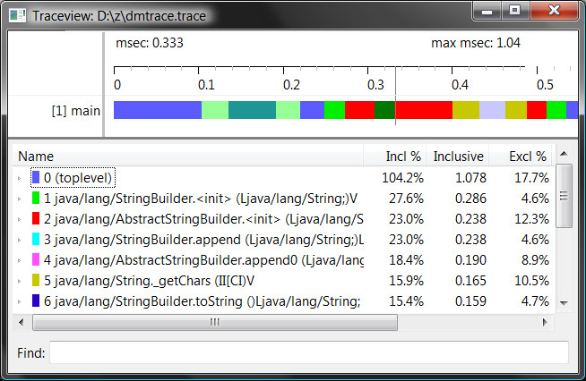

参考: [Traceview - Android Developers](http://developer.android.com/guide/developing/tools/traceview.html)


プロファイリングデータを取得する
----

アプリケーション内の特定のコード区間のプロファイリングを行うには、プロファイリンク期間を `android.os.debug.Debug ` クラスの  `startMethodTracing() ` と `stopMethodTracing()` で囲みます。

```java
Debug.startMethodTracing();
... プロファイリング中 ...
Debug.stopMethodTracing();
```

プロファイリング結果は、`/sdcard/dmtrace.trace` というバイナリファイルに出力されます。
端末に SD カードが挿入されていないとエラーになります。

`startMethodTracing` メソッドのパラメータでファイル名のベース名を指定すると、`/sdcard/<basename>.trace` というファイル名で出力されるようになります。
結局 SD カードに出力されることには変わりありません。

ドキュメントには、

> These methods start and stop method tracing across the entire virtual machine.

と記述されているので、`Debug.startMethodTracing()` を呼び出した時点から、アプリケーション全体（正確には Dalvik VM 全体）のプロファイリングが行われることになります。
Activity がそのアプリのエントリポイントとなっているのなら、`onCreate()`, `onDestroy()` でそれぞれ、`startMethodTracing()`、`stopMethodTracing()` を呼び出すようにすれば、そのアプリ全体のプロファイリングを行うことができます。


プロファイリングデータを表示する
----

Android SDK に含まれている `traceview` コマンドを使用すると、プロファイリング結果をグラフィカルに表示することができます。



上記の図では、タイムラインに main スレッドが一本だけ表示されていますが、複数のスレッドが存在すれば、main 以外のスレッドもその下に表示されます。

まずは、`/sdcard/dmtrace.trace` ファイルを PC に取得します。

```
C:\> adb pull /sdcard/dmtrace.trace
```

あとは `traceview` コマンドのパラメータとして、`dmtrace.trace` のパスを渡すだけです。
Windows ではフルパスで指定する必要があります。

```
C:\> traceview D:\z\dmtrace.trace
```


プロファイリングデータからメソッドの呼び出しグラフを作成する
----

```
$ dmtracedump -g output.png dmtrace.trace
```

※ `dmtracedump ` は Windows では動作しません。


プロファイリングデータを HTML で出力する
----

```
$ dmtracedump -h dmtrace.trace > output.html
```

※ `dmtracedump` は Windows では動作しません。

