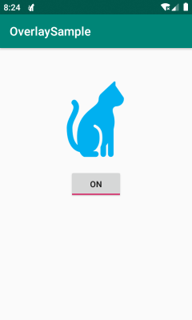
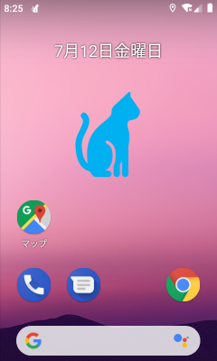
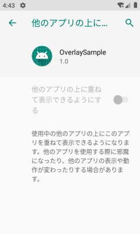
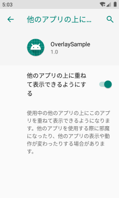
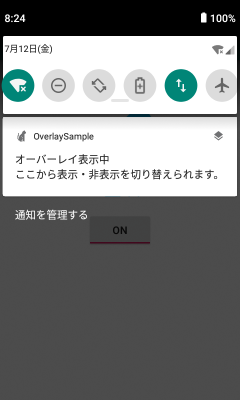

ここでは、任意のビュー（上の図では猫）をどのアプリよりも最前面に表示し、ずっとそこに表示し続けるようにする方法を説明します。
表示の ON/OFF は、メインアクティビティに配置したトグルボタンから行えるようにしています。
この猫が、下に表示されているアプリの操作を邪魔することはありません（猫をタップすると、下に表示されているアプリの画面をタッチしたことになります）。


アプリのビューを最前面にオーバーレイ表示する方法
----

Android で画面の最前面に張り付くウィジェットのようなものを作る場合、かつて (API Level 25 以前、Android 7 Nougat まで）はビューを `TYPE_SYSTEM_OVERLAY` や `TYPE_SYSTEM_SYSTEM_ALERT_WINDOW` などのレイヤーに表示することで実現していました。
API Level 26 以降（Android 8 Oreo 以降）はこのような特殊なレイヤーの使用は制限されており、代わりに **`TYPE_APPLICATION_OVERLAY`** レイヤーを使う必要があります。

- [TYPE_APPLICATION_OVERLAY](https://developer.android.com/reference/android/view/WindowManager.LayoutParams.html#TYPE_APPLICATION_OVERLAY)
- [TYPE_SYSTEM_OVERLAY (deprecated)](https://developer.android.com/reference/android/view/WindowManager.LayoutParams.html#TYPE_SYSTEM_OVERLAY)
- [TYPE_SYSTEM_ALERT (deprecated)](https://developer.android.com/reference/android/view/WindowManager.LayoutParams.html#TYPE_SYSTEM_ALERT)

`TYPE_APPLICATION_OVERLAY` を使うことにより、すべての Activity よりも上位に表示しつつも、ステータスバーや IME などの重要な UI よりは下に表示されることが保障されます。

`TYPE_APPLICATION_OVERLAY` のレイヤーに表示を行うには、AndroidManifest.xml に [SYSTEM_ALERT_WINDOW パーミッション](https://developer.android.com/reference/android/Manifest.permission.html#SYSTEM_ALERT_WINDOW) の使用を宣言し、さらにアプリケーション実行中にユーザーからの許可（ランタイムパーミッション）を得る必要があります。

View を最前面にオーバーレイ表示する流れは下記のようになります。

1. AndroidManifest.xml に `SYSTEM_ALERT_WINDOW` の uses-permission を追加
2. アプリ起動時やボタンを押したときなどにダイアログ表示してオーバーレイ表示の許可を得る
    * すでにパーミッションが付加されているかは `Settings.canDrawOverlays()` で確認できる
    * ダイアログの表示は `Settings.ACTION_MANAGE_OVERLAY_PERMISSION` アクションで `startActivity` すればよい
3. パーミッションが得られたら `WindowManager` で対象ビューのレイヤーを移動させる


実装例
----

### AndroidManifest.xml に uses-permission を追加

View のオーバーレイ表示を行うには、`SYSTEM_ALERT_WINDOW` パーミッションが必要です。
まず、マニフェストの uses-permission 要素で、**`android.permission.SYSTEM_ALERT_WINDOW`** を使用することを宣言しておきます。

```xml
<?xml version="1.0" encoding="utf-8"?>
<manifest xmlns:android="http://schemas.android.com/apk/res/android"
          xmlns:dist="http://schemas.android.com/apk/distribution"
          package="com.example.overlaysample">

    <uses-permission android:name="android.permission.SYSTEM_ALERT_WINDOW"/>
    ...
</manifest>
```

これを指定しなくても Runtime Permission を要求するダイアログを表示することはできるのですが、`TYPE_APPLICATION_OVERLAY` の OFF/ON ボックスがグレーアウトされてしまいます。





### オーバーレイ表示の許可を得る

実際に `SYSTEM_ALERT_WINDOW` パーミッションを使用するには、Runtime Permission の仕組みによって、アプリ起動後にユーザーから許可を得る必要があります（API level 23 以降）。

[Settings.canDrawOverlays()](https://developer.android.com/reference/android/provider/Settings#canDrawOverlays(android.content.Context)) を呼び出すと、すでにパーミッションが付加されているかどうかを調べることができるので、これが `false` を返した場合だけパーミッションを要求するダイアログを表示するようにします。
パーミッション要求のダイアログは、**`Settings.ACTION_MANAGE_OVERLAY_PERMISSION`** をアクション名とするインテントを投げることで起動することができます。

```kotlin
class MainActivity : AppCompatActivity() {
    // ...

    /** Requests an overlay permission to the user if needed. */
    private fun requestOverlayPermission() {
        if (isOverlayGranted()) return
        val intent = Intent(
            Settings.ACTION_MANAGE_OVERLAY_PERMISSION,
            Uri.parse("package:$packageName")
        )
        startActivityForResult(intent, OVERLAY_PERMISSION_REQUEST_CODE)
    }

    /** Checks if the overlay is permitted. */
    private fun isOverlayGranted() =
        Build.VERSION.SDK_INT < Build.VERSION_CODES.M ||
        Settings.canDrawOverlays(this)
}
```

API level 23 (`Build.VERSION_CODES.M`) より前は、Runtime Permission でユーザからの許可を得る必要はないので、何もしないで return するようにしています。

このパーミッションを取得せずに、`TYPE_APPLICATION_OVERLAY` のレイヤにビューを表示しようとすると、`WindowManager$BadTokenException` という RuntimeException が発生します。

ユーザーによってオーバーレイ表示が許可されたかどうかは、`startActivityForResult()` の呼び出し結果をハンドルするための `onActivityResult()` メソッドでチェックすればよいでしょう。

```kotlin
/** Terminates the app if the user does not accept an overlay. */
override fun onActivityResult(requestCode: Int, resultCode: Int, data: Intent?) {
    super.onActivityResult(requestCode, resultCode, data)
    if (requestCode == OVERLAY_PERMISSION_REQUEST_CODE) {
        if (!isOverlayGranted()) {
            finish()  // Cannot continue if not granted
        }
    }
}
```

ここでは、ユーザーがオーバーレイ表示を許可してくれなかった場合は、単純にアプリケーションを終了するようにしています。


ビューをオーバーレイ表示する
----

オーバーレイ表示のパーミッションを取得できたたら、[WindowManager.LayoutParams](https://developer.android.com/reference/android/view/WindowManager.LayoutParams) の設定により、任意のビューを最前面に表示することができます。

```kotlin
/** Settings for overlay view */
private val layoutParams = WindowManager.LayoutParams(
    WindowManager.LayoutParams.TYPE_APPLICATION_OVERLAY,  // Overlay レイヤに表示
    WindowManager.LayoutParams.FLAG_NOT_FOCUSABLE  // フォーカスを奪わない
        or WindowManager.LayoutParams.FLAG_NOT_TOUCHABLE
        or WindowManager.LayoutParams.FLAG_NOT_TOUCH_MODAL
        or WindowManager.LayoutParams.FLAG_LAYOUT_NO_LIMITS,  // 画面外への拡張を許可
    PixelFormat.TRANSLUCENT
)

fun showAsOverlay() {
    windowManager.addView(myView, layoutParams)
}
```


NotificationManager で通知領域にメッセージを表示する
----

このように、最前面にビューを表示し続ける場合は、ユーザーがその表示を簡単に OFF にできるように、通知領域にメッセージを登録しておくと親切です。



メインアクティビティを閉じても猫アイコン（ビュー）は表示され続けるのですが、ユーザーはこの通知をクリックすることで、いつでもメインアクティビティに戻ることできます。
あるサービスを Foreground service として動作させ、その際に Notification を登録しておくと、そのサービスが終了するまで通知メッセージを表示しておくことができます。

#### AndroidManifest.xml に uses-permission 追加

```xml
<uses-permission android:name="android.permission.FOREGROUND_SERVICE" />
```

#### Foreground service としてサービスを起動

```kotlin
class OverlayService : Service() {
    override fun onCreate() {
        if (Build.VERSION.SDK_INT >= Build.VERSION_CODES.O) {
            // Start as a foreground service
            val notification = MyNotification.build(this)
            startForeground(1, notification)
        }
        // ...
```

#### Notification を設定するためのヘルパクラス

```kotlin
object MyNotification {
    private const val CHANNEL_ID = "channel_id_overlay_sample"
    private const val CHANNEL_NAME = "オーバーレイ表示の切り替え"
    private const val CHANNEL_IMPORTANCE = NotificationManager.IMPORTANCE_DEFAULT
    private const val FIRST_LINE = "オーバーレイ表示中"
    private const val SECOND_LINE = "ここから表示・非表示を切り替えられます。"
    private val ACTIVITY = MainActivity::class.java

    /**
     * Set the info for the views that show in the notification panel.
     */
    fun build(context: Context): Notification {
        // Create a notification channel
        val nm = context.getSystemService(Context.NOTIFICATION_SERVICE) as NotificationManager
        nm.createNotificationChannel(
            NotificationChannel(CHANNEL_ID, CHANNEL_NAME, CHANNEL_IMPORTANCE)
        )

        // The PendingIntent to launch our activity if the user selects this notification
        val pendingIntent = PendingIntent.getActivity(
            context, 0, Intent(context, ACTIVITY), 0
        )

        return Notification.Builder(context, CHANNEL_ID)
            .setAutoCancel(false)  // don't dismiss when touched
            .setContentIntent(pendingIntent)  // The intent to send when the entry is clicked
            .setContentTitle(FIRST_LINE)  // the label of the entry
            .setContentText(SECOND_LINE)  // the contents of the entry
            .setSmallIcon(R.drawable.cat)  // the status icon
            .setTicker(context.getText(R.string.app_name))  // the status text
            .setWhen(System.currentTimeMillis())  // the time stamp
            .build()
    }
}
```

オーバーレイ表示を OFF にしたときは、このサービスを終了させる (`stopSelf()`) ことで、通知メッセージを自動的に削除することができます。


全ソースコード
----

ソースコードおよびリソース一式は下記に置いてあります。

- [https://github.com/maku77/AndroidOverlaySample/](https://github.com/maku77/AndroidOverlaySample/)

