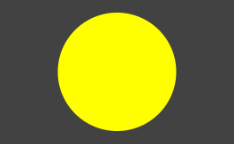
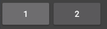

onDraw で自力で描画するカスタムビューを作る
----

Android では、`android.view.View` を継承したビュークラスを作成することで、簡単にカスタムビューを作成することができます。
ここでは、`com.example.myapp.MyCustomView` という、丸を描画するだけのカスタムビューを作成します。

{: .center }

描画処理は `onDraw()` メソッドをオーバーライドして記述します。

#### MyCustomView.java

~~~ java
package com.example.myapp;

import android.content.Context;
import android.graphics.Canvas;
import android.graphics.Color;
import android.graphics.Paint;
import android.util.AttributeSet;
import android.view.View;

public class MyCustomView extends View {
    private final Paint mBackgroundPaint = new Paint() {
        {
            setColor(Color.YELLOW);
            setAntiAlias(true);
        }
    };

    public MyCustomView(Context context) {
        super(context);
    }

    public MyCustomView(Context context, AttributeSet attrs) {
        super(context, attrs);
    }

    public MyCustomView(Context context, AttributeSet attrs, int defStyleAttr) {
        super(context, attrs, defStyleAttr);
    }

    @Override
    protected void onDraw(Canvas canvas) {
        int w = canvas.getWidth();
        int h = canvas.getHeight();
        int radius = w < h ? w/2 : h/2;
        canvas.drawCircle(w / 2, h / 2, radius, mBackgroundPaint);
    }
}
~~~

ちなみに、Kotlin では次のように少しだけシンプルに記述できます。

#### MyCustomView.kt

~~~ kotlin
package com.example.myapp

import android.content.Context
import android.graphics.Canvas
import android.graphics.Color
import android.graphics.Paint
import android.util.AttributeSet
import android.view.View

class MyCustomView @JvmOverloads constructor(
    context: Context,
    attrs: AttributeSet? = null,
    defStyleAttr: Int = 0
) : View(context, attrs, defStyleAttr) {

    private val backgroundPaint = Paint().apply {
        color = Color.YELLOW
        isAntiAlias = true
    }

    override fun onDraw(canvas: Canvas) {
        val w = canvas.width.toFloat()
        val h = canvas.height.toFloat()
        val radius = if (w < h) w / 2 else h / 2
        canvas.drawCircle(w / 2, h / 2, radius, backgroundPaint)
    }
}
~~~

作成したカスタムビューは、任意のレイアウト XML ファイルから次のように使用することができます。

#### activity_main.xml（抜粋）

~~~ xml
<com.example.myapp.MyCustomView
    android:layout_width="200dp"
    android:layout_height="100dp"
    android:layout_marginVertical="20dp" />
~~~

既存のビューを組み合わせてカスタムビューを作る
----

既存のボタンウィジェットなどを組み合わせて、ひとつのカスタムビューを作成することができます。
意味のある単位でカスタムビューの形でカプセル化しておくと、コードの見通しがよくなります。

{: .center }

ここでは、ボタンを横方向に２つ並べただけの、`MyButtonsView` クラスを作成します。
まずは、カスタムビュー用のレイアウトファイルを作成します（もちろん、XML ファイルを使わずに、Java コードの中で動的に配置することもできます）。

#### res/layout/my_buttons_view.xml

~~~ xml
<?xml version="1.0" encoding="utf-8"?>
<LinearLayout xmlns:android="http://schemas.android.com/apk/res/android"
    android:layout_width="match_parent"
    android:layout_height="match_parent"
    android:orientation="horizontal">

    <Button
        android:id="@+id/button1"
        android:text="1"
        android:layout_width="wrap_content"
        android:layout_height="match_parent"/>

    <Button
        android:id="@+id/button2"
        android:text="2"
        android:layout_width="wrap_content"
        android:layout_height="match_parent"/>

</LinearLayout>
~~~

次に、`MyButtonsView` クラスの実装を行います。
レイアウトとして `LinearLayout` を採用したので、`View` クラスではなく、`LinearLayout` を継承して作成します。

#### MyButtonsView.java

~~~ java
package com.example.myapp;

import android.content.Context;
import android.util.AttributeSet;
import android.view.LayoutInflater;
import android.view.View;
import android.widget.Button;
import android.widget.LinearLayout;
import android.widget.Toast;

public class MyButtonsView extends LinearLayout {
    public MyButtonsView(Context context) {
        super(context);
        init(context);
    }

    public MyButtonsView(Context context, AttributeSet attrs) {
        super(context, attrs);
        init(context);
    }

    public MyButtonsView(Context context, AttributeSet attrs, int defStyleAttr) {
        super(context, attrs, defStyleAttr);
        init(context);
    }

    private void init(Context context) {
        // 第 2 引数で this を指定することで、Layout XML を自分自身に inflate する
        View layout = LayoutInflater.from(context).inflate(R.layout.my_buttons_view, this);
        ((Button) layout.findViewById(R.id.button1)).setOnClickListener(mListener);
        ((Button) layout.findViewById(R.id.button2)).setOnClickListener(mListener);
    }

    private final View.OnClickListener mListener = new View.OnClickListener() {
        @Override
        public void onClick(View view) {
            Button button = (Button) view;
            Toast.makeText(view.getContext(), button.getText(), Toast.LENGTH_SHORT).show();
        }
    };
}
~~~

ちなみに、Kotlin だと次のようにもう少し簡潔に書けます。

#### MyButtonsView.kt

~~~ kotlin
package com.example.myapp

import android.content.Context
import android.util.AttributeSet
import android.view.LayoutInflater
import android.widget.Button
import android.widget.LinearLayout
import android.widget.Toast
import kotlinx.android.synthetic.main.my_buttons_view.view.*

class MyButtonsView @JvmOverloads constructor(
    context: Context,
    attrs: AttributeSet? = null,
    defStyleAttr: Int = 0
) : LinearLayout(context, attrs, defStyleAttr) {

    private val clickListener = OnClickListener { view ->
        val btn = view as Button
        Toast.makeText(context, btn.text, Toast.LENGTH_LONG).show()
    }

    init {
        LayoutInflater.from(context).inflate(R.layout.my_buttons_view, this)
        button1.setOnClickListener(clickListener)
        button2.setOnClickListener(clickListener)
    }
}
~~~

このカスタムビューを使用するときは、他の `View` クラスと同様に、任意のレイアウト XML ファイル内で以下のように使用できます。
もちろん、コード内から動的に `View` を生成することもできます。

~~~ xml
<com.example.myapp.MyButtonsView
    android:layout_width="match_parent"
    android:layout_height="wrap_content"/>
~~~

