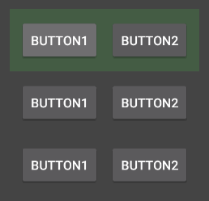

Android の `View` に対して `setOnFocusChangeListener()` でリスナを登録しておくと、その `View` がフォーカスを得たり、失ったりしたタイミングを検出することができます。

```kotlin
myView.setOnFocusChangeListener { v, hasFocus ->
    // ...
}
```

しかし、この通知はフォーカス対象となる末端の `View` に対してしか送られないため、複数の `View` を束ねるカスタムビュー単位でフォーカスが移動したことを判別したい場合は少し工夫が必要になります。

ここでは、次のように 2 つのボタンを持つカスタムビューを縦方向に 3 つ配置し、カスタムビュー間でフォーカスを移動させた場合に、カスタムビュー全体の背景色を変更することを考えてみます（うっすらとフォーカスされたカスタムビューの背景色を緑色にしています）。

{: .center }

次のコードはカスタムビューの実装例です。

#### MyCustomView.kt

```kotlin
package com.example.myapp

import android.content.Context
import android.graphics.Color
import android.util.AttributeSet
import android.view.LayoutInflater
import android.view.ViewTreeObserver.OnGlobalFocusChangeListener
import androidx.constraintlayout.widget.ConstraintLayout

class MyCustomView @JvmOverloads constructor(
    context: Context,
    attrs: AttributeSet? = null,
    defStyleAttr: Int = 0
) : ConstraintLayout(context, attrs, defStyleAttr) {

    private val focusListener = OnGlobalFocusChangeListener { _, _ ->
        if (findFocus() == null) {
            // このカスタムビュー内からフォーカスが失われた
            setBackgroundColor(Color.DKGRAY)
        } else {
            // このカスタムビュー内のいずれかのビューがフォーカスを得た
            setBackgroundColor(Color.rgb(68, 92, 68))  // DKGRAYより少し緑
        }
    }

    init {
        LayoutInflater.from(context).inflate(R.layout.my_custom_view, this)
        viewTreeObserver.addOnGlobalFocusChangeListener(focusListener)
    }
}
```

実際にフォーカスが当たっているのは、カスタムビュー内の子ビュー (`Button`) なので、このカスタムビュー自体の `onFocusChanged()` ではフォーカスの移動を検出できません。
そこで、ここでは **`ViewTreeObserver.OnGlobalFocusChangeListener`** を登録して、ビューツリー全体のフォーカス移動タイミングをハンドルするようにしています。

`onGlobalFocusChanged()` が発火したタイミングで `ViewGroup.findFocus()` を呼び出し、カスタムビュー内の子ビューがフォーカスを得たのか（あるいは失ったのか）を判定しています。
`ViewGroup.findFocus()` は、そのビューツリー以下のビューがフォーカスを持っているときにその参照を返し、持っていないときは `null` を返すため、何らかの `View` 参照が返された場合は、カスタムビュー内の子ビューがフォーカスを持っているのだと判断できます。

上記のカスタムビューが使用している、レイアウト XML ファイルも載せておきます。

#### res/layout/my_custom_view.xml

```xml
<?xml version="1.0" encoding="utf-8"?>
<androidx.constraintlayout.widget.ConstraintLayout
    xmlns:android="http://schemas.android.com/apk/res/android"
    xmlns:app="http://schemas.android.com/apk/res-auto"
    android:layout_width="match_parent"
    android:layout_height="match_parent"
    android:padding="10dp">

    <Button
        android:id="@+id/button1"
        android:layout_width="wrap_content"
        android:layout_height="wrap_content"
        android:layout_marginEnd="10dp"
        android:text="Button1"
        app:layout_constraintBottom_toBottomOf="parent"
        app:layout_constraintEnd_toStartOf="@+id/button2"
        app:layout_constraintStart_toStartOf="parent"
        app:layout_constraintTop_toTopOf="parent"
        />
    <Button
        android:id="@+id/button2"
        android:layout_width="wrap_content"
        android:layout_height="wrap_content"
        android:text="Button2"
        app:layout_constraintBottom_toBottomOf="parent"
        app:layout_constraintEnd_toEndOf="parent"
        app:layout_constraintStart_toEndOf="@+id/button1"
        app:layout_constraintTop_toTopOf="parent"
        />
</androidx.constraintlayout.widget.ConstraintLayout>
```

