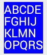

SurfaceView などでテキスト描画を行うには、Canvas#drawText() を使う必要がありますが、このメソッドは一行のテキスト描画しか行えません。
特定の幅でテキストを折り返して Canvas に描画するには、折り返しの計算処理と、複数行テキストの描画を自力で行う必要があります。

- [TextDrawUtil.java](./TextDrawUtil.java)

上記のユーティリティクラスを使用すると、特定の幅、高さに収まるように改行しながらテキストを描画できます。

~~~ java
// 座標 (0, 0) に、幅 80、高さ 100 に収まるようにテキスト描画
TextDrawUtil.drawMultilineText(canvas, text, 0, 0, 80, 100, mPaint);
~~~

何度も同じテキストを描画するような場合、描画内容を `Bitmap` インスタンスに保持しておいて、`Canvas#drawBitmap()` で描画する方が効率がよいです。
上記のユーティリティには、テキストを描画した `Bitmap` インスタンスを生成するメソッドも用意されています。

~~~ java
Bitmap bitmap = TextDrawUtil.createTextBitmap(text, 80, 100, mPaint);

// 作ったビットマップは以下のようにして描画
canvas.drawBitmap(bitmap, 0, 0, null);
~~~

下記は、全体的にどのように構成になるかのサンプルです。

#### MyView.java

~~~ java
public class MyView extends View {
    // ...
    private final Paint mPaintRect = new Paint() {
        {
            setColor(Color.BLUE);
        }
    };

    private final Paint mPaintText = new Paint() {
        {
            setColor(Color.WHITE);
            setTextSize(24);
            setAntiAlias(true);
        }
    };

    private final RectF mRect = new RectF(50, 50, 130, 155);

    @Override
    protected void onDraw(Canvas canvas) {
        // Draw a background of the text.
        canvas.drawRect(mRect, mPaintRect);

        // Draw a multiline text.
        final String text = "ABCDEFGHIJKLMNOPQRSTUVWXYZ";
        TextDrawUtil.drawMultilineText(canvas, text, mRect, mPaintText);
    }
}
~~~

