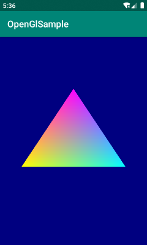
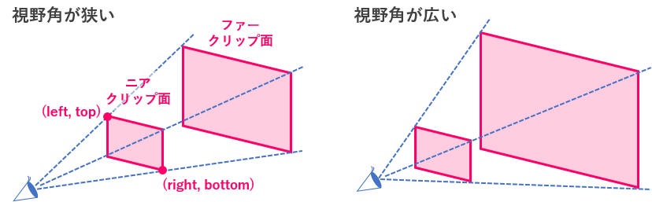
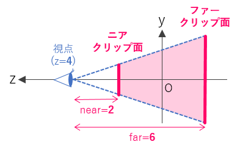

{: .center }

Android では、組み込み向けの OpenGL インタフェースである OpenGL ES を使用して 3D の描画を行うことができます。
Kotlin でも Java でも利用方法は変わらないのですが、今はもう Kotlin が主流になってきてますので、ここでは Kotlin で書いてみます。

Android で OpenGL ES を使った描画を行うには、下記のような手順を踏みます。

1. 描画用のビューとして [GLSurfaceView](https://developer.android.com/reference/android/opengl/GLSurfaceView) を作成する
2. 描画処理を実装した `GLSurfaceView.Renderer` インスタンスを `GLSurfaceView` にセットする


描画用のビュー (GLSurfaceView) の作成
----

下記は、`MainActivity` の実装です。
ここでは、OpenGL ES によって描画するためのビューとして、**`GLSurfaceView`** を生成し、そこに **`GLSurfaceView.Renderer`** インスタンスを設定します。

#### MainActivity.kt

```kotlin
package com.example.openglsample

import android.opengl.GLSurfaceView
import androidx.appcompat.app.AppCompatActivity
import android.os.Bundle

class MainActivity : AppCompatActivity() {
    override fun onCreate(savedInstanceState: Bundle?) {
        super.onCreate(savedInstanceState)
        val view = GLSurfaceView(this).apply {
            setRenderer(MyRenderer())
        }
        setContentView(view)
    }
}
```

これが OpenGL ES を使用する場合の、最低限のビュー構成になります。


レンダラー (GLSurfaceView.Renderer) の実装
----

次に、実際に OpenGL ES の API を使って描画処理を行うレンダラークラスを実装します。
レンダラークラスを作成するには、Android の [GLSurfaceView.Renderer インタフェース](https://developer.android.com/reference/android/opengl/GLSurfaceView.Renderer) が提供する下記のメソッドを実装します。

1. **`onSurfaceCreated`**: 描画用サーフェスが作成されたときに呼び出される。クリア色の初期化などを行う。
2. **`onSurfaceChanged`**: 描画用サーフェスのサイズが変更されたときに呼び出される。ビューポートの初期化などを行う。
3. **`onDrawFrame`**: 描画が必要なときに呼び出される。ここに実際の描画処理を記述する。

ここでは、各頂点が異なる色を持つ三角形を表示してみます。

#### MyRenderer.kt

```kotlin
package com.example.openglsample

import android.opengl.GLSurfaceView
import android.opengl.GLU
import javax.microedition.khronos.egl.EGLConfig
import javax.microedition.khronos.opengles.GL10

class MyRenderer : GLSurfaceView.Renderer {
    /** Called when the surface is created or recreated. */
    override fun onSurfaceCreated(gl: GL10, config: EGLConfig) {
        // 背景色を設定（暗い青）
        gl.glClearColor(0.0f, 0.0f, 0.5f, 1.0f)  // RGBA
    }

    /** Called when the surface changed size. */
    override fun onSurfaceChanged(gl: GL10, width: Int, height: Int) {
        // ビューポート（描画領域）の設定
        gl.glViewport(0, 0, width, height)

        // 視体積の設定 (left, right, bottom, top, near, far)
        val ratio = width.toFloat() / height
        gl.glMatrixMode(GL10.GL_PROJECTION)
        gl.glLoadIdentity()
        gl.glFrustumf(-ratio, ratio, -1f, 1f, 2f, 6f)

        // 視点と視線方向の設定
        GLU.gluLookAt(gl,
            0f, 0f, 4f,  // カメラの位置（視点）
            0f, 0f, 0f,  // カメラの向き（注視点）
            0f, 1f, 0f   // カメラ姿勢（上方向を表すベクトル）
        )
    }

    /** Called to draw the current frame. */
    override fun onDrawFrame(gl: GL10) {
        // 画面のクリア
        gl.glClear(GL10.GL_COLOR_BUFFER_BIT)

        // 3つの頂点の座標をセット
        val vertices = floatArrayOf(
            -1f, -0.5f, 0f,  // (x, y, z)
             1f, -0.5f, 0f,  // (x, y, z)
             0f,    1f, 0f   // (x, y, z)
        )
        gl.glVertexPointer(3, GL10.GL_FLOAT, 0, Util.makeFloatBuffer(vertices))
        gl.glEnableClientState(GL10.GL_VERTEX_ARRAY)

        // 3つの頂点の色をセット（RGBA の繰り返し）
        val colors = floatArrayOf(
            1.0f, 1.0f, 0.0f, 1.0f,  // #FFFF00 - 黄色
            0.0f, 1.0f, 1.0f, 1.0f,  // #00FFFF - シアン
            1.0f, 0.0f, 1.0f, 1.0f   // #FF00FF - マゼンタ
        )
        gl.glColorPointer(4, GL10.GL_FLOAT, 0, Util.makeFloatBuffer(colors))
        gl.glEnableClientState(GL10.GL_COLOR_ARRAY)

        // 描画（三角形の組み合わせで描画）
        gl.glDrawArrays(GL10.GL_TRIANGLE_STRIP, 0, vertices.size / 3)
    }
}
```

### onSurfaceCreated

```kotlin
override fun onSurfaceCreated(gl: GL10, config: EGLConfig) {
    // 背景色を設定（暗い青）
    gl.glClearColor(0.0f, 0.0f, 0.5f, 1.0f)  // RGBA
}
```

サーフェスが生成されたときに呼び出される `onSurfaceCreated` ですが、ここでは、クリア色（つまり背景色）の設定だけを行っています。

### onSurfaceChanged

サーフェスサイズが変更された場合（および初期表示時）には、[Renderer.onSurfaceChanged](https://developer.android.com/reference/android/opengl/GLSurfaceView.Renderer.html#onSurfaceChanged(javax.microedition.khronos.opengles.GL10,%2520int,%2520int)) が呼び出されるので、ここでビューポートや視点などの設定を行います。
ビューポートは、`GLSurfaceView` のどの領域に描画を行うかの設定です。
ここでは、単純にビュー全体に描画するように指定しています。

```kotlin
override fun onSurfaceChanged(gl: GL10, width: Int, height: Int) {
    // ビューポート（描画領域）の設定
    gl.glViewport(0, 0, width, height)
    ...
```

次に、[glFrustumf 関数](https://www.khronos.org/registry/OpenGL-Refpages/es1.1/xhtml/glFrustum.xml) を使って視体積の設定、[GLU.gluLookAt 関数](https://www.khronos.org/registry/OpenGL-Refpages/gl2.1/xhtml/gluLookAt.xml) を使って視点（カメラ）の設定を行います。

```kotlin
// 視体積の設定 (left, right, bottom, top, near, far)
val ratio = width.toFloat() / height
gl.glMatrixMode(GL10.GL_PROJECTION)
gl.glLoadIdentity()
gl.glFrustumf(-ratio, ratio, -1f, 1f, 2f, 6f)

// 視点と視線方向の設定
GLU.gluLookAt(gl,
    0f, 0f, 4f,  // カメラの位置（視点）
    0f, 0f, 0f,  // カメラの向き（注視点）
    0f, 1f, 0f   // カメラ姿勢（上方向を表すベクトル）
)
```

`glFrustumf` 関数のパラメータは次のようになっており、最初の 4 つのパラメータ (`left`, `right`, `bottom`, `top`) で、ニアクリップ面（最前面）の領域を示す座標値を指定します。
これが、視点から見たときに見える範囲の最前面になります。

```kotlin
glFrustumf(left, right, bottom, top, near, far)
```

{: .center }

図からもわかるように、視点とニアクリップ面までの距離が近いほど、表現上の視野角は広くなります。
`glFrustumf` の末尾の 2 つのパラメータ (`near`, `far`) が視点からニアプリップ面、ファークリップ面までの距離を表します。

{: .center }

`GLU.gluLookAt` 関数では、視点（カメラ）の位置、および向きを設定します。
ここでは、原点 (0, 0) あたりに描画オブジェクトを配置することを想定し、カメラ位置は (0, 0, 4) とし、原点の方向 (0, 0, 0) を向くように設定しています。

ここでは、遠くのものが小さく見える透視投影 (Perspective Projection) 用の設定を行いましたが、**`glOrthof`** 関数を使えば、正投影 (Orthographic Projection) 用の設定を行うことができます。
2D のゲームなどを作るのであれば、正投影を使ったほうが簡単です。


描画処理の実装 (onDrawFrame)
----

描画処理が必要なときには、`Renderer#onDrawFrame` が呼び出されるので、この中で 3D オブジェクトの描画処理を行います。
まずは、`glClear` を使って画面をクリアします。
クリア色として、`glClearColor` で設定済みの色が使用されます。

```kotlin
override fun onDrawFrame(gl: GL10) {
    // 画面のクリア
    gl.glClear(GL10.GL_COLOR_BUFFER_BIT)
    ...
```

次に、原点近く (z=0) に三角形を表示するために 3 つの頂点の座標を設定します。

```kotlin
// 3つの頂点の座標をセット
val vertices = floatArrayOf(
    -1f, -0.5f, 0f,  // (x, y, z)
     1f, -0.5f, 0f,  // (x, y, z)
     0f,    1f, 0f   // (x, y, z)
)
gl.glVertexPointer(3, GL10.GL_FLOAT, 0, Util.makeFloatBuffer(vertices))
gl.glEnableClientState(GL10.GL_VERTEX_ARRAY)
```

`glVertexPointer` の最初のパラメータで 3 と指定しているのは、各座標値が三次元 (x, y, z) のデータであることを示しています。
`Util.makeFloatBuffer` に関しては後述。

さらに、3 つの頂点の色を、それぞれ RGBA で設定します。

```kotlin
// 3つの頂点の色をセット（RGBA の繰り返し）
val colors = floatArrayOf(
    1.0f, 1.0f, 0.0f, 1.0f,  // #FFFF00 - 黄色
    0.0f, 1.0f, 1.0f, 1.0f,  // #00FFFF - シアン
    1.0f, 0.0f, 1.0f, 1.0f   // #FF00FF - マゼンタ
)
gl.glColorPointer(4, GL10.GL_FLOAT, 0, Util.makeFloatBuffer(colors))
gl.glEnableClientState(GL10.GL_COLOR_ARRAY)
```

ここでは 3 点の色を異なる色に設定していますが、すべて同じ色でよければ、下記のように簡単に設定することができます。

```kotlin
// 単色でよければ下記のような2行で OK
gl.glColor4f(1.0f, 1.0f, 0f, 0f)  // 黄色
gl.disableClientState(GL10.GL_COLOR_ARRAY)
```

最後に、設定した座標値などに従ってレンダリングを行って終了です。

```kotlin
// 描画（三角形の組み合わせで描画）
gl.glDrawArrays(GL10.GL_TRIANGLE_STRIP, 0, vertices.size / 3)
```


FloatBuffer 作成用のユーティリティ
----

上記の実装において、`glVertextPointer` で頂点座標を指定するときや、`glColorPointer` で頂点の色を指定するときに、`Util.makeFloatBuffer` という関数を使っていました。
これは、OpenGL が扱える形式のバッファー (`FloatBuffer`) を生成するためのユーティリティ関数です。

### Util.kt

```kotlin
package com.example.openglsample

import java.nio.ByteBuffer
import java.nio.ByteOrder
import java.nio.FloatBuffer

object Util {
    /** OpenGL 用のバッファを作成します。 */
    fun makeFloatBuffer(arr: FloatArray): FloatBuffer {
        val bb = ByteBuffer.allocateDirect(arr.size * 4)  // float は 4 byte
        bb.order(ByteOrder.nativeOrder())
        return bb.asFloatBuffer().apply {
            put(arr)
            position(0)
        }
    }
}
```

OpenGL でポリゴンを描画するには、座標値や色情報を OpenGL に転送してやる必要があるのですが、このとき渡すデータは Java VM 上に確保された float 配列ではダメで、OpenGL 用に作成したバッファー（ここでは `FloatBuffer`）でなければいけません。
上記の `makeFloatBuffer` 関数は、Java の float 配列を受け取り、OpenGL 用の `FloatBuffer` を生成して返します。


全ソースコード
----

上記のソースコードは下記からダウンロードできます。

* [https://github.com/maku77/AndroidOpenGlSample](https://github.com/maku77/AndroidOpenGlSample)

