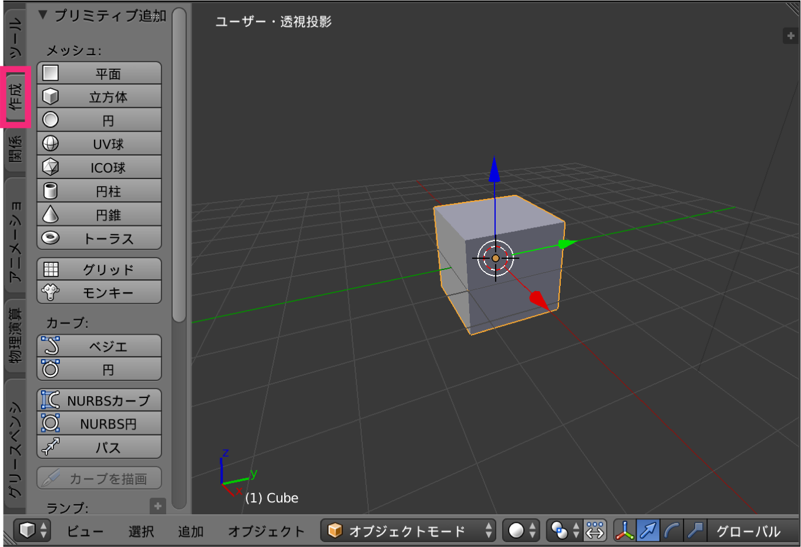
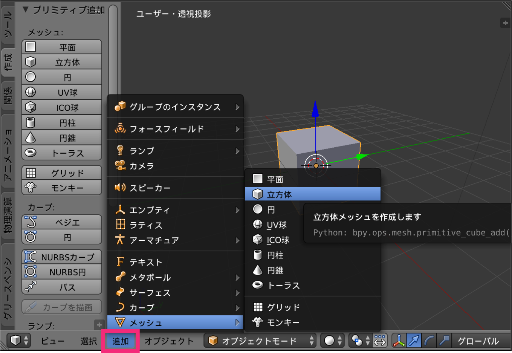
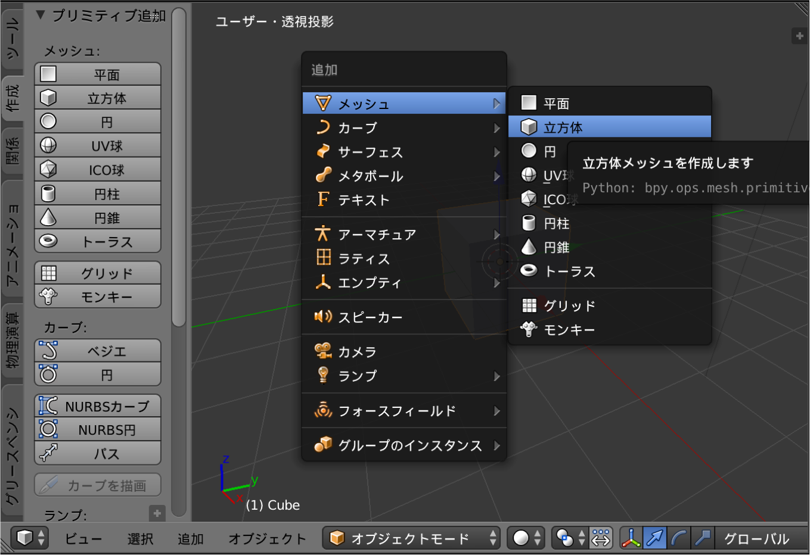
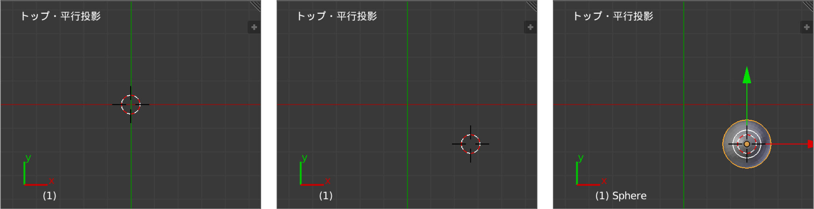

オブジェクトの追加方法
----

### ツールバーから追加する方法

<figure>
  
</figure>

**ツールバーの「作成」タブ**から、任意のオブジェクト（メッシュ）を追加することができます。
3D エディタにツールバーが表示されていない場合は、3D エディタの左上にある [+] アイコンをクリックするか、3D エディタ内にマウスカーソルを置いた状態で <kbd>t</kbd> を押すと表示されます。

### ヘッダから追加する方法

<figure>
  
</figure>

3D エディタの下にある、**ヘッダの「追加」メニュー**から、任意のオブジェクト（メッシュ）を追加することができます。

### ショートカットキーで追加する方法

<figure>
  
  <figcaption><kbd>Shift + A</kbd></figcaption>
</figure>

3D エディタ内にマウスカーソルがある状態で、<kbd>Shift + A</kbd> と入力すると、オブジェクト（メッシュ）を追加するポップアップを表示することができます。

オブジェクトを追加する位置を変更する
----

<figure>
  
  <figcaption>左クリックで 3D カーソルを移動</figcaption>
</figure>

オブジェクトを追加した時の初期位置は、3D エディタに表示された 3D カーソル（赤白の円と十字線）の位置になります。
3D カーソルは、マウスの左クリックで任意の位置に移動させることができます。

- 参考: [3D カーソルを原点（中心）に移動する](./snap-cursor-to-center.html)

