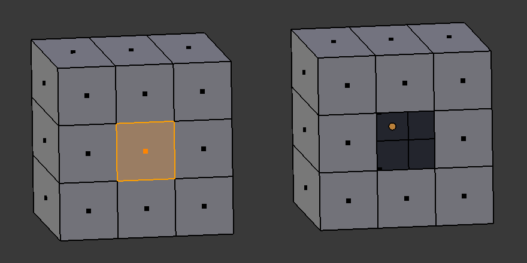
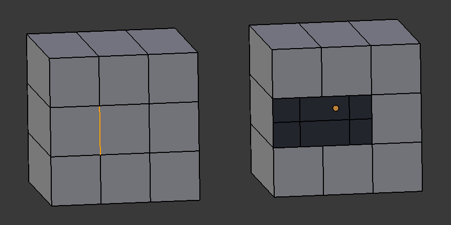
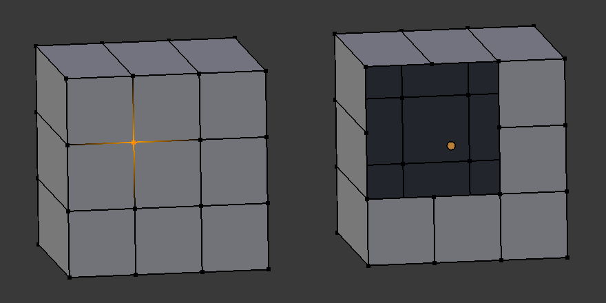
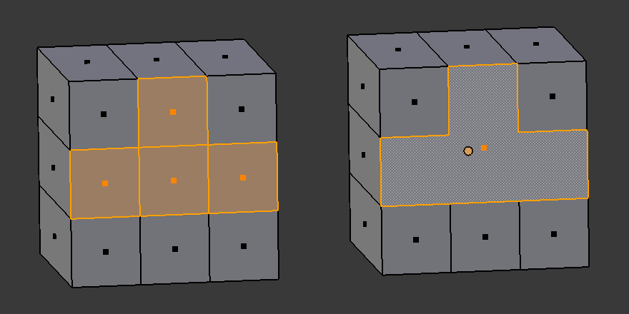
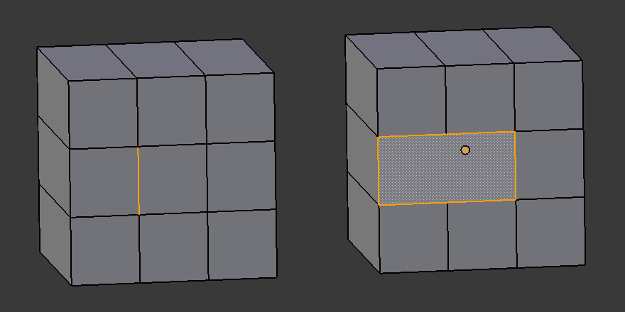
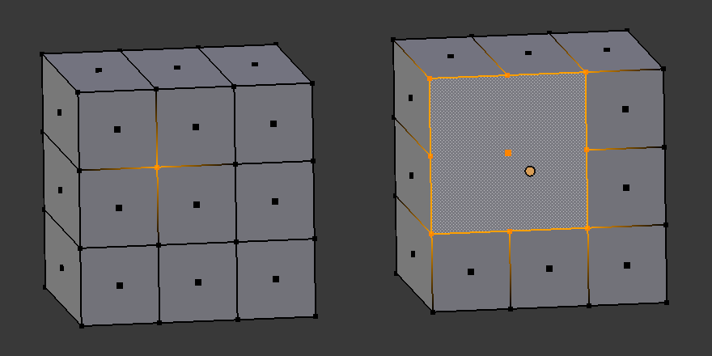
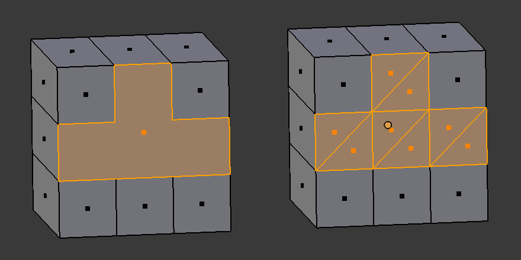
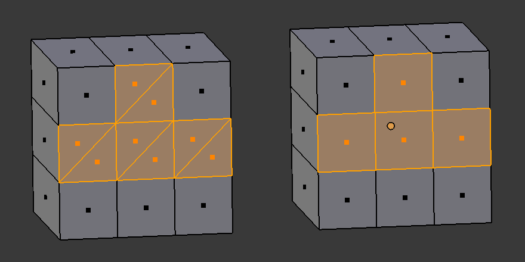

3D ビューエディタの編集モードで、頂点や辺、面を選択した状態で <kbd>X</kbd> キー、あるいは <kbd>Del</kbd> キーを押すと、要素を **削除 (Delete)**、**融解 (Dissolve)** するためのメニューが表示されます。

削除 (Delete) を実行すると選択要素に接する要素を巻き込む形で削除され、融解 (Dissolve) を実行すると選択要素のみが削除されます。
下記の例でそれぞれの振る舞いの違いを理解してください。

削除 (Delete)
----

<table>
  <tr>
    <td style="width: 200px"></td>
    <td><kbd>X</kbd> → <samp>面の削除 (Delete Faces)</samp></td>
  </tr>
  <tr>
    <td style="width: 200px"></td>
    <td><kbd>X</kbd> → <samp>辺の削除 (Delete Edges)</samp></td>
  </tr>
  <tr>
    <td style="width: 200px"></td>
    <td><kbd>X</kbd> → <samp>頂点の削除 (Delete Vertices)</samp></td>
  </tr>
</table>

辺を削除すると、その辺に接する面も一緒に削除されます。
頂点を削除すると、その頂点につながっている辺も一緒に削除され、さらに、その辺に接する面も一緒に削除されます。

つまり、頂点を削除したときに一番多くの要素が削除されます。
削除を実行すると、オブジェクトの表面には穴が開きます。

融解 (Dissolve)
----

<table>
  <tr>
    <td style="width: 200px"></td>
    <td><kbd>X</kbd> → <samp>面の融解 (Dissolve Faces)</samp></td>
  </tr>
  <tr>
    <td style="width: 200px"></td>
    <td><kbd>X</kbd> → <samp>辺の融解 (Dissolve Edges)</samp></td>
  </tr>
  <tr>
    <td style="width: 200px"></td>
    <td><kbd>X</kbd> → <samp>頂点の融解 (Dissolve Vertices)</samp></td>
  </tr>
</table>

融解は削除と異なり、できるだけ選択した要素のみを削除するように振る舞います。
融解を実行しても、オブジェクトの表面に穴が開くことはありません。

（おまけ）融解した面を三角面／四角面だけになるよう整える
----

<table>
  <tr>
    <td style="width: 200px"></td>
    <td><kbd>Ctrl + T</kbd> 面を三角化 (Triangulate Faces)</td>
  </tr>
  <tr>
    <td style="width: 200px"></td>
    <td><kbd>Alt + J</kbd> 三角面を四角面に (Tris to Quads)</td>
  </tr>
</table>

融解を行っていると、面が複雑な形になってしまうことがあります。
ポリゴンを四角面だけの構成にしたいときは、<kbd>Ctrl + T</kbd> で三角面に分割し、さらに <kbd>Alt + J</kbd> で四角面に結合します。

ちなみに、これらの操作は、<kbd>Ctrl + F</kbd> で表示される **面のスペシャルメニューからも実行できる** ので、ショートカットキーを忘れてしまったら、そこから実行するのがよいでしょう。

