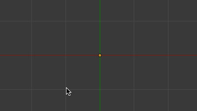
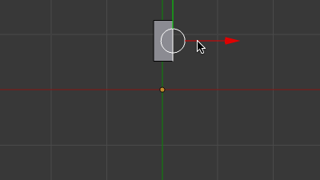

3D ビューエディタの編集モードで、頂点や線を選択した状態で、<kbd>Ctrl + 左クリック</kbd> すると、「押し出し」操作をその位置まで行ったような振る舞いをします。
連続して「押し出し」を行いたい場合は、この操作で代用するとスピーディに作業を行えます。

クリック連打で線を繋げていく
----

**頂点を選択した状態**、あるいは**すべてのメッシュが削除された状態**で頂点選択モードにし、<kbd>Ctrl + 左クリック</kbd> を連打すると、次々と頂点を打ちながら線を作成していくことができます。

{: .center }

<kbd>E</kbd> キーの押し出し (Extrude) で頂点を伸ばしていくこともできますが、この上記の方法だとクリックするだけで次々と頂点を作成していくことができるので作業スピードが上がります。
下絵を使って輪郭をトレースしたりしているときに便利です。

一連の線を作成し終わったら、<kbd>F</kbd> キーなどで面を作成すればよいでしょう。

クリック連打で面を繋げていく
----

**線が選択された状態**で、<kbd>Ctrl + 左クリック</kbd> すると、そこまで線が伸ばされて面が作成されます。

{: .center }

輪っか状に面を繋げていきたいときや、板が繋がった通路っぽいものを作りたい場合に便利です。
上記の例では、最後に 2 つの辺を選択して、<kbd>F</kbd> キーで面を作成しています。

