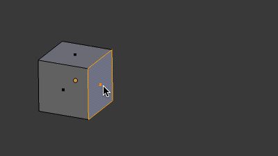
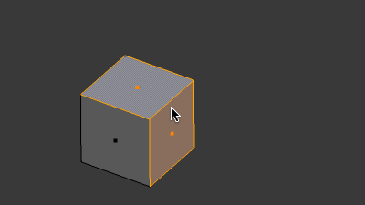
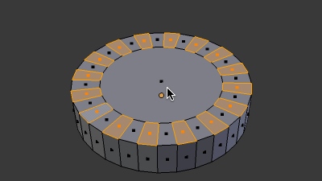
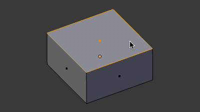

押し出し (Extrude) の基本
----

<kbd>E</kbd> キーによる押し出し (Extrude) は、オブジェクトに突起やくぼみを作るための機能です。
ひとつのキーに割り当てられていることからも分かるように、モデリング時に頻繁に使用します。

{: .center }

1. 編集モード (Edit Mode) で面を選択
2. <kbd>E</kbd> キーで押し出しを開始
3. マウスカーソルを動かしてニュッと押し出して <kbd>左クリック</kbd> で決定（<kbd>右クリック</kbd> でキャンセル）

<kbd>E</kbd> により面を押し出す場合、その方向は面の**法線**の方向になります。
法線の方向は、押し出し時に紫色の線で表示されます。

複数の面を同時に押し出す
----

複数の面を選択した状態で <kbd>E</kbd> キーを押すと、同時に複数の面の押し出しを行うことができます。
押し出しの方向は、すべての面の法線の中間方向になります。

{: .center }

同じ平面上にある面であれば、法線の方向は同じなので、直感的に垂直方向に押し出されることになります。

{: .center }

面を凹ませる（押し込む）
----

<kbd>E</kbd> キーによる押し出しは、面の中にくぼみを作るときにも使用できます。
下記の例では、まず <kbd>I</kbd> キーによる面の差し込み (Insert Face) を行ってから、その面を <kbd>E</kbd> キーで押し込んでいます。

{: .center }

