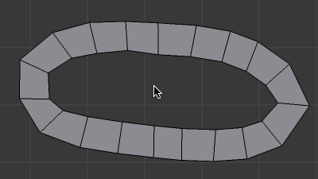

ポリゴンの一部に複雑な形状の穴が空いている時に、四角形（あるいは三角形）のポリゴンで埋めるテクニックがいくつかあります。

一つの辺を基準に面を張っていく方法
----

オススメの方法。
ぽっかりと空いた穴のひとつの辺を選択した状態で、<kbd>F</kbd> キーを連打すると、そこから四角形の面で連続して埋めてくれます。

{: .center }

一つの面を自動分割する方法
----

五角形以上の複雑な面がある場合、その面を選択して **<kbd>Ctrl + T</kbd>** で三角形だけの面に自動分割できます（面を三角化: Triangulate Faces）。
さらに、<kbd>Alt + J</kbd> で、三角形を結合して四角形だけにすることができます（三角面を四角面に: Tris to Quads）

{: .center }

上記の例では、最初に <kbd>Alt + 右クリック</kbd> で辺ループ選択し、<kbd>F</kbd> で面を作成しています。

三角形でまとめて面を張る方法
----

穴の空いたところに面を張るときに、<kbd>F</kbd> ではなく、<kbd>Alt + F</kbd> を使用すると、三角形だけで面を張ることができます。

{: .center }

その後、<kbd>Alt + J</kbd> キーで四角面に結合できます。

