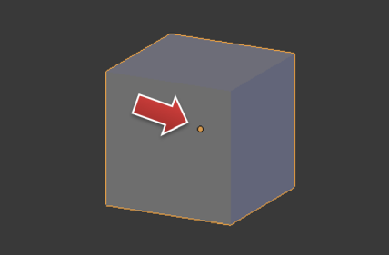
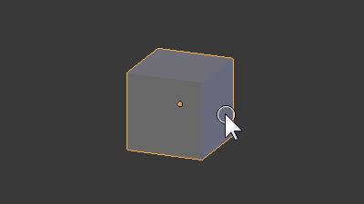
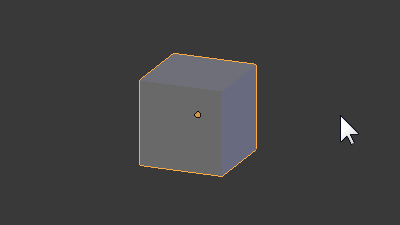
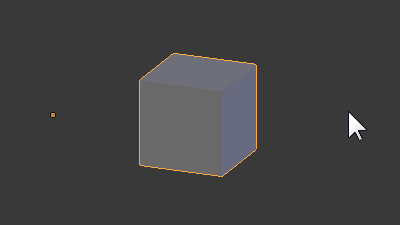
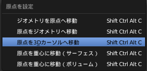
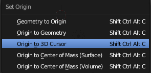

オブジェクトの原点とは
----

{: .center }

**オブジェクトの原点 (Object Origin)** は、オブジェクトを選択したときに**オレンジ色のドット**で表示されます。
編集モードにおけるメッシュ要素（頂点、辺、面）などの位置は、この原点からの相対座標で管理されます。

原点は、オブジェクトを追加したときにオブジェクトの中央に設定されます。
つまり、**3D カーソルがあったところが新規作成したオブジェクトの原点になります**。
オブジェクトモードでオブジェクトを動かした場合、オブジェクトの原点はそれに追従して移動します。

{: .center }

逆に、編集モードでメッシュの要素（頂点、辺、面）を動かすと、オブジェクトの原点は固定された状態で各要素が移動します。

オブジェクトの原点が与える影響
----

オブジェクトの原点は、オブジェクトモードでの回転操作 (<kbd>R</kbd>) や、ミラー・モディファイアによる反転の基準位置として使用されます。
編集モードでメッシュの位置を大きく動かした後に、オブジェクト全体の回転操作を行うと、回転の仕方が変わってきます。

原点は、各種モディファイアの基準点としても使われます。
ミラー・モディファイアで左右対称のモデルを作成しようとしたときに、うまく反転表示されない場合は、原点の位置を確認してみてください。

オブジェクトの原点を移動する
----

オブジェクトの原点位置を移動するには、オブジェクトモードで <kbd>Shift + Ctrl + Alt + C</kbd> で表示される **原点を設定 (Set Origin)** のメニューを使用します。

使用頻度が高いのは、<samp>原点を 3D カーソルへ移動</samp> でしょう。
マウスクリックで 3D カーソルを移動してから実行すれば、その位置へオブジェクトの原点を移動させることができます。

### グローバル座標の中央へ原点を設定する

オブジェクトの原点をグローバル座標の原点に移動させたいことはよくあります。
例えば、ミラー・モディファイアで左右対称のモデルを作成するときは、画面中央が原点になっていた方が作業しやすいでしょう。

オブジェクトの原点を画面中央へ移動させるには、下記のように、まず 3D カーソルを原点に移動させてから、そこにオブジェクトの原点を移動させます。

1. オブジェクトモードで対象となるオブジェクトを選択
2. <kbd>Shift + S</kbd> → <samp>カーソル→原点</samp> を選択
3. <kbd>Shift + Ctrl + Alt + C</kbd> → <samp>原点を3Dカーソルへ移動</samp> を選択

