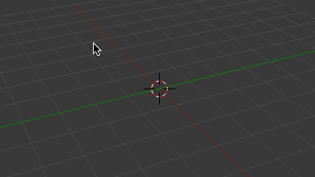
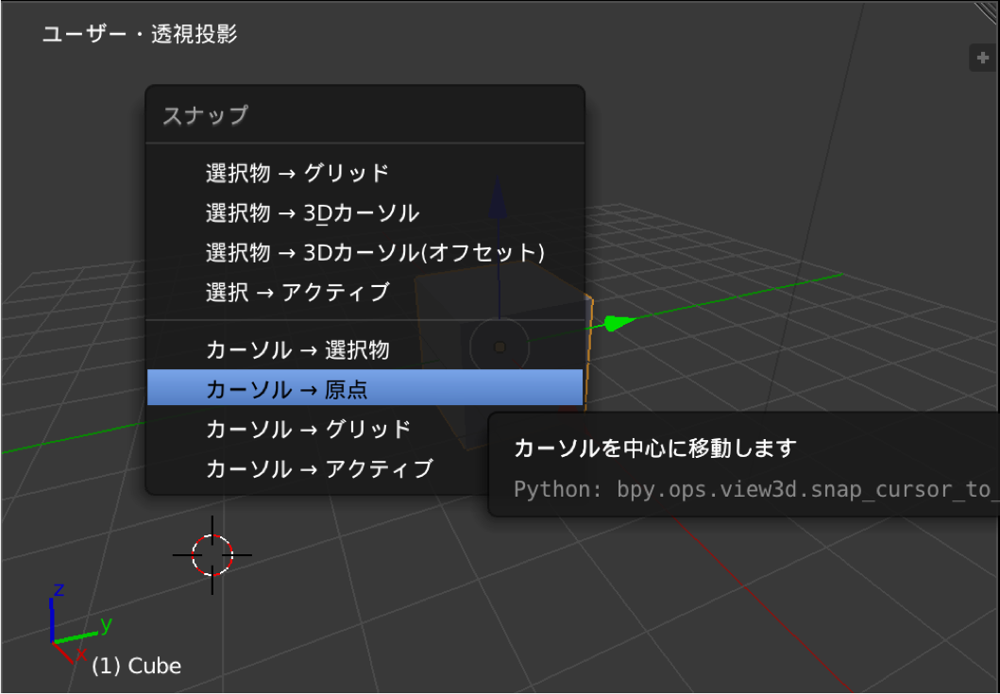

<kbd>Shift + A</kbd> などでオブジェクトを追加する場合、3D カーソルがある位置にオブジェクトが作成されます。
3D カーソルの位置は、3D ビューエディタ上で左クリックすると移動します。

{: .center }

3D カーソルの位置を原点座標 (0, 0, 0) に戻したいときは、3D ビューエディタの上にマウスカーソルがある状態で <kbd>Shift + S</kbd> でスナップメニューを表示し、<samp>カーソル → 原点</samp> を選択します。
スナップメニューからは、他にも、アクティブになっているオブジェクトの中央に 3D カーソルを移動したりできます。

<figure>
  
  <figcaption>
    <ol>
      <li><kbd>Shift + S</kbd></li>
      <li><kbd><samp>カーソル → 原点</samp></kbd> を選択</li>
    </ol>
  </figcaption>
</figure>

他の方法として、<kbd>Shift + C</kbd>（あるいは <kbd>Home</kbd>）キーを使って、表示位置をリセットする方法があります。
このショートカットキーを使うと、3D カーソルが原点に戻るだけでなく、すべてのオブジェクトがエディタ内にちょうど収まるように視点が調整されます。

