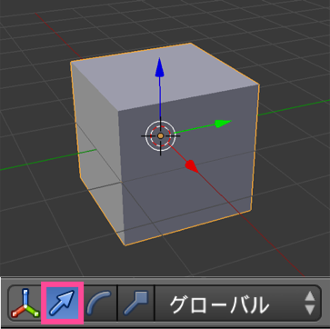

マニピュレータを使って移動する方法
----

<figure>
  
  <figcaption>
    <ol>
      <li>オブジェクトを選択（オブジェクトモードで右クリック）</li>
      <li>移動マニピュレータに切り替える（上図のピンク枠のアイコン）</li>
      <li>中央の白い円、あるいは、3色（赤緑青）の矢印をドラッグして移動 （移動中に、右クリック or <kbd>ESC</kbd> でキャンセル）</li>
    </ol>
  </figcaption>
</figure>

マニピュレータ中央の白い円をドラッグすると、オブジェクトを任意の方向に移動することができます。
マニピュレータの3色の矢印をドラッグすると、オブジェクトをx軸方向（赤の矢印）、y軸方向（緑の矢印）、z軸方向（青の矢印）に移動することができます。

<kbd>Shift</kbd> キーを押しながら矢印をドラッグすると、その軸以外の方向に（その軸の位置だけ固定して）移動することができます。
例えば、<kbd>Shift</kbd> キーを押しながら青の矢印（z軸）をドラッグすると、地面に水平な方向（x軸、y軸）方向にだけオブジェクトを移動することができます。

ショートカットキーを使って移動する方法
----

1. オブジェクトを選択（オブジェクトモードで右クリック）
2. <kbd>G</kbd> キーを押す
3. マウスを動かしてオブジェクトを移動させる
4. クリックで位置を決定 （右クリック or <kbd>ESC</kbd> でキャンセル）

マウスを動かしてオブジェクトを移動させている最中に、<kbd>X</kbd> キー、<kbd>Y</kbd> キー、<kbd>Z</kbd> キーを押すと、移動方向をその軸だけに制限できます（マニピュレータの矢印をドラッグするのと同様）。

<kbd>Shift</kbd> を押しながら <kbd>X</kbd> キー、<kbd>Y</kbd> キー、<kbd>Z</kbd> キーを押すと、その軸以外の方向に移動することができます（マニピュレータの矢印を <kbd>Shift</kbd> キーを押しながらドラッグするのと同様）。

より具体的には、オブジェクトの移動中に <kbd>X</kbd> を押すと、グローバルなx軸上で移動するようになります。続けてもう一度 <kbd>X</kbd> を押すと、ローカルなx軸上で移動するようになります。

マウスでの移動量を大きくする／小さくする
----

オブジェクトを移動しているときに、<kbd>Ctrl</kbd> キーを押しながらマウス移動すると、移動の単位を大きくすることができます（基本的には、水平面などに表示されたグリットのサイズ単位で動くようになります）。
例えば、Blender の初期状態では、中央に 2x2x2 のサイズの立方体が表示されているため、これをz軸方向に1単位だけ動かすと、地面に接地した立方体にすることができます。

<figure>
  
  <figcaption>
    <ol>
      <li>右クリックで立方体を選択状態にする</li>
      <li><kbd>G</kbd> キーで移動開始</li>
      <li><kbd>Z</kbd> キーで移動方向をz軸に限定</li>
      <li><kbd>Ctrl</kbd> キーを押しながらマウスを上へ動かす</li>
      <li>z軸方向に1単位だけ動いたらクリックして位置決定</li>
    </ol>
  </figcaption>
</figure>

上記は、テンキーの <kbd>1</kbd> を押して、正面からの視点に切り替えた画面で、z軸方向へ1単位だけオブジェクトを動かしています。
実際には、このくらいの操作であれば、青色矢印を <kbd>Ctrl</kbd> キーを押しながらドラッグする操作の方が簡単ですね。

通常は、<kbd>Ctrl</kbd> キーを押しながらオブジェクトを移動させると 1 単位の移動になりますが、オブジェクトを大きくズームインした状態では 0.1 単位ずつの移動になったり、逆にズームアウトした状態では 10 単位ずつの移動になったりします。
ただ、いずれのケースでも、<kbd>Ctrl</kbd> キーを押しながら移動させることで、通常より大きく移動するようになることは変わりありません。

逆に、<kbd>Shift</kbd> キーを押しながら移動すると、通常より細かい単位で動かせるようになります。
最終的な位置合わせで微調整するときに使用するとよいでしょう。

プロパティパネルで移動先の座標値を入力する
----

移動量があらかじめわかっている場合は、3Dエディタ内のプロパティパネルで座標値を直接入力してしまうのが簡単です。

<figure>
  
</figure>

プロパティパネルが表示されていない場合は、3Dエディタの右上の [+] アイコンをクリックするか、3Dエディタ内にマウスカーソルがある状態で <kbd>N</kbd> キーを押すと表示されます。

プロパティパネル内の座標値を、マウスのドラッグで調整しているときも、<kbd>Ctrl</kbd> キーや、<kbd>Shift</kbd> キーによって変化単位を調節することができます。

ショートカットキーで移動量を指定する
----

次のようにすると、ショートカットキーだけでオブジェクトを移動することができます。

1. オブジェクトを選択状態にする
2. <kbd>G</kbd> キーで移動開始
3. <kbd>X</kbd> or <kbd>Y</kbd> or <kbd>Z</kbd> キーで移動方向を指定する
4. 数字キーで移動量を入力（1単位移動させるなら <kbd>1</kbd> と入力）
5. <kbd>Enter</kbd> キーで決定

移動量は、移動後の座標値ではなく、現在位置からのオフセットで入力することに注意してください。
移動量にマイナスの値を入力することもできます。

#### 例: Z軸方向に +1 移動させる

~~~
G Z 1 Enter
~~~

#### 例: Y軸方向に -0.5 移動させる

~~~
G Y -0.5 Enter
~~~

マイナス (`-`) は、数値の後から入力することもできます。
つまり、上記の Y軸方向への -0.5 の移動は、次のようにも実行できます。

~~~
G Y 0.5 - Enter
~~~

移動を取り消したいときは、<kbd>Esc</kbd> キーを押せばキャンセルできます。

