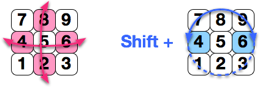
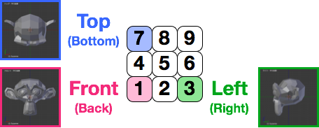
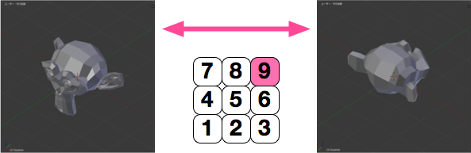
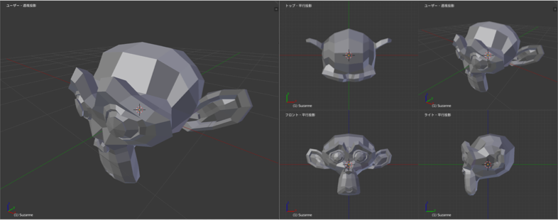
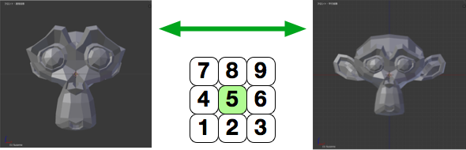

Blender で視点の操作を行うときは、主にマウスの中央ボタン（ホイール）や、テンキーを使用します。

ズーム (Zoom)
----

{:.center}

**マウスホイールを回転**させると、3Dビューの中央を基準にしていズームイン、ズームアウトを行えます。
テンキーの <kbd>+</kbd>、<kbd>-</kbd> でもズームイン、ズームアウトを行えます。

視点の回転 (Orbit)
----

{:.center}

**マウスの中央ボタン（通常はホイール）をドラッグ**すると、3Dビューの中央を基準にして視点を回転させることができます。
画面中央をいろんな方向から眺めるような動きをします。
視点を固定させて、3D空間を回転させていると捉えることもできますね。

{:.center}

テンキーの <kbd>2</kbd>、<kbd>4</kbd>、<kbd>6</kbd>、<kbd>8</kbd> を押すことでも、視点を回転させることができます（1度押すごとに15度回転します）。

さらに、<kbd>Shift</kbd> キーを押しながらテンキーの <kbd>4</kbd>、<kbd>6</kbd> を押すと、水平面に対して視点を傾ける（ロールする）ことができます（この操作はマウスでは行えません）。

視点の平行移動 (Pan)
----

{:.center}

**<kbd>Shift</kbd> キーを押しながらマウスの中央ボタンをドラッグ**すると、視点を平行移動（パン）することができます。
視点をパンすると、ズーム (Zoom) や回転 (Orbit) の基準となる点もずれるため注意してください。

{:.center}

<kbd>Ctrl</kbd> キーを押しながらテンキーの <kbd>2</kbd>、<kbd>4</kbd>、<kbd>6</kbd>、<kbd>8</kbd> を押すことでも、視点のパンを行うことができます。
<kbd>Shift</kbd> キーを押しながらマウスホイールを回すことでも、上下方向に視点をパンすることができます（<kbd>Ctrl</kbd>+<kbd>2</kbd> や <kbd>Ctrl</kbd>+<kbd>8</kbd> と同じ）。

前／後／上／下／左／右からの視点に切り替える
----

### 真正面、右、上からの視点

{:.center}

テンキーの <kbd>1</kbd>、<kbd>3</kbd>、<kbd>7</kbd> を押すと、視点を、正面（前）、右、上からの方向に切り替えることができます。
<kbd>Ctrl</kbd> キーを押しながら、同様の操作を行うと、後ろ、左、下からの方向に切り替えることができます。

### 反対側からの視点に切り替える

{:.center}

テンキーの <kbd>9</kbd> を押すと、今見ている視点の反対側からの視点に切り替えることができます。
3Dビューの中心を基準にして、グルッと回り込んで見る感じです。

四分割表示に切り替える
----

{:.center}

以下のいずれかの操作で、3Dビューを**四分割表示（正面、右、上、ユーザ視点）**に切り替えることができます。
もう一度同じ操作を行うと、元の分割なしのユーザービューに戻すことができます。

* <kbd>Ctrl</kbd>+<kbd>Alt</kbd>+<kbd>Q</kbd>
* 3Dビューヘッダの [ビュー] メニュー → [四分割表示] を選択

分割後のそれぞれのビューの上にマウスカーソルを持っていき、マウスホイールを使って個別にズームイン、ズームアウトを行うことができます。このとき、クリック操作を行う必要はありません（カーソルの下にある分割ビューが操作対象となります）。

{:.center}

四分割表示に切り替えた直後の視点は、正面、右、上、ユーザ視点となっていますが、マウスカーソルを対象の分割ビューに合わせた状態で、テンキーの <kbd>9</kbd> キーを押すことで、反対側から見た視点に切り替えることができます。
つまり、後ろ（バック）、左、下からの視点に切り替えることができます。
この場合も、<kbd>9</kbd> キーを押す前に、マウスでクリックする操作は必要ありません（カーソル位置を合わせるだけでOK）。

カメラ視点に切り替える
----

{:.center}

テンキーの <kbd>0</kbd> を押すと、ユーザ視点（作業用の視点）とカメラ視点（レンダリング用の視点）を交互に切り替えることができます。

透視投影と平行投影を切り替える
----

{:.center}

テンキーの <kbd>5</kbd> を押すと、透視投影 (Perspective Projection) と平行投影 (Orthographic Projection) を交互に切り替えることができます。
デフォルトは透視投影になっていますが、真正面からの視点（テンキーの <kbd>1</kbd>）などでオブジェクトを編集するときは、平行投影の方がやりやすいと思います。

