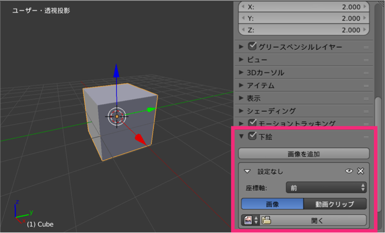
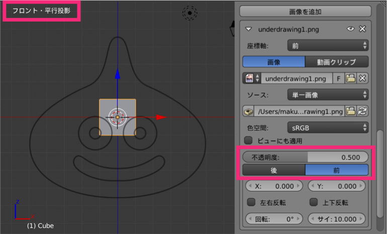

モデリングの参考になるイラストや写真がある場合は、それを下絵として表示することができます。
例えば、ここでは下記のようなイラストを下絵として使ってみます。

{:.center}

下絵の設定は、3D エディタのプロパティシェルフから行います。
プロパティシェルフが表示されていない場合は、3D エディタ右上の [+] アイコンをクリックするか、3D エディタ内にマウスカーソルがある状態で <kbd>N</kbd> キーを押して表示してください。

プロパティシェルフの下の方にある、**下絵**というところで下絵の設定を行います。

{:.center}

1. [下絵] のチェックボックにチェックを入れます
2. [座標軸] の項目で **[前]** を選択します（今回は正面からのイラストを使うため）
3. [開く] を押して画像ファイルを選択します

正面用に設定した下絵は、**3D エディタの視点を前（フロント）にし、かつ平行投影にしなければ表示されません**。
テンキーの <kbd>1</kbd> キーで視点を前に切り替え、テンキーの <kbd>5</kbd> で平行投影に切り替えてください。

{:.center}

画像ファイルを選択すると、その画像をどのように表示するかが表示されます。
後／前というボタンは、下絵をオブジェクトの後ろに表示するか、前に表示するかを設定します。
ここでは、下絵がオブジェクトに隠れて見えなくならないように、**[前]** を選択します。
不透明度の設定ができるため、下絵を前に表示しても、オブジェクトが見えなくなってしまうことはありません。

以上で、正面から見たときの下絵の設定は終わりです。
同様に、上から見たときや、右から見たときの下絵を設定したいときは、**[画像を追加]** ボタンを押して追加していくことができます。

あとは、表示された下絵をベースにモデリングを進めていくだけです。

