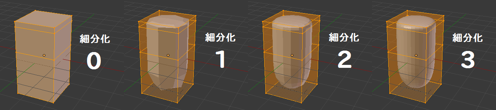

モディファイアとは
----

モディファイアは、オブジェクトのメッシュ構造に手を入れずに、様々な装飾を施すための機能です。

例えば、オブジェクトにミラー・モディファイアを追加すると、オブジェクトの原点で反転させて鏡のように表示することができます。
オブジェクトからミラー・モディファイアを削除すれば、元の単一の表示に戻すことができます。
モディファイアを使用すると、元のメッシュ構造を壊さずに装飾することができるため、非破壊的 (non-destructive) な操作と呼ばれたりします。

{: .center }

細分割曲面 (Subdivision Surface) （通称: Subsurf）モディファイアを追加すると、メッシュ構造を滑らかにした見た目にすることができます。
このモディファイアは、少ないポリゴン数（ローポリ）で滑らかな曲面を表現するために必須のモディファイアです。

{: .center }

モディファイアの追加
----

オブジェクトにモディファイアを追加するには、対象のオブジェクトが選択された状態で、**プロパティ・エディタ** の **モディファイア・タブ（レンチ型のアイコン）** を選択し、<samp>追加</samp>ボタンを押します。

{: .center }

すると、モディファイアの一覧が表示されるので、その中からオブジェクトに追加したいものを選択します。

{: .center }

よく使用するのは、

* ミラー (Mirror)
* 細分割曲面 (Subdivision Surface)
* 配列複製 (Array)

などです。

モディファイアは複数追加することができ、上に並べられたものから順番に効果が反映されていきます。
下記の例では、3 つのモディファイアが追加されています（三角アイコンを押してパネルを展開すると、各モディファイアの設定が表示されます）。

{: .center }

モディファイアの適用
----

モディファイアによってオブジェクトの見た目が変形していても、元になっているメッシュの形状は変わっていません。
その形状をメッシュに適用するには、オブジェクトモードに切り替え、モディファイアのパネルに表示された <samp>適用</samp> ボタンを押します。

{: .center }

例えば、細分割曲面 (Subsurf) モディファイアをオブジェクトに適用すると、メッシュが細かく分割された形状に変化します（モディファイアによって表示されていた形がメッシュに反映される）。

モディファイアを一度適用してしまうと元に戻せないので注意してください。
**できるだけモディファイアが追加された状態で作業を続け、微調整が必要になった時点で反映する**、というのが作業を効率的に進めるコツです。

