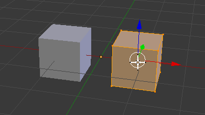
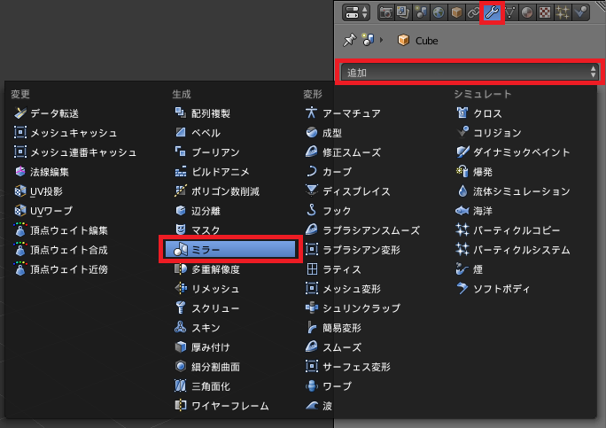
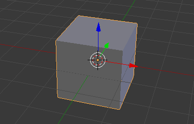
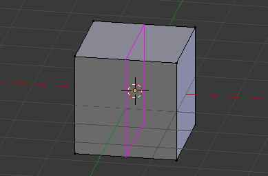
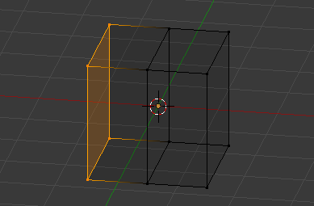
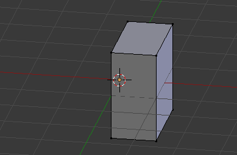
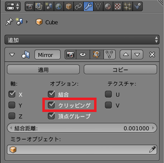
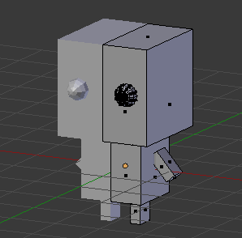

ミラー・モディファイアとは
----

オブジェクトにミラー・モディファイアを追加すると、オブジェクトの原点 (Origin) で反転してオブジェクトを表示することができます。

{: .center }

左右対称のキャラクターをモデリングするときなど、頻繁に使用するモディファイアなので使いこなせるようになりましょう。

ミラー・モディファイアを追加する
----

オブジェクトにミラー・モディファイアを追加するには次のようにします。

1. 対象のオブジェクトを選択
2. プロパティエディタのモディファイアタブ（レンチ型のアイコン）を選択
3. 追加ボタンを押して、ミラーを選択

{: .center }

オブジェクトの原点が基準になる
----

ミラー・モディファイアによるオブジェクトの反転表示は、オブジェクトの原点（オレンジ色のドット）が反転の基準位置となります。

ミラー・モディファイアを使ったモデリングをするときは、オブジェクトの原点は、グローバル座標の中央にあった方がやりやすいでしょう。

1. オブジェクトモードで対象となるオブジェクトを選択
2. <kbd>Shift + S</kbd> → <samp>カーソル→原点</samp> を選択
3. <kbd>Shift + Ctrl + Alt + C</kbd> → <samp>原点を3Dカーソルへ移動</samp> を選択

オブジェクトの原点に関しての詳細は下記を参照してください。

- [オブジェクトの原点 (Object Origin) を移動する](../3dview/origin.html)

ミラー・モディファイアを使ってみる
----

ここでは実際に、立方体をベースにして **X 軸方向にミラーさせたモデリング** をする手順を示します。

### オブジェクトの追加

まず、3D カーソルが原点にある状態で、画面中央に立方体 (Cube) を作成します。

{: .center }

このように画面中央にオブジェクトを作成すると、オブジェクトの原点も画面中央になるので、ミラー・モディファイアによる作業を始めるには都合がよいです。

### 余計な部分を削除

次に、反転表示して重なる部分（左側半分）のメッシュを削除します。
テンキーの <kbd>1</kbd> を押してフロント・ビューに切り替えると、どの部分が左側かなのかがすぐに分かります。
編集モードに切り替え、反転の境目になる部分（X=0 の位置）を <kbd>Ctrl + R</kbd> でループカットします。

{: .center }

左側の面（あるいは4つの頂点）を選択し、<kbd>X</kbd> → <samp>頂点</samp> で削除します。

{: .center }

すると、立方体の右側半分だけが残り、ミラー・モディファイアを適用する準備が整います。

{: .center }

### ミラー・モディファイアの追加

プロパティエディタのモディファイアタブ（レンチ型のアイコン）を選択し、ミラー・モディファイアを追加します。

{: .center }

ミラー・モディファイアが有効になると、デフォルトで X 軸方向に反転表示するようになっているので、あたかも元の立方体の形に復元されたかのように見えます。
実際には、メッシュが存在するのは右側半分だけです。

{: .center }

ミラー・モディファイアの設定パネルで、**クリッピング** オプションにチェックを入れておくと、頂点を移動したときに反転位置（オブジェクトの原点）をはみ出さないように制限してくれます。
メッシュが重ならないようにこのチェックを入れておくとよいでしょう。
ただし、クリッピング位置に一度移動した頂点は、クリッピングオプションを外さないと、その軸方向には動かせなくなってしまうことに注意してください。

### モデリングとモディファイアの適用

あとは、反転表示させながらモデリングを進めるだけです。

{: .center }

ミラー・モディファイアによる作業が完了したら、オブジェクトモードでモディファイアの <samp>適用</samp> ボタンを押すことで、形状をメッシュに反映することができます。
その後は、左右で形の異なる部分を作りこんでいくことができます。

