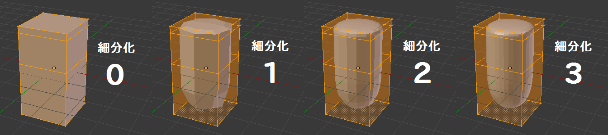
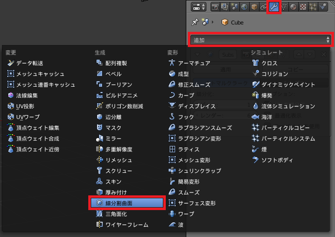
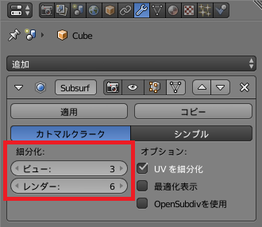
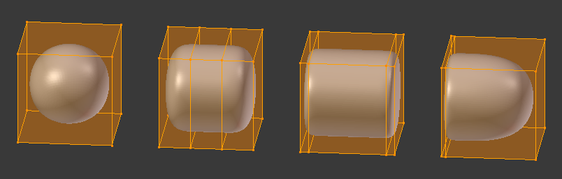

細分割曲面モディファイアとは
----

{: .center }

オブジェクトに**再分割曲面モディファイア (Subdivision Surface Modifier)** を追加すると、各面を等間隔に分割するように丸みを持たせることができます。
細分化のレベルは 0～6 の間で自由に変更することができ、大きな値ほど滑らかな曲線に近づいていきます。

サブサーフをうまく利用すると、**少ないポリゴン数（ローポリ）でも滑らかな曲線を表現することができます**。
メッシュをシンプルな構造に保つことで、編集作業を効率的に行うことができます。

Subdivision Surface を略して、**サブサーフ (Subsurf)** と呼ぶこともあります。
Blender のメニューの中にも Subsurf という表現が出てきたりするので覚えておきましょう。

細分割曲面モディファイアを追加する
----

オブジェクトに細分割曲面モディファイアを追加するには次のようにします。

1. 対象のオブジェクトを選択
2. プロパティエディタのモディファイアタブ（レンチ型のアイコン）を選択
3. 追加ボタンを押して、細分割曲面を選択

{: .center }

細分化のレベルを調節する
----

Subsurf モディファイアの設定パネルで、**細分化** の数値を変更すると、各サーフェスを何回分割するかを変更することができます。
細分化のレベルを上げていくと、より滑らかな曲面になっていきます。

{: .center }

細分化のレベルは **ビュー** と **レンダリング** で別々の値を設定することができ、それぞれ編集時のレベル、レンダリング時のレベルを表しています。
基本的には、ビューのレベルは小さ目にして動作が重くなることを防ぎ、レンダリングのレベルは大きくして最終的なイメージを綺麗に仕上げるようにします。

丸くしたくない部分は辺同士を近づける
----

立方体に Subsurf モディファイアを追加して、細分化のレベルを上げていくと、どんどん球体に近づいていきます。
Subsurf モディファイアには、面を構成する辺と辺の距離が離れているほど丸みを帯びるという特徴があります。

{: .center }

角をもっと鋭角にしたいときは、<kbd>Ctrl + R</kbd> によるループカットで辺を追加し、辺同士が近くなるように配置します。

