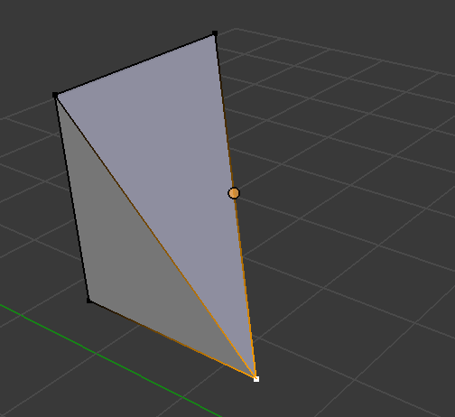
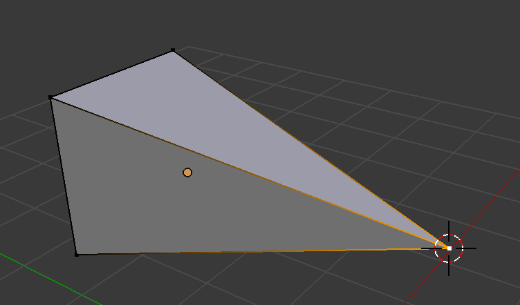

（まとめ中）

<table class="blender-example">
  <tr><th colspan="2">選択</th></tr>
  <tr><td>全選択／解除</td><td><kbd>A</kbd></td></tr>
  <tr><td>カーソル位置を選択</td><td>右クリック</td></tr>
  <tr><td>カーソル位置を選択（連続選択）</td><td><kbd>Shift</kbd> を押しながら右クリック</td></tr>
  <tr><td>領域を囲んで選択</td><td><kbd>Ctrl</kbd> + ドラッグ</td></tr>
  <tr><td>領域を囲んで選択解除 <td><kbd>Ctrl + Shift</kbd> + ドラッグ</td></tr>

  <tr><th colspan="2">視点の移動</th></tr>
  <tr><td>ズームイン</td><td><kbd>Ctrl + −</kbd> / マウスホイールを手前へ回す</td></tr>
  <tr><td>ズームアウト</td><td><kbd>Ctrl + ＋</kbd> / マウスホイールを奥へ回す</td></tr>
  <tr><td>視点の平行移動</td><td><kbd>Shift</kbd> + 中央ボタンでドラッグ</td></tr>
  <tr><td>視点の回転</td><td>中央ボタンでドラッグ</td></tr>
  <tr><td>カメラ視点</td><td><kbd>テンキー0</kbd></td></tr>
  <tr><td>前</td><td><kbd>テンキー1</kbd></td></tr>
  <tr><td>後ろ</td><td><kbd>Ctrl</kbd> + <kbd>テンキー1</kbd></td></tr>
  <tr><td>右</td><td><kbd>テンキー3</kbd></td></tr>
  <tr><td>左</td><td><kbd>Ctrl</kbd> + <kbd>テンキー3</kbd></td></tr>
  <tr><td>上</td><td><kbd>テンキー7</kbd></td></tr>
  <tr><td>下</td><td><kbd>Ctrl</kbd> + <kbd>テンキー7</kbd></td></tr>
  <tr><td>平行投影／透視投影</td><td><kbd>テンキー5</kbd></td></tr>
  <tr><td>四分割表示</td><td><kbd>Ctrl + Alt + Q</kbd></td></tr>

  <tr><th colspan="2">オブジェクトの操作</th></tr>
  <tr><td>移動</td><td><kbd>G</kbd> → マウスで移動 → クリックで決定</td></tr>
  <tr><td>コピー</td><td><kbd>Shift</kbd>+<kbd>D</kbd> → マウスで移動 → クリックで決定</td></tr>
  <tr><td>頂点の結合</td><td><kbd>Alt</kbd>+<kbd>M</kbd></td></tr>
</table>

<h3>頂点の結合いろいろ</h3>
<table class="blender-example">
<tr>
  <th>操作方法</th>
  <th>元のメッシュ形状</th>
  <th>操作後のメッシュ形状</th>
</tr>
<tr>
  <td>頂点を選択 → <kbd>Alt+M</kbd> → 中心に</td>
  <td></td>
  <td></td>
</tr>
<tr>
  <td>頂点を選択 → <kbd>Alt+M</kbd> → 最初に選択した頂点に</td>
  <td></td>
  <td></td>
</tr>
<tr>
  <td>頂点を選択 → <kbd>Alt+M</kbd> → 最後に選択した頂点に</td>
  <td></td>
  <td></td>
</tr>
<tr>
  <td>頂点を選択 → <kbd>Alt+M</kbd> → カーソル位置に</td>
  <td></td>
  <td></td>
</tr>
<tr>
  <td>頂点を選択 → <kbd>Alt+M</kbd> → 束ねる</td>
  <td></td>
  <td></td>
</tr>
</table>

