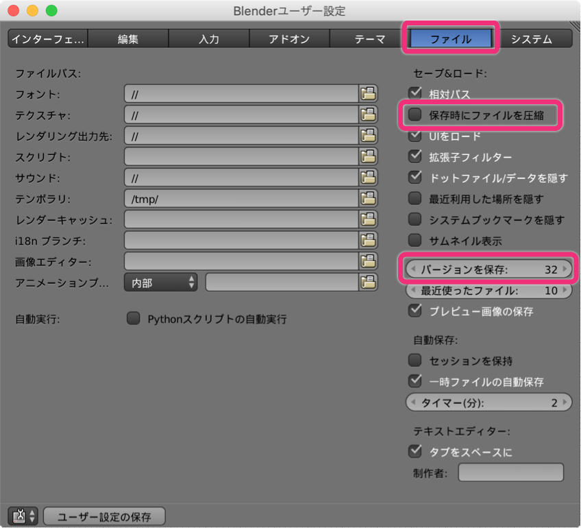
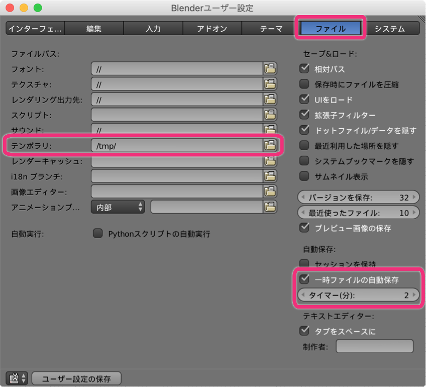
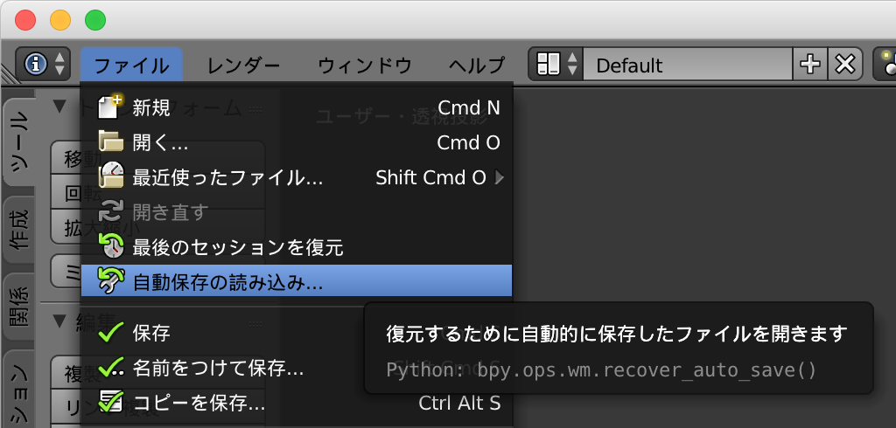
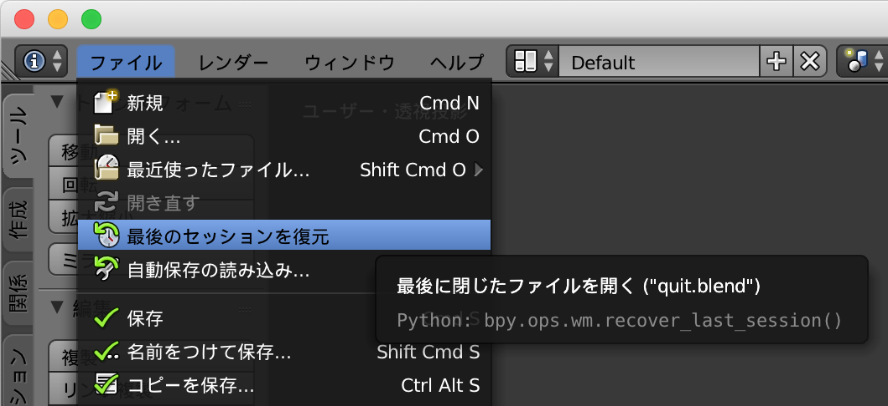

過去バージョンのファイルを保存する
----

Blender で作成したファイルは、`.blend` 拡張子のファイルとして保存されますが、**バージョンを保存** の設定をしておくと、過去のバージョンを **`.blend2`**、**`.blend3`**、**`.blend4`** というように残しておくことができます。

<figure>
  
  <figcaption>
    <ol>
      <li>メニューから <kbd><samp>ファイル</samp></kbd> → <kbd><samp>ユーザ設定</samp></kbd> を選択（あるいは <kbd>Cmd + ,</kbd>）</li>
      <li><kbd><samp>ファイル</samp></kbd> タブを選択</li>
      <li><kbd><samp>バージョンを保存</samp></kbd> で 1 以上の数値を入力</li>
      <li><kbd><samp>ユーザ設定の保存</samp></kbd> ボタンをクリック</li>
    </ol>
  </figcaption>
</figure>

<samp>バージョンを保存</samp> の設定で `0` を指定しておくと、過去バージョンファイルの作成は行われなくなります。
Git などでバージョン管理を行うのもよいですが、この仕組みであれば手軽にバージョン管理を行うことができます。
保存数は最大の `32` に設定しておくのがよいでしょう。

ファイルがたくさん作られることによってストレージ容量が圧迫されること気になる場合は、<samp>保存時にファイルを圧縮</samp> のチェックを入れておくとファイルサイズを小さくできるかもしれません。

一定時間おきに一時ファイルとして自動保存する
----

**一時ファイルの自動保存** を有効にしておくと、タイマーで指定した分ごとに、作業内容が一時ファイルとして自動的の保存されます。
一時ファイルは、<samp>テンポラリ</samp> で指定したディレクトリ内に作成されます。

{: .center }

Blender が異常終了してしまった場合に、一時ファイルから状態を復帰させるには、メニューから <samp>自動保存の読み込み</samp> を選択します。

{: .center }

最後のセッションを復元する
----

Blender を終了するときに、内容を保存せずに閉じてしまった場合でも、Blender はその内容を自動保存しています。
Blender を最後に閉じたときの状態に戻すには、メニューから <samp>最後のセッションを復元</samp> を選択します。

{: .center }

