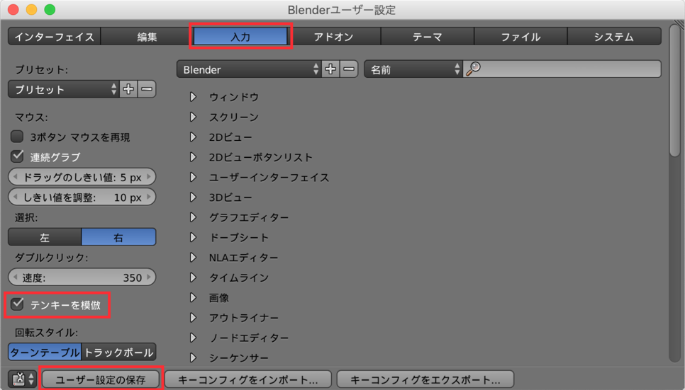

テンキーの数字キーは、視点切り替えのためのショートカットキーとして割り当てられており、とても便利に使用することができます。
一方で、キーボード上方の数字キーは、レイヤーの切り替えのためのショートカットキーに割り当てられていますが、どちらかというと視点切り替え操作の方が頻繁に行う操作です。

下記のように設定しておくと、キーボード上方の数字キーを、テンキーの代わり（視点切り替えショートカット）として使用できるようになります。

<figure>
  
  <figcaption>
    <ol>
      <li>メニューから <kbd><samp>ファイル</samp></kbd> → <kbd><samp>ユーザ設定</samp></kbd> を選択（あるいは <kbd>Cmd + ,</kbd>）</li>
      <li><kbd><samp>入力</samp></kbd> タブを選択</li>
      <li><kbd><samp>テンキーを模倣</samp></kbd> にチェックを入れる</li>
      <li><kbd><samp>ユーザ設定の保存</samp></kbd> ボタンをクリック</li>
    </ol>
  </figcaption>
</figure>

