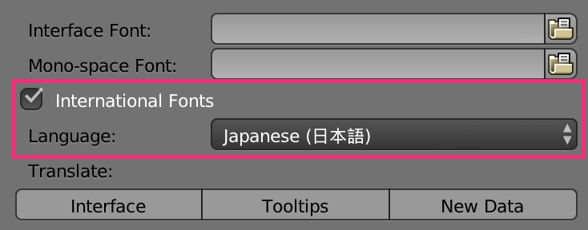
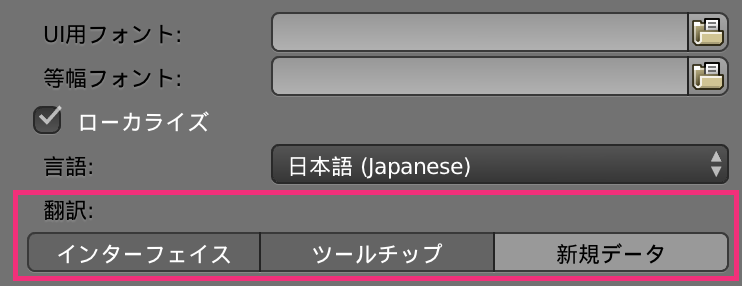

Blender アプリケーション内の表示は、デフォルトではすべて英語表示になっています。
次のように設定することで、日本語表示に切り替えることができます。

<figure>
  
  <figcaption>
    <ol>
      <li>メニューから <kbd><kbd><samp>File</samp></kbd> → <kbd><samp>User Preferences...</samp></kbd></kbd> を選択（あるいは <kbd>Cmd + ,</kbd>）</li>
      <li><kbd><samp>System</samp></kbd> タブを選択</li>
      <li><kbd><samp>International Fonts</samp></kbd> にチェック</li>
      <li><samp>Language</samp> の項目で <kbd><samp>Japanese（日本語）</samp></kbd> を選択</li>
      <li><samp>Translate</samp> の項目で <kbd><samp>Interface</samp></kbd>、<kbd><samp>Tooltip</samp></kbd>、<kbd><samp>New Data</samp></kbd> を ON</li>
    </ol>
  </figcaption>
</figure>

最後のステップで <kbd><samp>Interface</samp></kbd> のボタンを押した瞬間に、ダイアログ上のテキスト表示が日本語に変わります。

<figure>
  
</figure>

<kbd><samp>Tooltip</samp></kbd> を ON にしておくと、ボタンなどにマウスカーソルを合わせたときに表示されるツールチップが日本語になります。

  <kbd><samp>New Data</samp></kbd> を ON にすると、新規作成するオブジェクトの名前が日本語になってしまい、不都合が生じる可能性があるので、ここは OFF のままにしておくのがオススメです（オブジェクト名は英語で扱う）。

