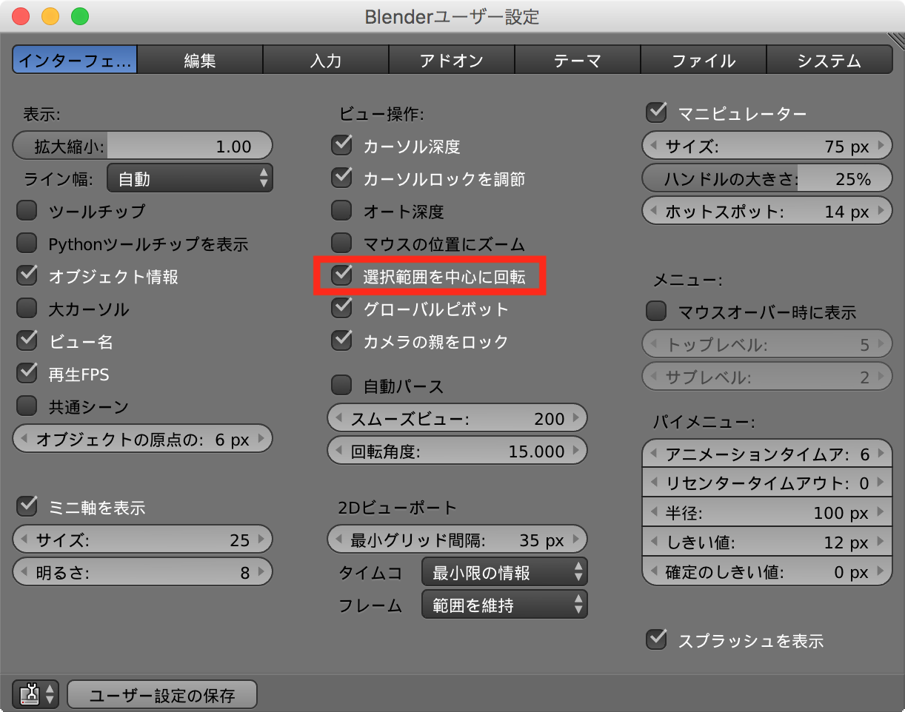

マウスの中央ボタンなどをドラッグして視点を回転させるとき、デフォルトでは回転の中心は、画面の中央になっています。
<kbd>Shift</kbd>+中央ボタンで視点の位置を平行移動していると、この回転の中心がずれてしまいます。
常に選択したオブジェクトが画面に収まるように回転させるようにするには、以下のように設定します。

<figure>
  
  <figcaption>
    <ol>
      <li>メニューから <kbd><samp>ファイル</samp></kbd> → <kbd><samp>ユーザ設定</samp></kbd> を選択（あるいは <kbd>Cmd + ,</kbd>）</li>
      <li><kbd><samp>インターフェイス</samp></kbd> タブを選択</li>
      <li><kbd><samp>選択範囲を中心に回転</samp></kbd> にチェックを入れる</li>
      <li><kbd><samp>ユーザ設定の保存</samp></kbd> ボタンをクリック</li>
    </ol>
  </figcaption>
</figure>

