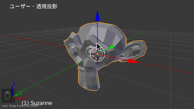
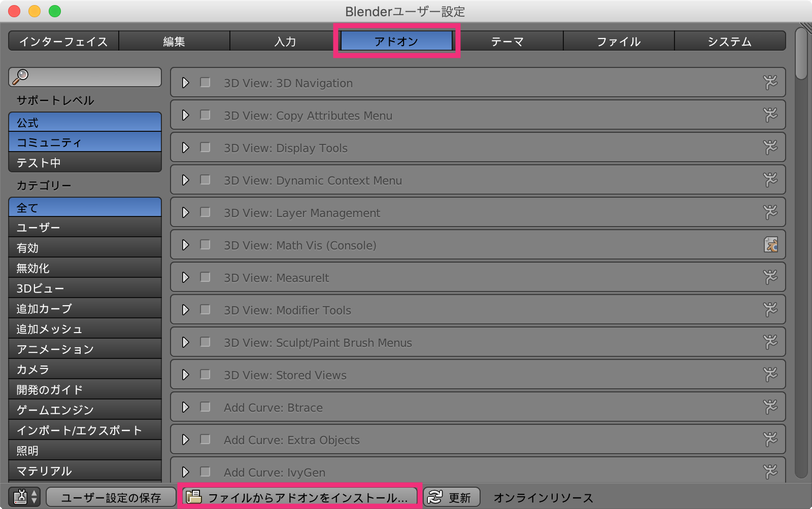
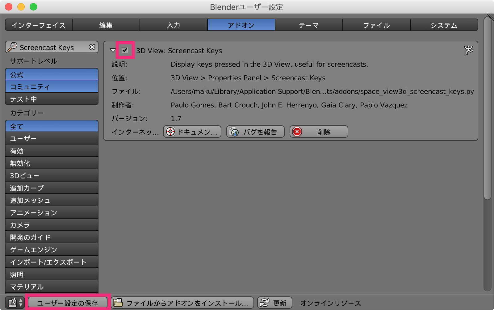
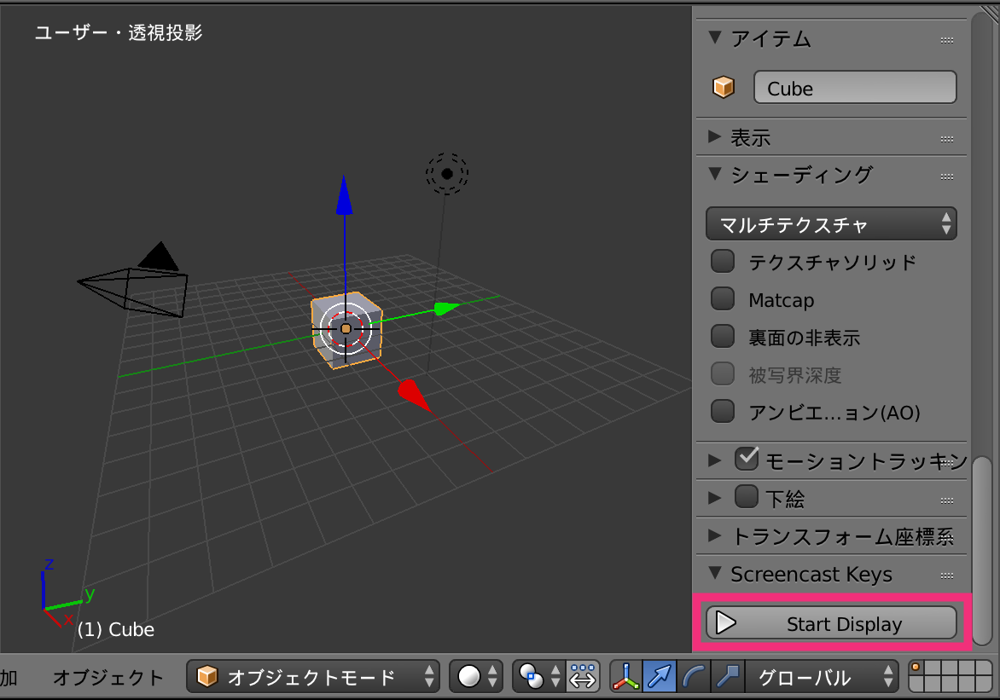

Screencast Keys アドオンとは？
----

**Screencast Keys** というアドオンを使用すると、3D ビュー・エディタでの操作（キーボード＆マウス操作）を画面の左下に表示することができます。
Blender の操作説明の動画を作成するときなどに便利です。

{: .center }

Screencast Keys アドオンのダウンロード
----

Screencast Keys アドオンは、Python のスクリプトとして提供されているため、下記からダウンロードしてください。

- [space_view3d_screencast_keys.py](https://svn.blender.org/svnroot/bf-extensions/trunk/py/scripts/addons/space_view3d_screencast_keys.py)（[ミラー](./files/space_view3d_screencast_keys.py.txt)）

Screencast Keys アドオンのインストール
----

1. <kbd>Ctrl + Alt + U</kbd> (<kbd>Cmd + [,]</kbd>) でユーザ設定 (User Preference) を開く
2. <samp>アドオン</samp> タブの <samp>ファイルからアドオンをインストール...</samp> ボタンを押して、ダウンロードしたスクリプトを選択

{: .center }

すると、アドオンの一覧に <samp>Screencast Keys</samp> が表示されるので、**チェックボックスを ON** にして有効化します。

{: .center }

Screencast Keys アドオンを使用する
----

Screencast Keys による入力の表示を開始するには、下記のようにします。

1. 3D ビュー・エディタ上で <kbd>N</kbd> キーを押してプロパティ・リージョンを開く
2. プロパティ・リージョンの一番下にある <samp>Screencast Keys</samp> パネルの <kbd><samp>Start Display</samp></kbd> ボタンを押す

{: .center }

