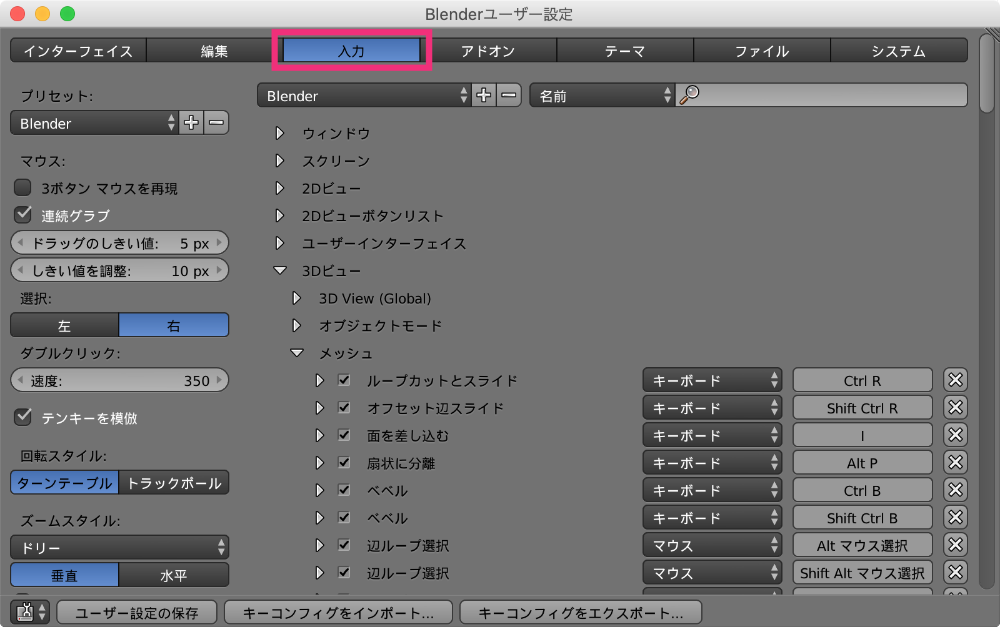
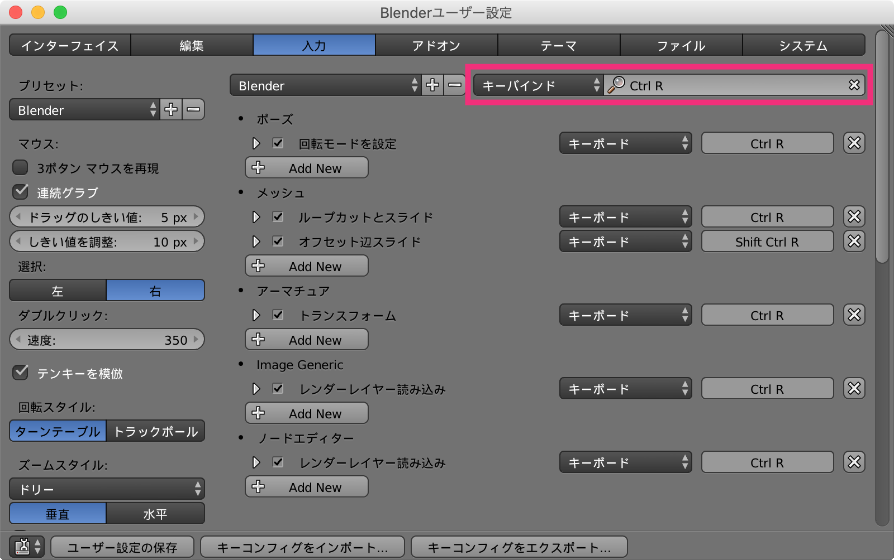

すべてのキーバインドを表示する
----

Blender ですべてのキーバインドを確認するには、<kbd>Ctrl + Shift + U</kbd>（あるいは <kbd>Cmd + ,</kbd>）でユーザ設定 (User Preference) を開き、<samp>入力 (Input)</samp> のタブを選択します。

{: .center }

各 UI ごとに分類されてショートカットキーの一覧が表示されます。

あるキーに割り当てられた操作を調べる
----

特定のキーコンビネーションに割り当てられている操作を確認するには、右上のプルダウンから <samp>キーバインド (Key-Binding)</samp> を選択し、キーの名前を入力します。
例えば、<kbd>Ctrl + R</kbd> の組み合わせに割り当てられている操作を調べるには、**`Ctrl R`** と入力します（`+` や `-` は入力しないことに注意してください）。

{: .center }

同一のショートカットキーであっても、エディタごとに異なる操作が割り当てられているため、上記のようにエディタごとの割り当てが表示されます。

