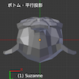
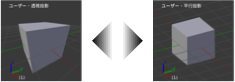
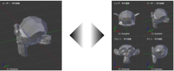
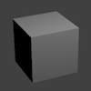

Blender 全般
----

<table class="local-example">
  <tr>
    <td><kbd>Ctrl + Up</kbd> / <kbd>Ctrl + Down</kbd> / <kbd>Shift + Space</kbd></td>
    <td>カーソル下のエディタを最大化</td>
  </tr>
  <tr>
    <td><kbd>Alt + F10</kbd></td>
    <td>エディタのメイン領域をフルスクリーン表示</td>
  </tr>
  <tr>
    <td><kbd>Ctrl + Alt + U</kbd> / <kbd>Cmd + [,]</kbd></td>
    <td>User Preference（ユーザ設定）を開く</td>
  </tr>
</table>

「3Dビュー」エディタのショートカットキー
----

### 選択

選択のショートカットキーは、<kbd>A</kbd> / <kbd>B</kbd> / <kbd>C</kbd> を覚えるとよいです。

<table class="local-example">
  <tr>
    <td></td>
    <td><kbd>Ctrl + Tab</kbd>（編集モードのみ）</td>
    <td>メッシュ選択モードの切り替え（頂点／辺／面）</td>
  </tr>
  <tr>
    <td rowspan="2"></td>
    <td><kbd>右クリック</kbd></td>
    <td>カーソル下の要素を選択</td>
  </tr>
  <tr>
    <td><kbd>Shift + 右クリック</kbd></td>
    <td>連続選択</td>
  </tr>
  <tr>
    <td></td>
    <td><kbd>A</kbd></td>
    <td>全てを選択／解除 ((De)select All)</td>
  </tr>
  <tr>
    <td rowspan="2"></td>
    <td><kbd>B</kbd> → <kbd>ドラッグ</kbd></td>
    <td>矩形で囲んで選択 (Border Select)</td>
  </tr>
  <tr>
    <td><kbd>B</kbd> → <kbd>Shift + ドラッグ</kbd></td>
    <td>〃解除</td>
  </tr>
  <tr>
    <td rowspan="2"></td>
    <td><kbd>C</kbd> → <kbd>左クリック</kbd></td>
    <td>円内の要素を選択 (Circle Select) （ホイールで円サイズ変更）</td>
  </tr>
  <tr>
    <td><kbd>C</kbd> → <kbd>Shift + 左クリック</kbd></td>
    <td>〃解除</td>
  </tr>
  <tr>
    <td rowspan="2"></td>
    <td><kbd>Ctrl + ドラッグ</kbd></td>
    <td>自由領域で囲んで選択</td>
  </tr>
  <tr>
    <td><kbd>Ctrl + Shift + ドラッグ</kbd></td>
    <td>〃解除</td>
  </tr>
  <tr>
    <td></td>
    <td><kbd>Ctrl + I</kbd></td>
    <td>選択の反転 (Inverse)</td>
  </tr>
</table>

### 視点（ビュー）の切り替え

ここでの数字キー <kbd>0</kbd>〜<kbd>9</kbd> や <kbd>+</kbd>/<kbd>-</kbd>/<kbd>.</kbd> キーは、テンキー上のキーを表しています。

<table class="local-example">
  <tr>
    <td></td>
    <td><kbd>-</kbd> / <kbd>+</kbd> / マウスホイール</td>
    <td>ズームイン／アウト</td>
  </tr>
  <tr>
    <td></td>
    <td><kbd>Shift</kbd> + 中央ボタンドラッグ</td>
    <td>視点の平行移動</td>
  </tr>
  <tr>
    <td></td>
    <td>中央ボタンドラッグ</td>
    <td>視点の回転</td>
  </tr>
  <tr>
    <td></td>
    <td><kbd>0</kbd></td>
    <td>カメラ視点</td>
  </tr>
  <tr>
    <td></td>
    <td><kbd>1</kbd></td><td>前</td>
  </tr>
  <tr>
    <td></td>
    <td><kbd>Ctrl + 1</kbd></td><td>後ろ</td>
  </tr>
  <tr>
    <td></td>
    <td><kbd>3</kbd></td><td>右</td>
  </tr>
  <tr>
    <td></td>
    <td><kbd>Ctrl + 3</kbd></td><td>左</td>
  </tr>
  <tr>
    <td></td>
    <td><kbd>7</kbd></td><td>上</td>
  </tr>
  <tr>
    <td></td>
    <td><kbd>Ctrl + 7</kbd></td><td>下</td>
  </tr>
  <tr>
    <td></td>
    <td><kbd>5</kbd></td>
    <td>透視投影 ↔︎ 平行投影</td>
  </tr>
  <tr>
    <td></td>
    <td><kbd>Ctrl + Alt + Q</kbd></td>
    <td>四分割表示 (Quad View)</td>
  </tr>
  <tr>
    <td></td>
    <td><kbd>Shift + C</kbd></td>
    <td>全てを表示 (View All) ... 全てのオブジェクトを表示するようにズーム</td>
  </tr>
  <tr>
    <td></td>
    <td><kbd>.</kbd></td>
    <td>選択したオブジェクトにズーム ★ある個所にフォーカスして編集するときに便利</td>
  </tr>
  <tr>
    <td></td>
    <td><kbd>Shift + B</kbd> → 矩形選択</td>
    <td>矩形選択した部分にズーム</td>
  </tr>
  <tr>
    <td></td>
    <td><kbd>`</kbd>（バッククォート）</td>
    <td>全レイヤの表示／非表示</td>
  </tr>
</table>

### 全般

<table class="local-example">
  <tr>
    <td></td>
    <td><kbd>Tab</kbd></td>
    <td>オブジェクトモード ⇔ 編集モードの切り替え</td>
  </tr>
  <tr>
    <td></td>
    <td><kbd>Ctrl + Tab</kbd>（編集モード以外の時）</td>
    <td>オブジェクトモード ⇔ ウェイトペイントモードの切り替え</td>
  </tr>
  <tr>
    <td></td>
    <td><kbd>T</kbd></td>
    <td>ツールシェルフの表示</td>
  </tr>
  <tr>
    <td></td>
    <td><kbd>N</kbd></td>
    <td>プロパティリージョンの表示</td>
  </tr>
  <tr>
    <td></td>
    <td><kbd>Shift + S</kbd></td>
    <td>スナップメニューの表示 3D カーソルを原点に戻すときに使用</td>
  </tr>
  <tr>
    <td></td>
    <td><kbd>Ctrl + Space</kbd></td>
    <td>マニピュレーターの ON/OFF (Show Manipulator)</td>
  </tr>
</table>

### オブジェクトモード (Object Mode)

<table class="local-example">
  <tr>
    <td><kbd>Shift + A</kbd></td>
    <td>プリミティブ・オブジェクトを追加（メニュー表示）(Add Primitive Object)</td>
  </tr>
  <tr>
    <td><kbd>G</kbd></td>
    <td>移動 (Grab/Move)</td>
  </tr>
  <tr>
    <td><kbd>R</kbd></td>
    <td>回転 (Rotate)</td>
  </tr>
  <tr>
    <td><kbd>S</kbd></td>
    <td>拡大縮小 (Scale)</td>
  </tr>
  <tr>
    <td><kbd>X</kbd></td>
    <td>削除 (Delete)</td>
  </tr>
  <tr>
    <td><kbd>Shift + D</kbd></td>
    <td>複製 (Duplicate)</td>
  </tr>
  <tr>
    <td><kbd>U</kbd></td>
    <td>UV マッピング (UV Mapping)（メニュー表示）</td>
  </tr>
</table>

### 編集モード (Edit Mode)

<table class="local-example">
  <tr>
    <td></td>
    <td><kbd>Shift + A</kbd></td>
    <td>メッシュを追加（メニュー表示）</td>
  </tr>
  <tr>
    <td></td>
    <td><kbd>W</kbd></td>
    <td>スペシャル・メニューを表示 (Special Menu)</td>
  </tr>
  <tr>
    <td></td>
    <td><kbd>Ctrl + E</kbd></td>
    <td>辺メニューを表示 (Edges Menu)</td>
  </tr>
  <tr>
    <td></td>
    <td>3 つ以上の頂点を選択して <kbd>F</kbd></td>
    <td>面の作成 (Make Face) ... 選択した辺・頂点を繋ぐように面・辺を作成</td>
  </tr>
  <tr>
    <td></td>
    <td><kbd>Alt + F</kbd></td>
    <td>面を張る ... 選択した頂点を閉じるように三角形の面を作成</td>
  </tr>
  <tr>
    <td></td>
    <td><kbd>I</kbd></td>
    <td><a href="../3dview/insert-face.html">面を差し込む (Insert Faces)</a></td>
  </tr>
  <tr>
    <td></td>
    <td><kbd>E</kbd></td>
    <td><a href="../3dview/extrude.html">面の押し出し (Extrude Region)</a></td>
  </tr>
  <tr>
    <td></td>
    <td><kbd>Ctrl + R</kbd></td>
    <td><a href="../3dview/loopcut.html">ループカットとスライド (Loopcut and Slide)</a></td>
  </tr>
  <tr>
    <td></td>
    <td><kbd>K</kbd> → クリック繰り返し</td>
    <td>ナイフ (Knife)</td>
  </tr>
  <tr>
    <td></td>
    <td><kbd>W</kbd> → <samp>Subdivide</samp></td>
    <td>（面の）細分化 (Subdivide)</td>
  </tr>
  <tr>
    <td></td>
    <td><kbd>W</kbd> → <samp>Subdivide</samp></td>
    <td>（辺の）細分化 (Subdivide)</td>
  </tr>
  <tr>
    <td></td>
    <td><kbd>J</kbd></td>
    <td>頂点の経路を連結 (Connect Vertext Path) <small>既存の面を分割</small></td>
  </tr>
  <tr>
    <td></td>
    <td>2 つの頂点を選択して <kbd>F</kbd></td>
    <td>辺の作成 <small>面を分割したいときは <kbd>J</kbd> を使うこと</small></td>
  </tr>
  <tr>
    <td></td>
    <td><kbd>Alt + M</kbd></td>
    <td>選択した頂点を結合 (Merge)</td>
  </tr>
  <tr>
    <td></td>
    <td><kbd>Ctrl + T</kbd></td>
    <td>面を三角化 (Triangulate Faces)</td>
  </tr>
  <tr>
    <td></td>
    <td><kbd>Alt + J</kbd></td>
    <td>三角面を四角面に (Tris to Quads)</td>
  </tr>
</table>

### シェーディング（陰影処理）の切り替え

<table class="local-example">
  <tr>
    <td></td>
    <td></td>
    <td>ソリッド <small>デフォルトの表示</small></td>
  </tr>
  <tr>
    <td></td>
    <td><kbd>Shift + Z</kbd></td>
    <td>レンダー <small>レンダリング結果をプレビュー表示</small></td>
  </tr>
  <tr>
    <td></td>
    <td>（なし）</td>
    <td>マテリアル <small>GLSL (OpenGL Shading Language) で描画。光源が反映される</small></td>
  </tr>
  <tr>
    <td></td>
    <td><kbd>Alt + Z</kbd></td>
    <td>テクスチャー <small>テクスチャを貼った状態で表示</small></td>
  </tr>
  <tr>
    <td></td>
    <td><kbd>Z</kbd></td>
    <td>ワイヤーフレーム <small>辺のみを表示</small></td>
  </tr>
  <tr>
    <td></td>
    <td>（なし）</td>
    <td>バウンディングボックス <small>オブジェクトの範囲を直方体で表示</small></td>
  </tr>
</table>

