UV 展開／マッピングとは
----

複雑な形状のメッシュに、画像などをテクスチャマッピングするには、まずは三次元表現のオブジェクトを平面に展開してからマッピングします。
この展開のことを **UV 展開**と言います。
三次元表現で xyz 座標系に配置されていたオブジェクトは、UV 展開後は uv 座標系にマッピングされます。

シームを付ける (Mark Seam)
----

UV 展開を行うには、三次元オブジェクトを、どの辺で切り離して展開するかを指定しなければいけません。
この辺の指定のことを、**シームを付ける (Mark Seam)** と言います。

シームを付けるには、編集モードで対象となる辺を選択し、<kbd>Ctrl-E</kbd> で表示される辺メニューから <kbd><samp>シームを付ける</samp></kbd> を選択します。
あるいは、3D ビューのツールシェルフから、<kbd><samp>シェーディング/UV</samp></kbd> タブを選択し、<kbd><samp>シームを付ける</samp></kbd> ボタンを押します。

<figure>
  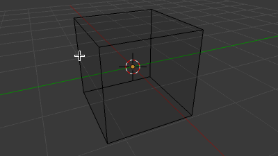
  <figcaption>
    <ol>
      <li>シーム対象の辺を選択（<kbd>Shift</kbd>押しながら右クリック）</li>
      <li><kbd>Ctrl-E</kbd>（Edges メニューを表示）</li>
      <li><kbd><samp>シームを付ける</samp></kbd> を選択</li>
    </ol>
  </figcaption>
</figure>

シームの付いた辺は、赤色に変化します。

<kbd>Z</kbd> キーを押して、3D ビューの表示モードを <em>ワイヤーフレーム</em> に切り替えると、辺を選択しやすくなります。

UV/画像エディターを表示する
----

UV マッピングを行うには、**UV/画像エディター** を使用し、三次元オブジェクトと UV 平面の対応付けを行っていきます。
この作業を行うときは、3D ビューエディターと、UV/画像エディターを同時に表示しておくと対応付けが分かりやすくなります。

Blender がデフォルトで用意しているスクリーンレイアウトである、**UV Editing** レイアウトを使用するとよいでしょう。
左側にUV/画像エディター、右側に3Dエディターというレイアウトに切り替わります。

<figure>
  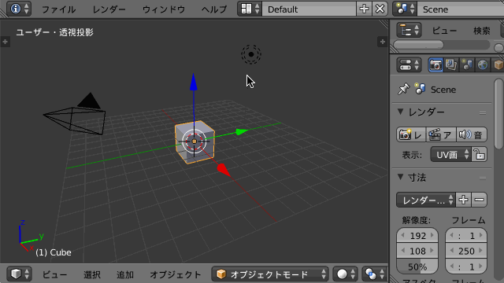
  <figcaption>インフォエディターから <kbd><samp>UV Editing</samp></kbd> レイアウトに切り替える方法</figcaption>
</figure>

現在のエディターを分割して、一方を UV/画像エディターに切り替える方法もあります。

<figure>
  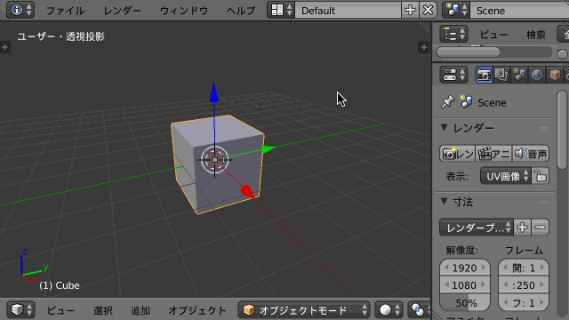
  <figcaption>3Dビューエディターを分割し、一方を <kbd><samp>UV/画像エディター</samp></kbd> に切り替える方法</figcaption>
</figure>

UV 展開を実行する
----
辺のシームを付け終わったら、実際に UV 展開を行います。
展開対象の面をすべて選択し、<kbd>U</kbd> キーを押して UV マッピングメニューを表示し、<kbd><samp>展開</samp></kbd> を選択します。
あるいは、ツールシェルフの<samp>シェーディング</samp>タブから、<kbd><samp>展開</samp></kbd> → <kbd><samp>展開</samp></kbd> と選択します。

<figure>
  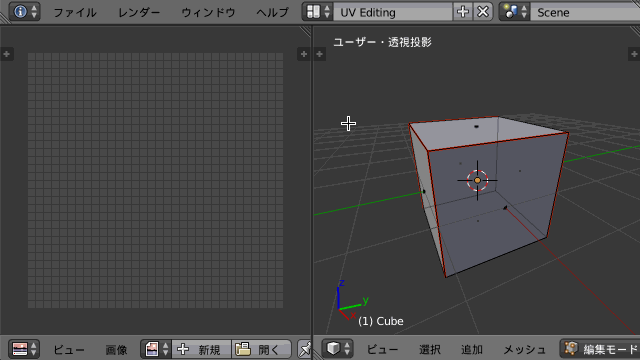
  <figcaption>
    <ol>
      <li>面選択モードに切り替える (<kbd>Ctrl-Tab</kbd>)</li>
      <li>全ての面を選択 (<kbd>A</kbd> キー)</li>
      <li><kbd>U</kbd> キー</li>
      <li><kbd><samp>展開</samp></kbd> を選択</li>
    </ol>
  </figcaption>
</figure>

UV マッピング用のテクスチャを作成する
----
UV マッピング用のテクスチャ画像は、Blender で出力する UV 配置画像をベースにして作成します。
UV 配置画像は、下記のようにして出力できます。

<figure>
  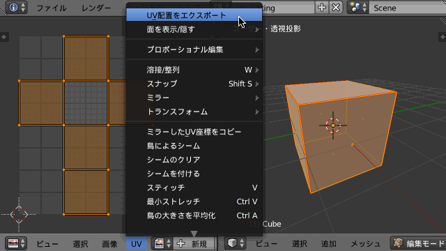
  <figcaption>
    <ol>
      <li>UV/画像エディターのヘッダから <kbd><samp>UV</samp></kbd> → <kbd><samp>UV配置をエクスポート</samp></kbd></li>
      <li>PNG ファイル名を入力して保存</li>
    </ol>
  </figcaption>
</figure>

出力される画像は、下記のように外形だけが分かる、背景色が透過されたものになっています。

<figure>
  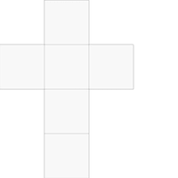
  <figcaption>出力される UV 配置画像</figcaption>
</figure>

このファイルをペイント系ソフトに読み込み、テクスチャ画像を作成します。
レイヤー機能の使えるツールを使用するのがよいでしょう（ここでは、mac のベクター編集ソフトである Graphic を使っています）。

<figure>
  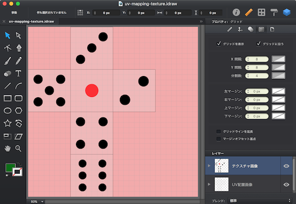
  <figcaption>出力される UV 配置画像</figcaption>
</figure>

作成したテクスチャ画像を保存するときは、ベースとなる UV 配置画像のレイヤは非表示にして書き出します。

<figure>
  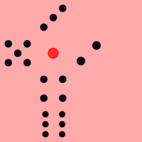
  <figcaption>完成したテクスチャ画像</figcaption>
</figure>

テクスチャ画像を適用する
----
テクスチャ画像が完成したら、オブジェクトに適用します。

3D ビューをオブジェクトモードにし、立方体のオブジェクトを選択します。
プロパティエディタの<kbd><samp>テクスチャ</samp></kbd>タブを選択し、テクスチャのタイプを <kbd><samp>画像または動画</samp></kbd> に設定します。

<figure>
  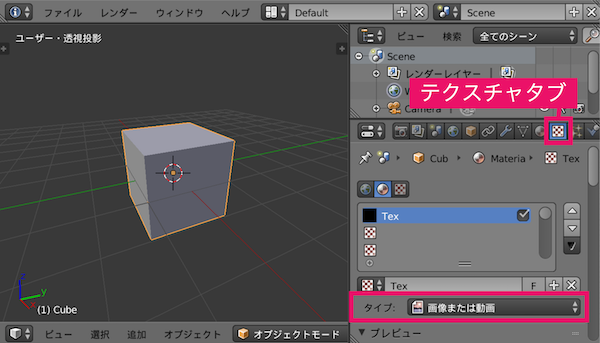
  <figcaption>テクスチャタイプを <kbd><samp>画像または動画</samp></kbd> に設定</figcaption>
</figure>

画像の●●●●● で、開くボタンを押して、テクスチャ画像を読み込みます。

<figure>
  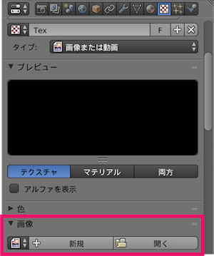
  <figcaption>テクスチャ画像を読み込み</figcaption>
</figure>

最後に、UV/画像エディタでマッピングした通りの座標に、テクスチャ画像を適用するための設定を行います。

<figure>
  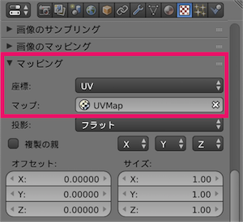
  <figcaption>
    <ol>
      <li><samp>座標</samp> に <kbd><samp>UV</samp></kbd> を指定</li>
      <li><samp>マップ</samp> に <kbd><samp>UVMap</samp></kbd> を指定</li>
    </ol>
  </figcaption>
</figure>

マッピングの設定が完了したら、<kbd>Shift-Z</kbd> を押して、描画モードをレンダリングに切り替えると、テクスチャマッピングされたオブジェクトを確認することができます。

<figure>
  
</figure>

