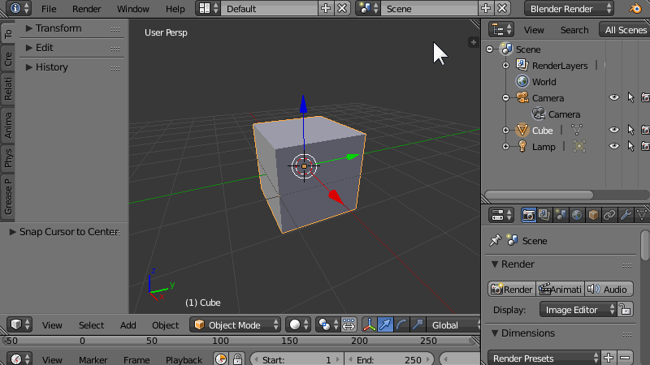

<figure>
  
  <figcaption><kbd>Shift</kbd> キー押しながら三角アイコンをドラッグ</figcaption>
</figure>

エディタの左下や左上にある三角のマーク（サイズ変更用のアイコン）を、<kbd>Shift</kbd> キーを押しながらドラッグすると、エディタを複製して、専用の新規ウィンドウとして作成することができます。
必要なくなったら、<kbd>[×]</kbd> を押してウィンドウごと閉じてしまえば OK です。

マルチディスプレイ環境などでは、この機能を使って、一つのディスプレイを 3D ビューエディタ専用にしてしまうと、画面を広く使えて便利です。

