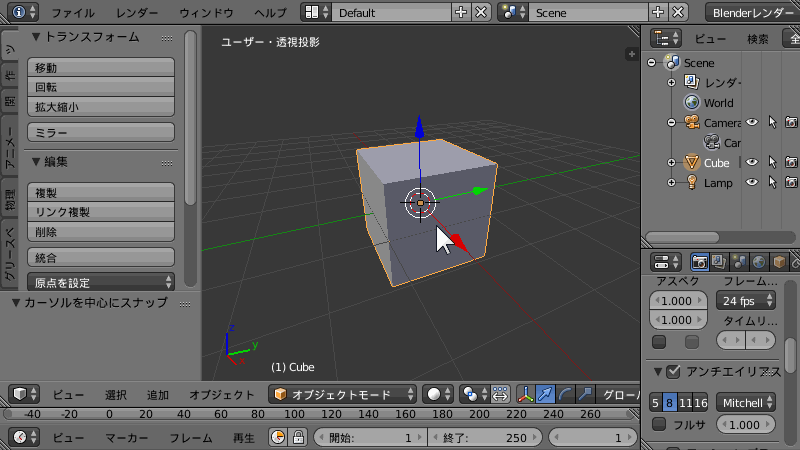

エディタを最大化する
----

<figure>
  
  <figcaption><kbd>Shift-Space</kbd> or <kbd>Ctrl-Up</kbd> or <kbd>Ctrl-Down</kbd></figcaption>
</figure>

任意のエディタ（上記の例では 3D ビュー）の上にマウスカーソルがある状態で、<kbd>Shift-Space</kbd> と押すると、そのエディタをウィンドウいっぱいに表示することができます（インフォエディタ以外の他のエディタが非表示になります）。
もう一度同じ操作を行うと、元の表示に戻ります。

エディタのメイン領域を最大化する
----

<figure>
  
  <figcaption><kbd>Alt-F10</kbd></figcaption>
</figure>

任意のエディタ（上記の例では 3D ビュー）の上にマウスカーソルがある状態で、<kbd>Alt-F10</kbd> でエディタのメイン領域をウィンドウいっぱいに表示することができます。
元に戻すときは、マウスカーソルを右上に持っていったときに表示されるアイコンをクリックするか、もう一度 <kbd>Alt-F10</kbd> を押します。

