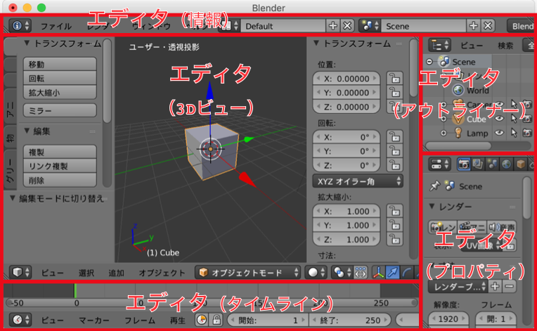
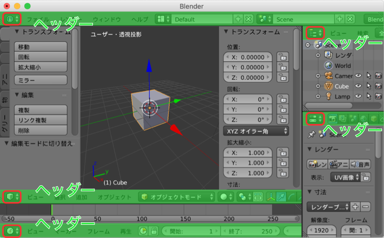
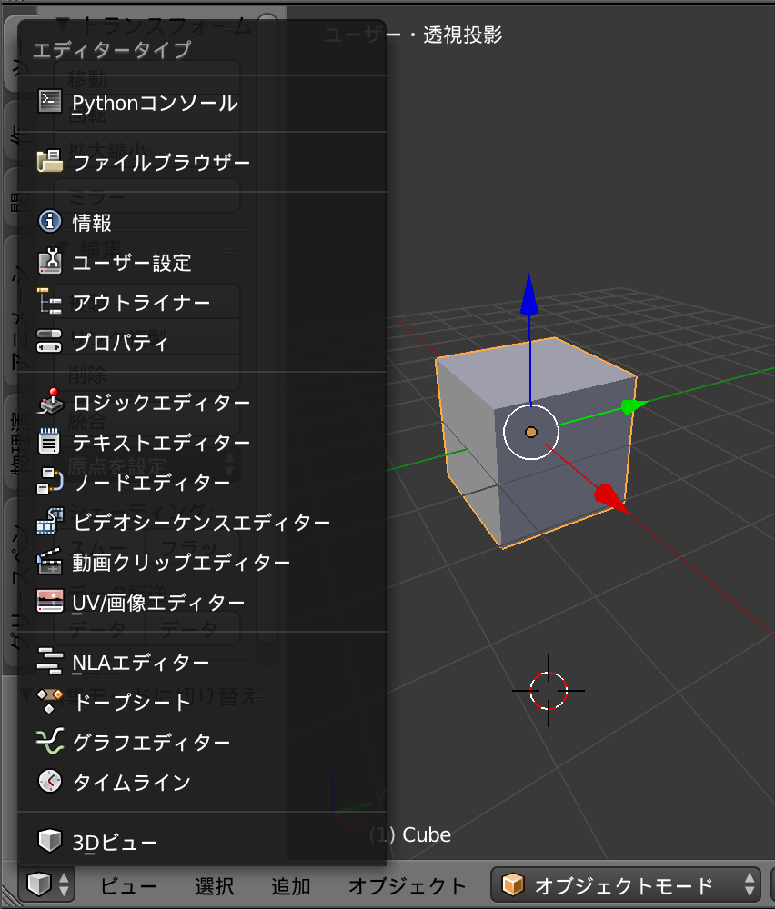
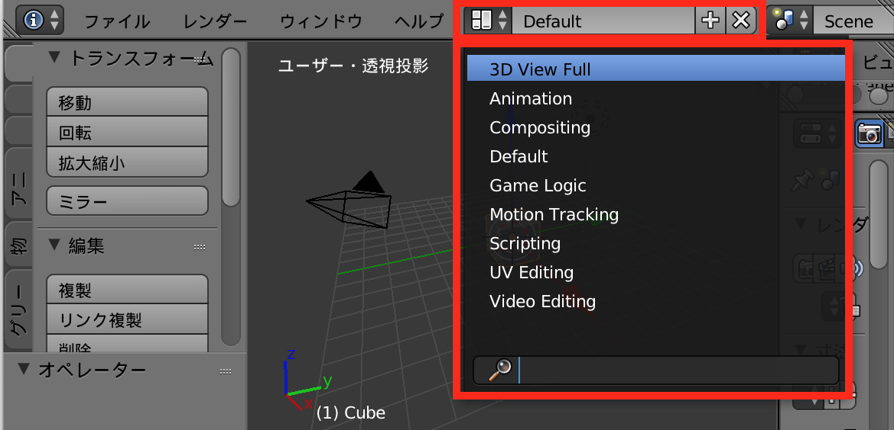
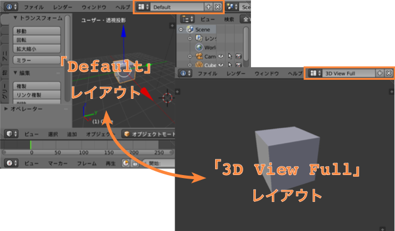
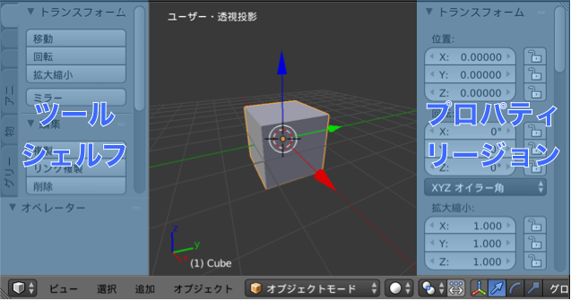
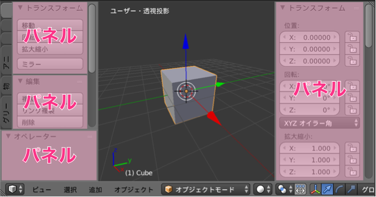

Blender の画面構成を理解することは、Blender の使い方を効率に学ぶためのポイントになります。
1つのウィンドウ内にたくさんの部品が並んでいるため、最初はチンプンカンプンになりますが、下記のようにひとつずつ理解していけばとても体系立てて構成されていることがわかると思います。

ウィンドウはエディタの組み合わせ
----

Blender のウィンドウには色々な部品が配置されているように見えますが、大きな単位としては**エディタ**の組み合わせによって構成されています。
下記の赤枠で囲まれたものは、すべてエディタです。

{: .center }

ウィンドウ全体が、エディタで敷き詰められていることがわかると思います。
デフォルトのレイアウトでは、「情報」、「3Dビュー」、「タイムライン」、「アウトライナー」、「プロパティ」のエディタが配置されていますが、これらの配置は自由に入れ替えることができます。

各エディタにはヘッダーが付いている
----

各エディタの上端、あるいは下端には**ヘッダー**が配置されています。

{: .center }

ヘッダーをエディタの上部と下部のどちらに配置するかは、ヘッダー部分を右クリックして表示されるメニューから切り替えることができます。
デフォルトでは、「3Dビュー」エディタのヘッダーは下部に、「アウトライナー」エディタのヘッダーは上部に表示されています。

ヘッダーの左端には、エディタの種類を切り替えるための**タイプ切替ボタン (Editor Type Selector)** がついており、ここに表示されたアイコンを見れば、何のエディタが表示されているかを判別することができます（図の赤丸のところ）。

例えば、「3Dビュー」エディタのタイプ切替ボタンを押すと、下記のようにエディタの種類が一覧表示され、好きなエディタに切り替えることができます。

{: .center }

レイアウトセレクタでエディタ配置を変更する
----

Blender は、それぞれの作業に適したエディタ配置をあらかじめ色々用意しています。
このエディタ配置のことを**スクリーン**と呼び、「情報」エディタのヘッダーに表示されている**スクリーンレイアウトセレクタ**から切り替えることができます。

{: .center }

デフォルトでは「Default」というレイアウト（エディタ配置）が選択されています。
下記はセレクタから「3D View Full」レイアウトに切り替えたときの表示の変化を示しています。

{: .center }

レイアウトの切り替えは基本的には「情報」エディタのセレクタから行いますが、<kbd>Ctrl-Left</kbd> / <kbd>Ctrl-Right</kbd> というショートカットキーでもレイアウトを切り替えることができます。
このショートカットキーを使用すれば、「情報」エディタのヘッダが表示されていなくてもレイアウトを切り替えることが可能です。

細かい構成要素の名前
----

各エディタの下には、さらに細かい単位の構成要素が配置されています。
例えば、「3Dビュー」エディタの左側には**ツールシェルフ**（<kbd>T</kbd>キーでOn/Off）、右側には**プロパティリージョン**（<kbd>N</kbd>キーでOn/Off）が配置されています。

{: .center }

この「プロパティ」リージョンは、より大きな UI 構成要素である「プロパティ」エディタとは異なるものなので混同しないようにしましょう。
プロパティリージョンは、あくまで「3Dビュー」エディタなどのエディタ内の構成要素です。

エディタごとに構成要素は異なるため、各エディタを使用する際に少しずつ慣れていきましょう。
構成要素の表示・非表示は、各エディタのヘッダーの「ビュー」メニューや、ショートカットキーなどを使用して切り替えることができます。

▼（下矢印）や ▶（右矢印）で開閉できる要素は**パネル**と呼ばれており、複数の項目をまとめる UI パーツとしては一番細かいものです。

{: .center }

ここまでを理解すれば、一見複雑に見える Blender のウィンドウの中で迷子になることはないでしょう（もちろん、各エディタの使い方は個別に学ぶ必要がありますが）。

