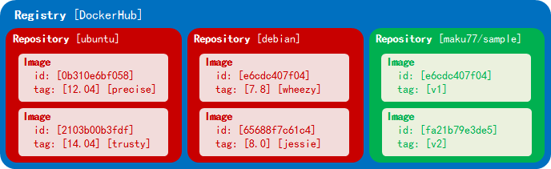

Registry / Repository / Image / Tag の概念
====

* DockerHub などのレジストリ上では、複数のリポジトリが管理されている。
* Top-level リポジトリでは、ubuntu や devian といった有名どころなものが管理されている。
* Top-level リポジトリ以外に、ユーザリポジトリがあり、こちらは `<user>/` というプレフィックスが付く。
* 各リポジトリ内には複数のイメージがあり、イメージ ID やタグで指定できる。
* 1 つのイメージに対しては唯一の ID が付けられるが、タグは複数付けられていることがある。

イメージ関連のコマンド
====

| コマンド | 内容 |
| -------- | ---- |
| `docker pull <user>/<repo>:<tag>` | Resitry から ubuntu イメージを取得 |
| `docker images` | Host 上のイメージの一覧 |
| `docker search <repo>` | DockerHub 上のリポジトリを検索※ |
| `docker inspect <user>/<repo>:tag` | イメージの詳細を確認 |
| `docker build -t <user>/<repo>:<tag> <dir>` | Dockerfile からイメージを作成 |
| `docker build --no-cache ...` | ビルド時にキャッシュを使わない |

※リポジトリ内のタグは、下記のサイトから調べることができます。

- https://registry.hub.docker.com/

コンテナ関連のコマンド
====

| コマンド | 内容 |
| -------- | ---- |
| `docker ps -l`   | 最後に作成されたコンテナの情報を確認 |
| `docker ps -lq`  | 最後に作成されたコンテナの ID だけ確認 |
| `docker commit -m "<Comment>" -a "<Author>" <ContainerID> <user>/<repo>:<tag>` | コンテナからイメージを作成 |

実行に関するコマンド
====

| コマンド | 内容 |
| -------- | ---- |
| `docker run -it ubuntu:12.04 /bin/bash` | シェルを起動して TTY 接続 |
| `docker run --rm -it ubuntu:12.04 /bin/bash` | 終了時に自動的にコンテナを破棄 |

Docker ファイルでの命令
====

| 命令 | 内容 |
| ---- | ---- |
| `# <comment>` | `#` で始まる行はコメント |
| `FROM <repo>:<tag>` | ベースイメージの指定 |
| `MAINTAINER <name> "<email>"` | イメージの作者情報 |
| `ENV http_proxy http://proxy.example.com:8888/` | プロキシの設定 |
| `ENV PATH $PATH:/foo/bar` | パスの追加 |
| `EXPOSE <portNumber>` | 公開するポート番号 |
| `RUN <command>` | コマンドの実行（`/bin/sh -c` による実行） |
| `RUN ["<arg1>", "<arg2>", "<arg3>"]` | コマンドの実行（シェルを使わない） |
| `WORKDIR <path>` | 作業ディレクトリの移動（`RUN cd` では次の命令に引き継がれない） |

