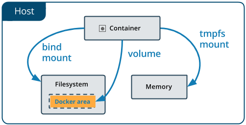
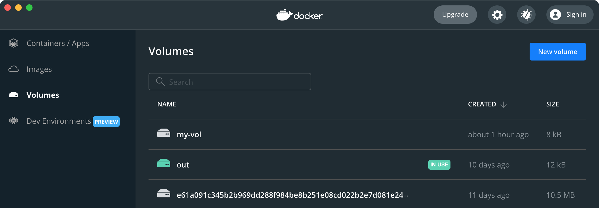

Docker の 3 種類のマウント
----

Docker コンテナ内で作成・編集した作業ファイルは、コンテナを停止 (`docker container stop`) しても消えてしまうことはありませんが、コンテナを削除 (`docker container rm`) した場合には消えてしまいます。
これは、コンテナ内のファイル群が、コンテナ内に閉じて存在しているからです（だからこそコンテナなのですが）。

Docker のマウント機能を用いると、コンテナ内の特定のディレクトリパス（の中のファイル群）をホスト PC 上のファイルシステムに関連付けることができるため、コンテナのライフサイクルとは切り離して作業ファイルを管理できるようになります。
マウントには下記で説明する 3 種類がありますが、作業ファイルをホスト PC 側に永続化したい場合は、「ボリュームマウント」か「バインドマウント」というマウントタイプを使用します。
もうひとつの「tmpfs マウント」は、その名のとおりテンポラリファイルにのみ使用できます。



（図は Docker 公式サイトより抜粋）

ボリュームマウント
: __ホスト PC 上にコンテナ用のデータファイルを作成__ し、コンテナ内の特定のディレクトリパスにマッピングします。
このデータファイルはポータビリティが高く、クラウド上に保存するということもできます（ボリュームドライバーが必要）。
複数のコンテナから 1 つのボリュームを共有することも可能です。
コンテナ内で作成したファイルの永続化には、このボリュームの使用が推奨されています。

バインドマウント
: __ホスト PC の特定のディレクトリ（絶対パス指定）__ を、コンテナ内の特定のディレクトリパスにマッピングします。
ボリュームと比べてポータビリティが低いため、名前付きボリュームの使用が推奨されてます。例えば、バインドマウントでは、ホスト側の多数のファイルとマッピングされてしまうため別環境に移しにくいとか、マウント時のパス表現が OS に依存してしまうといった欠点があります。
ホスト側からコンテナで操作したファイルをささっと覗いて見たいときはバインドマウントは便利ですが、これはコンテナ内で作成した危険なファイルが、そのままホスト上にも作られてしまうということを示しています。

tmpfs マウント
: __ホスト PC のメモリ領域__ を、コンテナ内の特定のディレクトリパスにマッピングします。コンテナ上でファイル生成を行うと、実際には一時的なメモリ領域に保存されることになるので、ここに保存されたファイルはコンテナを停止すると消えてしまいます。一時的なファイルを格納するディレクトリを tmpfs マウントすることで、コンテナサイズの増加を防ぐことができ（書き込みレイヤーに出力されない）、パフォーマンスの向上を見込めます。

上記で、「ホスト PC」といっているのは Docker コンテナの実行環境のことであり、Windows や macOS で Docker Desktop を使用している場合は、正確には Linux VM のことを示します。


ボリュームマウント (volume mount) の使い方
----

コンテナ内での作業内容（生成したファイル）をホスト PC 側に永続化したいときに最初に検討すべきは「ボリューム」の使用です。
ボリュームの実体はホスト PC 上のファイルシステム（Docker 管轄下）に永続化されたファイルであり、コンテナ側から見ると「ディレクトリ」として見えます。

### ボリュームを作成する (docker volume create)

ボリュームを明示的に作成するには次のように実行します（コンテナ実行時に自動生成することも可能です）。
ボリューム名を明示するので、名前付きボリューム (named volume) と呼ばれます。

```console
$ docker volume create my-vol
```

Docker ホスト上に存在しているボリュームの一覧を表示するには、次のように実行します。

```console
$ docker volume ls
DRIVER    VOLUME NAME
local     e61a091c345b2b969dd288f984be...
local     my-vol  ← 今回作成したボリューム
local     out
```

（ボリューム名がランダムな記号列になっているものは、匿名マウント時に自動生成されたボリュームです）

### ボリュームを削除する (docker volume rm/prune)

```console
### ボリューム名を指定して削除
$ docker volume rm my-vol

### 未使用のボリューム（どのコンテナからも参照されていないもの）をすべて削除
$ docker volume prune
```

### ボリュームマウントしてコンテナを起動する

コンテナ側の `/volume` というパスに、上記で作成した `my-vol` ボリュームをマウントして使ってみます。
ここでは、軽量の Alpine Linux イメージ (`alpine:latest`) を使ってコンテナを作成します。

```
### コンテナ (my-alpine) の作成
$ docker container create -it --mount src=my-vol,dst=/volume --name my-alpine alpine:latest

### コンテナが作成できているか確認
$ docker container ls -a
```

__`--mount`__ オプションの `src` や `dst` でボリューム名やマウント先のパスを指定します。

- __`src=<ボリューム名>`__ ... `src` ではなく `source` でも OK。存在しないボリューム名を指定すると、その名前のボリュームが自動的に生成されます。`src` パラメーターを省略すると、ランダムな16進文字列の名前のボリュームが生成されます。
- __`dst=<コンテナ側のパス>`__ ... `dst` ではなく `destination` や `target` でも OK。
- __`type=<マウントタイプ>`__ ... ボリュームマウントの場合は省略できます。マウントタイプとして `volume`、`bind`、`tmpfs` を指定します。

コンテナを作成したら、次のようにして起動してシェル接続できます。

```
$ docker start -ai my-alpine
```

コンテナ側の `/volume` というディレクトリが見えているかを確認してください。
この中にファイルを作成すると、ホスト OS 側のボリューム領域に内容が保存されるので、次回コンテナを起動 (`docker start`) したときにファイル編集作業の続きを行えます。
`my-volume` ボリュームを他のコンテナにマウントして共有するということもできます。

```
# ls /volume  # 初期状態は空っぽ
# echo Hello > /volume/hello.txt
# exit
```

### ボリュームファイルの格納場所

ボリュームのデータファイルは具体的にはホスト PC の `/var/lib/docker/volumes` に生成されますが、ボリュームは `docker volume` コマンドを介して操作するので、通常は保存先のパスを意識する必要はありません。
Windows や macOS で Docker Desktop を使用している場合は、Volumes タブでボリュームの一覧を確認することができます（Docker Desktop のバックエンドとして使われる Linux VM 上に格納されているため、Windows や macOS 上で上記のパスを探しても見つからないことに注意してください）。




バインドマウント (bind mount) の使い方
----

記載中 :)


tmpfs マウントの使い方
----

記載中 :)
