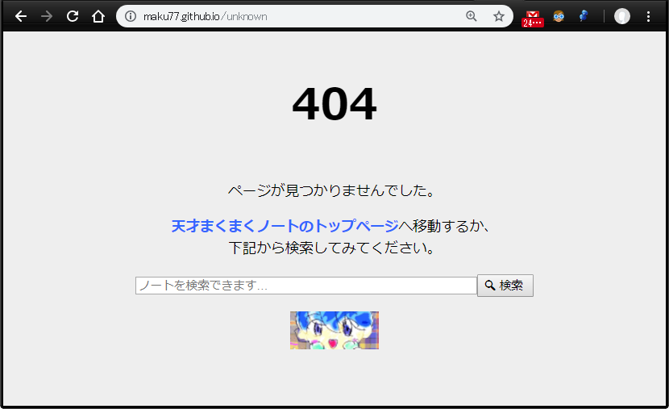

{: .center }

コンテンツファイル (`404.md`) の作成
----

まず、プロジェクトのルートディレクトリに `404.md` を作成し、`404.html` というページが出力されるようにします。

#### 404.md

~~~
---
title: "404"
layout: "404"
permalink: "/404.html"
---
~~~

他のページと同様に、404 ページも通常のレイアウトを使って表示してしまうことはできますが、ここでは 404 ページ専用のレイアウト (`_layouts/404.html`) を作成することにします。
具体的な HTML の内容はそちらに記述するので、`404.md` には上記のような Front matter だけを定義しておけば OK です。

レイアウトファイル (`_layouts/404.html`) の作成
----

404 ページの出力内容は特有のレイアウトになることが多いので、専用のレイアウトファイルで作成するのがオススメです。
ここでは、`_layouts/404.html` というパスにファイルを作成します（`404.md` の Front matter で指定したレイアウト名に合わせておく必要があります）。

#### _layouts/404.html

~~~ html
<!DOCTYPE html>
<html lang="ja">
<head>
  <meta charset="UTF-8">
  <meta property="og:title" content="{{ "{{" }} page.title }} | {{ "{{" }} site.name }}" />
  <title>{{ "{{" }} page.title }} | {{ "{{" }} site.name }}</title>
  <link rel="icon" sizes="16x16 32x32 48x48 64x64" href="/assets/img/favicon/favicon.ico" />
  <link rel="apple-touch-icon-precomposed" href="/assets/img/favicon/favicon-152.png" />
  
  {{ "
    {{ "
  {{ "
</head>
<body>
  <h1>{{ "{{" }} page.title }}</h1>
  

    
ページが見つかりませんでした。

    
<a href="{{ "{{" }} site.url }}">{{ "{{" }} site.name }}のトップページ</a>へ移動するか、 
       下記から検索してみてください。

    
{{ "

    

  

</body>
</html>
~~~

上記の例では、Google Analytics 用のコードも別ファイル (`_includes/analytics.html`) に定義して挿入するようにしています。
こうしておけば、404 ページへのアクセスも解析できるようになるので便利です。
Google Analytics を使用していないのであれば外してください。
また、404 ページからトップページへ飛ばすだけでは不親切なので、Google カスタム検索のためのフォーム (`_includes/search-bar.html`) も配置するようにしています。
このあたりは適宜調整してください。

上記のレイアウト内で、site 変数を使ってサイト名 (`site.name`) やロゴファイル名 (`site.logo`) を取得していますので、`_config.yml` の中で下記のような感じで設定しておいてください。

#### _config.yml

~~~ yaml
name: 天才まくまくノート
url: https://maku77.github.io
logo: /assets/img/logo.jpg
~~~

あとは、作成した `404.md` と `_layouts/404.html` を GitHub 上のリポジトリにプッシュすれば完成です。

参考サイト
----

* [Creating a custom 404 page for your GitHub Pages site - User Documentation](https://help.github.com/articles/creating-a-custom-404-page-for-your-github-pages-site/)

