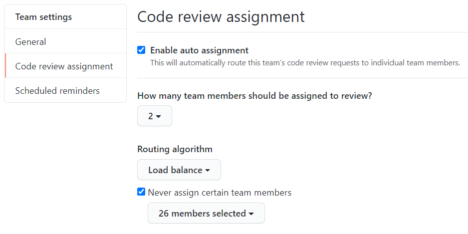

2019年の末に、GitHub にコードレビューワーの自動アサイン機能が[追加](https://github.blog/changelog/2019-11-12-code-review-assignment-beta/)されました。

- [Managing code review assignment for your team - GitHub Docs](https://docs.github.com/en/free-pro-team@latest/github/setting-up-and-managing-organizations-and-teams/managing-code-review-assignment-for-your-team)

この機能を有効にすると、Pull Request のレビューワーとしてチームをアサインしたときに、そのチーム内の数名を自動アサインしてくれるようになります。
この機能は、チーム単位の設定になるので、あらかじめリポジトリに何らかのチームを参加させておく必要があります。
チーム構成に迷ったら、プロジェクトと同じ粒度で作ってしまうのが手っ取り早いです（例えば、`MyApp` プロジェクトのチームとして、`team-MyApp` を作成します）。

自動アサインの設定画面は、チームのページから、__Settings__ → __Code review assignment__ と辿ると開くことができます。

{: .center }

上記の例では次のような設定を行っています。

- <b>自動アサインする人数:</b> 2人
- <b>選択アルゴリズム:</b> ロードバランス
- <b>アサイン対象外とする人:</b> （省略）

自動アサインのアルゴリズムとしては「ラウンドロビン」と「ロードバランス」を選択できます。
「ラウンドロビン」を選択すると、単純に順番に割り当てていきます。
「ロードバランス」を選択すると、最近レビュー活動を行っていない人から優先的に割り当てていきます。

自動アサインといっても、PR 作成時に完全自動でアサインされるわけではありません（チームを手動でアサインする必要がある）。
状況に応じて、この自動アサイン機能と、ユーザー単位の手動アサインを使い分けると便利です。

ちなみに、この自動アサインの設定は、Organization の Owner メンバーだけでなく、各チームで __team maintainer__ として登録されているユーザーが自由に行うことができます。
各チームのレビュー事情はチーム内の人が一番よく分かっているので、team maintainer をうまく設定してあげるとよいです。

