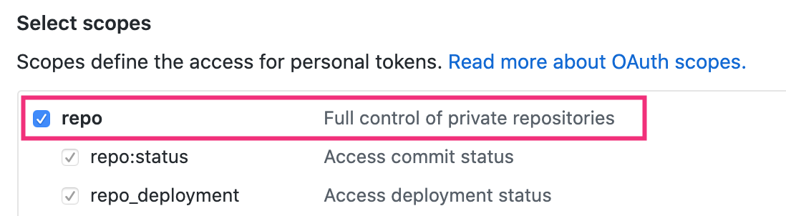

あるリポジトリの Issues の一覧を取得する
----

__`/repos/ユーザー名/リポジトリ名/issues`__ という REST API で、特定のリポジトリ内の Issue の一覧を取得することができます。
「ユーザー名」の部分は「Organization名」でも OK です。

下記は、`curl` コマンドを使って REST API を呼び出すサンプルです。
ユーザー名とリポジトリ名の部分は適切な値に変更してください。

### Public なリポジトリの場合

```
USER_NAME=myname
REPO_NAME=myrepo
curl https://api.github.com/repos/$USER_NAME/$REPO_NAME/issues
```

HTTP レスポンスのヘッダ情報も確認したい場合は、 __`-i`__ オプションを追加してください。
上記のような GET リクエストにより、Issue のリスト（PR も含む）が JSON 形式で返されます。
単純な GET リクエストなので、ブラウザで直接 URL を入力することでも情報を取得することができます。

下記は、1 つの Issue だけ含むリポジトリから情報を取得したときのサンプルです（この Issue には、ラベル1、ラベル2 という 2 つのラベルを設定しています）。

- [リポジトリの Issue のリストの例 (JSON)](github-rest-api-issues-001.txt)

Issue が 1 つも存在しない場合は、空の配列を示す JSON 文字列 (`[]`) が返されます。
リポジトリ名などが間違っている場合は、次のような JSON 文字列が返されます（レスポンスのステータスコードは `HTTP/1.1 404 Not Found` です）。

```json
{
  "message": "Not Found",
  "documentation_url": "https://developer.github.com/v3/issues/#list-issues-for-a-repository"
}
```

### Private なリポジトリの場合

Private なリポジトリの情報を単純に GET リクエストで取得しようとすると、間違ったリポジトリ名を指定した場合と同様の Not Found メッセージが返されます。
`403 Forbidden` ではなく、`404 Not Found` を返すのは、Private リポジトリの存在に気づかれないようにするためのセキュリティ上の対策とされています。

Private リポジトリから Issue の一覧を取得するには、GitHub の [Personal access token 設定](https://github.com/settings/tokens) で発行したトークンや、OAuth トークンを使ってアクセスする必要があります。
二要素認証を有効にしている場合でも、これらのトークンによるアクセスは有効です。
トークンは次のように HTTP リクエストの __`Authorization`__ ヘッダで指定します。

```
TOKEN=dd7bbe7538fd705d5350bc152c5e44d828d32b22
USER_NAME=myname
REPO_NAME=myrepo
curl -H "Authorization: token $TOKEN" https://api.github.com/repos/$USER_NAME/$REPO_NAME/issues
```

アクセストークンのスコープとしては、次のように `repo (Full control of private repositories)` を割り当てておく必要があるようです。

{:.center}


あるユーザーにアサインされた Issue の一覧を取得する
----

__`/user/issues`__ REST API を使用すると、認証済みユーザーにアサインされた Issue の一覧を取得することができます。
例えば、次のように、Personal Access Token を使った情報取得が可能です。

```
TOKEN=dd7bbe7538fd705d5350bc152c5e44d828d32b22
curl -H "Authorization: token $TOKEN" https://api.github.com/user/issues
```


取得する Issue の種類の制御
----

クエリ文字列で、取得する Issue を絞り込むことができます。

### open/closed の状態でフィルタ (state)

#### 例: Close 済みの Issue を取得する

```
USER_NAME=myname
REPO_NAME=myrepo
curl https://api.github.com/repos/$USER_NAME/$REPO_NAME/issues?state=closed
```

- `state=open` ... Open 状態の Issue のみ取得（デフォルト）
- `state=closed` ... Close 状態の Issue のみ取得
- `state=all` ... すべての Issue を取得

URL 末尾のクエリ文字列で指定する代わりに、次のように個々の __`--data`__ オプションで指定することもできます。
この場合は、POST メソッドではなく GET メソッドを使うことを __`-G`__ オプションで明示する必要があります。

```
curl -G --data "state=closed" https://api.github.com/repos/$USER_NAME/$REPO_NAME/issues
```

### あるラベルが付いているものだけ取得 (labels)

#### 例: 「ラベル1」というラベルを持つ Issue を取得する

```
curl -G --data-urlencode "labels=ラベル1" https://api.github.com/repos/$USER_NAME/$REPO_NAME/issues
```

__`labels`__ パラメータでは、複数のラベル名をカンマ区切りで指定することができます。
URL 末尾のクエリ文字列として指定することもできるのですが、日本語を含むラベル名などは URL エンコードした形で指定しなければいけないので、ここでは curl の __`--data-urlencode`__ オプションを使って `labels` パラメータを渡しています。

他にもいろいろパラメータがあるので、詳しくは下記の GitHub Developers Guide のサイトで確認してみてください。

- 参考: [Issues ｜ GitHub Developer Guide](https://developer.github.com/v3/issues/#parameters-3)

