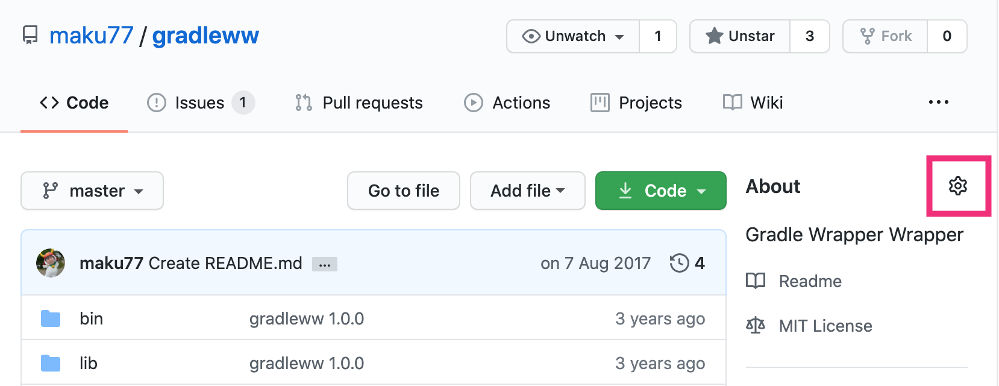
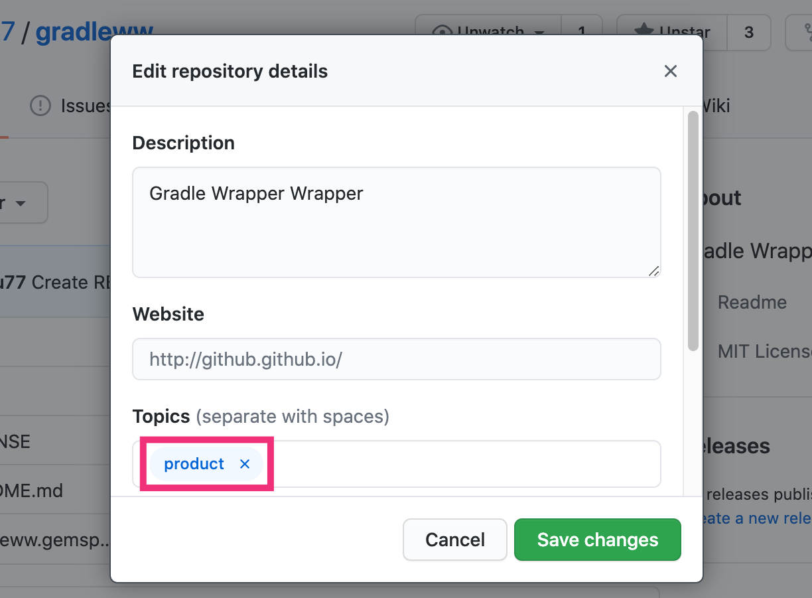
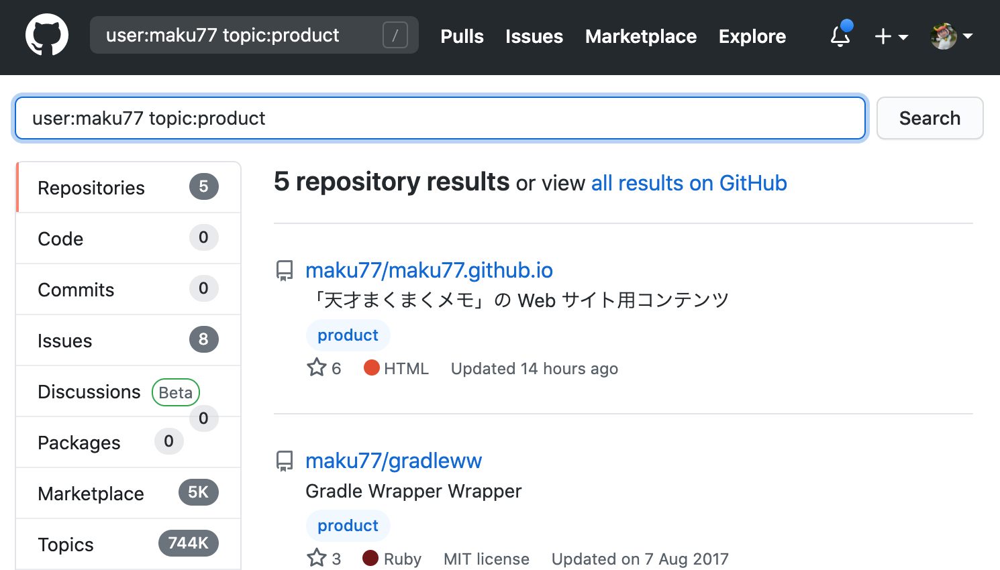

GitHub リポジトリのトピック機能
----

社内で GitHub を使っている場合、組織内 (GitHub organization) にたくさんのリポジトリがごちゃ混ぜになっているかもしれません。
例えば、製品アプリ用のリポジトリ、社内ツール用のリポジトリ、ドキュメント管理用のリポジトリなどなど。

このような場合は、__リポジトリのトピック機能__ を使用すると、リポジトリをグループ化して管理することができます。
例えば、一般ユーザーにリリースする予定の製品アプリには __`product`__ というトピックを付けるというルールで運用すると、製品アプリの一覧を簡単に作成することができます。
GitHub API を使ってリポジトリの一覧情報を取得すれば、高度な自動化処理を実現することができます。

GitHub リポジトリにトピックを割り当てる
----

リポジトリへのトピック割り当てはとても簡単です。
リポジトリのトップページを開き、右上の __歯車アイコンをクリック__ します。

{: .center }

すると、リポジトリの情報を入力するダイアログが開くので、__Topics__ の項目に任意のトピック名を入力します。
ここでは、製品アプリであることを示す `product` というトピックを付けています。

{: .center }

あとは、左上の検索窓などに __`topic:product`__ と入力すれば、組織内の製品アプリ用のリポジトリの一覧を表示することができます。

{: .center }

{: .center }

このときブラウザに表示されている URL を共有すれば、マネージャー陣にアプリリストを提出するということも簡単にできます。
製品別のトピックを付けて管理するのもいいですね！

