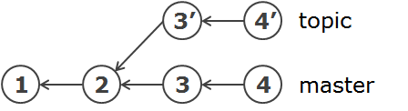
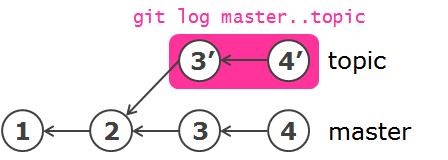
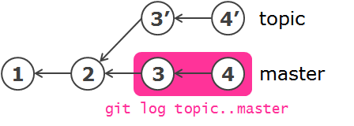
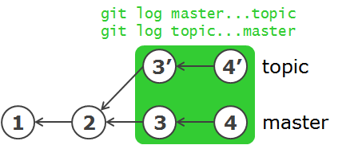

下記のようなブランチ構成になっているとします。



master ブランチには commit1, commit2, commit3, commit4 がコミットされており、topic ブランチは commit2 から分岐し、commit3' と commit4' がコミットされています。
topic ブランチにだけコミットされているものを調べるには以下のようにします（順番重要）。

```bash
$ git log master..topic
```

図で表すと、下記の部分のログだけを表示することになります。



正確には、後ろに指定したコミットからたどれるコミットのログのみを表示しています。トピックブランチを作って作業するスタイルを取っている場合は、このように差分チェックすれば、自分がトピックブランチに対してコミットした履歴のみ調べることができます。
逆に、master ブランチにだけコミットされているものを調べたいときは、指定順序を逆にします。



ブランチ名やコミット ID を省略すると、HEAD を指定したとみなされます。
つまり、現在 topic ブランチをチェックアウトしている場合は、下記のコマンドは同じ意味になります。

```bash
$ git log master..HEAD
$ git log master..topic
$ git log master..
```

下記の 3 コマンドも同じ意味になります。

```bash
$ git log topic..master
$ git log HEAD..master
$ git log ..master
```

master ブランチと topic ブランチのいずれかのブランチに含まれているコミットを調べたい場合は、ドット 2 (..) だったところをドット 3 つ (...) にします。
この場合は、ブランチの指定順序には意味がなくなります。



