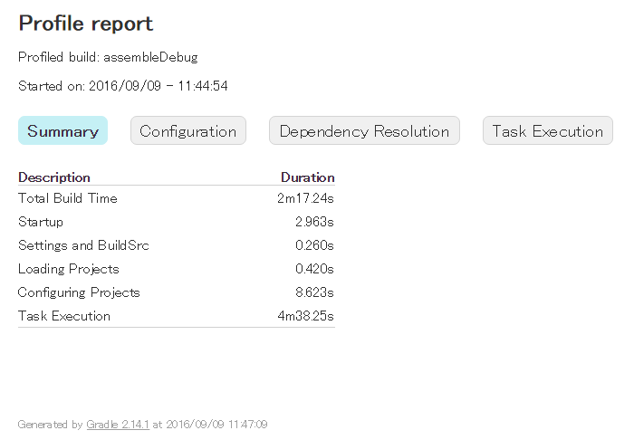

`gradle` コマンドを実行するときに、`--profile` オプションを追加して実行すると、ビルド中の各処理でどの程度時間がかかっているかのプロファイリング結果を出力してくれます。
プロファイリング結果は、`build/reports/profile` ディレクトリ以下に HTML ファイルとして出力されます。

#### 例: build/reports/profile/profile-2016-09-09-11-44-54.html

{:.center}

Gradle によるビルドがあまりにも遅いと感じたら、このプロファイリング機能を使ってボトルネックを探るとよいです。

