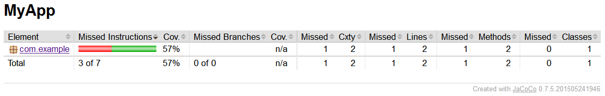

JaCoCo Plugin を使用すると、JUnit などによるユニットテスト結果のカバレッジレポートを生成することができます。
カバレッジレポートは、そのままブラウザで見ることのできる HTML 形式や、Jenkins などの CI サーバで扱う exec データなどの形式で出力できます。

* [Gradle JaCoCo Plugin](https://docs.gradle.org/current/userguide/jacoco_plugin.html)

#### HTML 形式のカバレッジレポートの例



下記は jacoco というタスクを定義する例です。

#### build.gradle

```groovy
apply plugin: 'java'
apply plugin: 'jacoco'

repositories {
    mavenCentral()
}

dependencies {
    testCompile 'junit:junit:4.+'
}

jacoco {
    toolVersion = "0.7.+"
    // reportsDir = file("$buildDir/reports/jacoco")
}

task jacoco(type: JacocoReport, dependsOn: 'test') {
    sourceSets sourceSets.main
    executionData = files(tasks.jacocoTestReport.executionData)
    reports {
        html.enabled = true
        xml.enabled = true
        csv.enabled = true
    }
}
```

カバレッジレポートを生成するには、ユニットテストの結果が必要なので、jacoco タスクは test タスクに依存するように定義しています。
テストカバレッジを生成するには、下記のように実行します。

```
$ gradle jacoco
:compileJava
:processResources UP-TO-DATE
:classes
:compileTestJava
:processTestResources UP-TO-DATE
:testClasses
:test
:jacoco

BUILD SUCCESSFUL

Total time: 8.697 secs
```

タスクの実行に成功すると、下記のようなファイルが生成されます。

* build/jacoco/test.exec（Jenkins の JaCoCo プラグインなどで使用）
* build/reports/jacoco/jacoco/html/index.html（ブラウザ表示用のレポート）
* build/reports/jacoco/jacoco/jacoco.csv（CSV 形式のレポート）
* build/reports/jacoco/jacoco/jacoco.xml（XML 形式のレポート）

ちなみに、Jenkins の JaCoCo プラグインなどでカバレッジレポートを生成する場合は、上記のタスクで生成した exec ファイルのフォーマットと、Jenkins のプラグインが想定するフォーマットのバージョンが合っていないとうまくカバレッジレポートが生成されない（0% になってしまう）ので、Jenkins と連携させる場合は、下記のように明確にバージョン指定しておいた方がよいです。
jacoco 0.7.4 と 0.7.5 ではフォーマットが変わっていてハマりました。

```groovy
jacoco {
    toolVersion = '0.7.4.201502262128'
}
```


おまけ: Android の場合
----

通常の Java プロジェクトではなく、Android プロジェクトのユニットテスト結果に対するレポートを作成するには、例えば以下のような感じで定義します。
java プラグインの代わりに com.android.application プラグインを読み込んでいるところ、test タスクの代わりに testDebug タスクに依存するようにするところなどが異なります。


#### build.gradle

```groovy
apply plugin: 'com.android.application'
apply plugin: 'jacoco'

android {
    /* skip */
}

jacoco {
    toolVersion = "0.7.+"
}

task jacoco(type: JacocoReport, dependsOn: 'testDebug') {
    reports {
        xml.enabled = true
        html.enabled = true
    }
    classDirectories = fileTree(
            dir: './build/intermediates/classes/debug',
            excludes: ['**/R.class',
                       '**/R$*.class',
                       '**/BuildConfig.class',
            ])
    sourceDirectories = files('src/main/java')
    executionData = files('build/jacoco/testDebug.exec')
}
```

