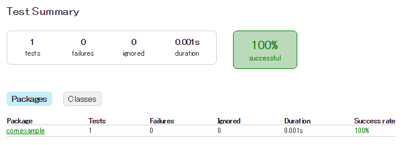

JUnit の設定とテストコードの作成
----
Java プロジェクトにおいて、JUnit を使ったユニットテストコードを記述する場合は、build.gradle スクリプトに下記のように JUnit を使用する設定を行っておきます。


#### build.gradle

```groovy
apply plugin: 'java'

repositories {
    mavenCentral()
}

dependencies {
    testCompile 'junit:junit:4.+'
}
```

テスト対象のプロダクトコードと、そのテストコードは、下記のようなディレクトリ構成で配置します。

- src/main/java/com/example/Sample.java（プロダクトコード）
- src/test/java/com/example/SampleTest.java（テストコード）

#### Sample.java（実装例）

```java
package com.example;

public class Sample {
    public static int add(int a, int b) {
        return a + b;
    }
}
```

#### SampleTest.java（実装例）

```java
package com.example;

import org.junit.Test;
import static org.junit.Assert.*;

public class SampleTest {
    @Test
    public void testAdd() {
        assertEquals(3, Sample.add(1, 2));
    }
}
```

ちなみに、JUnit 4.x 系では上記のようにアノテーションを使って記述しますが、JUnit 3.x までは下記のように TestCase クラスを継承する形で記述していました。後方互換性のため、JUnit 4.x を使っている場合でも、下記のように記述することができます。

```java
package com.example;

import junit.framework.TestCase;

public class SampleTest extends TestCase {
    public void testAdd() {
        assertEquals(3, Sample.add(1, 2));
    }
}
```

テストの実行
----

テストコードのビルド＆実行は、**test** タスクにより実行することができます。

```
$ gradle test
:compileJava
:processResources UP-TO-DATE
:classes
:compileTestJava
:processTestResources UP-TO-DATE
:testClasses
:test

BUILD SUCCESSFUL

Total time: 6.226 secs
```

もちろん、テストに失敗すればエラーが表示されます。

```
$ gradle -q test

1 test completed, 1 failed

FAILURE: Build failed with an exception.
...
```

実行結果からも分かるように、test タスクを実行すると、テストの実行に先立って、プロダクトコードのコンパイル (classes) とテストコードのコンパイル (testClasses) が実行されます。
テストが完了すると、下記のようなディレクトリにファイルが出力されます。

* build/classes/test/ -- コンパイルされたテストクラス
* build/test-results/ -- XML 形式のテスト結果（Jenkins などで使用）
* build/reports/tests/ -- HTML 形式のテスト結果（ブラウザでの確認用）

Gradle は HTML 形式で見やすいレポートを出力してくれます。
`build/reports/tests/index.html` をブラウザで開けば、詳細なレポートを確認できます。




実行されるテスト
----

test タスクを実行したときに実行されるテストは下記のようなものです。

* @Test でアノテートされたメソッド（JUnit と TestNG のどちらも認識する）
* @RunWith でアノテートされたクラス
* junit.framework.TestCase や groovy.util.GroovyTestCase を継承したクラス (JUnit 3.x)


特定のテストクラスだけを実行することもできます。
**test.single** というシステムプロパティで、クラス名のパターンを指定して test タスクを実行することにより、パターンに一致したテストクラスだけが実行されます。

下記の例では、クラス名が LargeTest で終わるテストクラスだけを実行しています。

```
$ gradle -Dtest.single=**/*LargeTest test
```


