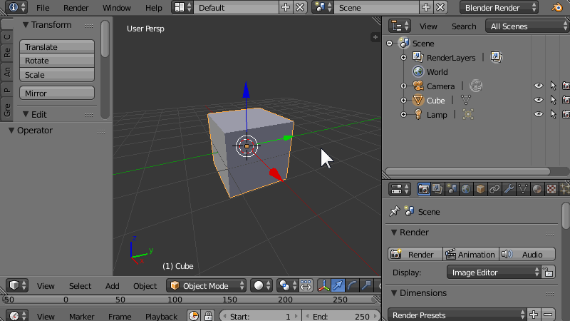

<figure>
  
  <figcaption><kbd>Ctrl</kbd> キーを押しながら三角アイコンをドラッグ</figcaption>
</figure>

エディタの左下や左上にある三角のマーク（サイズ変更用のアイコン）を、<kbd>Ctrl</kbd> キーを押しながら他のエディタ上にドラッグすると、2つのエディタの表示位置を入れ替えることができます。

上記の例では、画面右側に表示されている「アウトライナー」と「プロパティ」の2つのエディタ領域を入れ替えています。

