pandas の DataFrame から部分データを抽出する方法のまとめです。

指定した行と列の抽出
----

基本的に、行と列の __「名称」による抽出には `loc`__ プロパティを使い、__「数値」による抽出には `iloc`__ プロパティを使用します。
下記の例では、インデックス名（行名）に `Y1` 〜 `Y5`、カラム名（列名）に `X1` 〜 `X5` が設定されているものとします。

<style>
  .series { background: #cfc; color: #090; }
  .df { background: #cef; color: blue; }
  .scalar { background: #fdd; color: #a00; }
</style>
<table>
  <thead>
    <tr>
      <th>カテゴリ</th>
      <th>コード</th>
      <th>抽出のイメージ</th>
      <th>戻り値の型</th>
    </tr>
  </thead>
  <tbody>
    <tr>
      <td rowspan="1">スカラー値</td>
      <td>
        <code>df.loc["Y3", "X2"]</code><br />
        <code>df.iloc[2, 1]</code>
      </td>
      <td>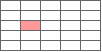</td>
      <td><code class="scalar">numpy.float64</code><br />など</td>
    </tr>
    <tr>
      <td rowspan="2">1 行の抽出</td>
      <td>
        <code>df.loc["Y2"]</code><br />
        <code>df.loc["Y2", :]</code><br />
        <code>df.iloc[1]</code><br />
        <code>df.iloc[1, :]</code>
      </td>
      <td>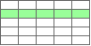</td>
      <td><code class="series">Series</code></td>
    </tr>
    <tr>
      <td>
        <code>df.loc[["Y2"]]</code><br />
        <code>df.loc[["Y2"], :]</code><br />
        <code>df.iloc[[1]]</code><br />
        <code>df.iloc[[1], :]</code>
      </td>
      <td>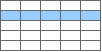</td>
      <td><code class="df">DataFrame</code></td>
    </tr>
    <tr>
      <td rowspan="3">複数行の抽出</td>
      <td>
        <code>df.loc["Y2":"Y4"]</code><br />
        <code>df.iloc[1:4]</code><br />
        <code>df["Y2":"Y4"]</code><br />
        <code>df[1:4]</code>
      </td>
      <td></td>
      <td><code class="df">DataFrame</code></td>
    </tr>
    <tr>
      <td><code>df.head(2)</code></td>
      <td>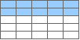</td>
      <td><code class="df">DataFrame</code></td>
    </tr>
    <tr>
      <td><code>df.tail(2)</code></td>
      <td>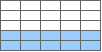</td>
      <td><code class="df">DataFrame</code></td>
    </tr>
    <tr>
      <td rowspan="2">1 列の抽出</td>
      <td>
        <code>df.loc[:, "X2"]</code><br />
        <code>df.iloc[:, 1]</code><br />
        <code>df["X2"]</code>
      </td>
      <td>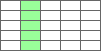</td>
      <td><code class="series">Series</code></td>
    </tr>
    <tr>
      <td>
        <code>df.loc[:, ["X2"]]</code><br />
        <code>df.iloc[:, [1]]</code><br />
        <code>df[["X2"]]</code>
      </td>
      <td>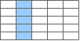</td>
      <td><code class="df">DataFrame</code></td>
    </tr>
    <tr>
      <td rowspan="1">複数列の抽出</td>
      <td>
        <code>df.loc[:, ["X2", "X4", "X5"]]</code><br />
        <code>df.iloc[:, [1, 3, 4]]</code><br />
        <code>df[["X2", "X4", "X5"]]</code>
      </td>
      <td>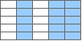</td>
      <td><code class="df">DataFrame</code></td>
    </tr>
    <tr>
      <td rowspan="4">組み合わせ</td>
      <td>
        <code>df.loc["Y3":"Y5", "X2"]</code><br />
        <code>df.iloc[2:5, 1]</code>
      </td>
      <td>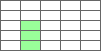</td>
      <td><code class="series">Series</code></td>
    </tr>
    <tr>
      <td>
        <code>df.loc["Y3":"Y5", ["X2"]]</code><br />
        <code>df.iloc[2:5, [1]]</code>
      </td>
      <td>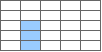</td>
      <td><code class="df">DataFrame</code></td>
    </tr>
    <tr>
      <td>
        <code>df.loc["Y3":"Y5", "X2":"X4"]</code><br />
        <code>df.iloc[2:5, 1:4]</code>
      </td>
      <td>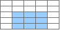</td>
      <td><code class="df">DataFrame</code></td>
    </tr>
    <tr>
      <td>
        <code>df.loc["Y3":"Y5", ["X2", "X4"]]</code><br />
        <code>df.iloc[2:5, [1, 3]]</code>
      </td>
      <td>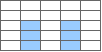</td>
      <td><code class="df">DataFrame</code></td>
    </tr>
  </tbody>
</table>

- 参考: [pandas.DataFrame から部分データを抽出する](/p/8j4k3iy/)


値の条件指定による絞り込み
----

```python
# 指定した列の値が条件に一致する行を抽出
df[df["列名"] >= 10]
df[df["列名"] == 10]
df[df["列名"] == "AAA"]

# 指定した列の値が "AAA" または "BBB" である行を抽出
df[df["列名"].isin(["AAA", "BBB"])]

# 指定した列の値にある部分文字列を含む／含まない行を抽出
df[df["列名"].str.contains("部分文字列")]   # 部分文字列を含む
df[~df["列名"].str.contains("部分文字列")]  # 部分文字列を含まない

# 指定した列に値が存在する行だけを抽出する
df[df["列名"].notna()]

# 条件の組み合わせ
df[(df["列名"] >= 0) & (df["列名"] < 10)]  # AND 条件
df[(df["列名"] == "AAA") | (df["列名"] == "BBB")]  # OR 条件

# 指定した列の値で条件フィルタしつつ、特定の列だけ抽出する
df.loc[df["列名"] > 0, ["列1", "列2", "列3"]]
```


（おまけ）テストデータ
----

上記の処理を試すための 5 行 5 列のテストデータです。

```python
import numpy as np
import pandas as pd

data = np.arange(1, 26).reshape((5, 5))  # 5x5 の連番データを作成
columns = ["X%d" % i for i in range(1, 6)]  # カラム名
index = ["Y%d" % i for i in range(1, 6)]  # インデックス名
df = pd.DataFrame(data, columns=columns, index=index)
```

Python の対話シェルに上記をコピペして DataFrame を作成すれば、`df["X1"]` などの結果を調べることができます。

```python
>>> df
    X1  X2  X3  X4  X5
Y1   1   2   3   4   5
Y2   6   7   8   9  10
Y3  11  12  13  14  15
Y4  16  17  18  19  20
Y5  21  22  23  24  25

>>> df.loc["Y1":"Y3", "X3":"X5"]
    X3  X4  X5
Y1   3   4   5
Y2   8   9  10
Y3  13  14  15
```

