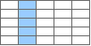

Pandas の DataFrame から部分データを抽出する方法のまとめです。
インデックス名（行名）は `"Y1", "Y2", "Y3"`、カラム名（列名）は `"X1", "X2", "X3"` のように表現しています。

<table>
  <thead>
    <tr>
      <th>カテゴリ</th>
      <th>コード</th>
      <th>抽出のイメージ</th>
      <th>戻り値の型</th>
    </tr>
  </thead>
  <tbody>
    <tr>
      <td>行の抽出（1 行）</td>
      <td><code>df.iloc[1]</code> <code>df.loc["Y2"]</code></td>
      <td></td>
      <td><code class="series">Series</code></td>
    </tr>
    <tr>
      <td rowspan="3">行の抽出（複数行）</td>
      <td><code>df.head(2)</code></td>
      <td></td>
      <td><code class="df">DataFrame</code></td>
    </tr>
    <tr>
      <td><code>df.tail(2)</code></td>
      <td></td>
      <td><code class="df">DataFrame</code></td>
    </tr>
    <tr>
      <td><code>df[1:4]</code> <code>df["Y2":"Y4"]</code></td>
      <td></td>
      <td><code class="df">DataFrame</code></td>
    </tr>
    <tr>
      <td rowspan="2">列の抽出（1 列）</td>
      <td>
        <code>df["X2"]</code> 
        <code>df.loc[:, "X2"]</code>
      </td>
      <td></td>
      <td><code class="series">Series</code></td>
    </tr>
    <tr>
      <td><code>df[("X2")]</code></td>
      <td></td>
      <td><code class="df">DataFrame</code></td>
    </tr>
    <tr>
      <td rowspan="1">列の抽出（複数列）</td>
      <td><code>df[("X2", "X4", "X5")]</code></td>
      <td></td>
      <td><code class="df">DataFrame</code></td>
    </tr>
    <tr>
      <td rowspan="1">スカラー値</td>
      <td><code>df["Y3", "X3"]</code></td>
      <td></td>
      <td><code class="scalar">numpy.float64</code> など</td>
    </tr>
  </tbody>
</table>

- 参考: [pandas.DataFrame から部分データを抽出する](/p/8j4k3iy/)

