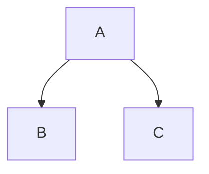
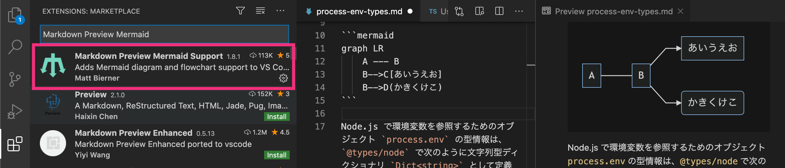

mermaid.js とは
----

[mermaid.js](https://mermaid-js.github.io/mermaid/) を使うと、独自構文のテキストから UML 図などを生成することができます。
JavaScript で動的に SVG を生成することができるので、Markdown ファイルに図を埋め込みたい場合によく使われています。

[Azure DevOps Wiki](https://www.azuredevops.tips/wikimermaid-diagrams/) や [Gitlab](https://docs.gitlab.com/ee/user/markdown.html#mermaid) などでも標準サポートされており、Markdown で図を扱うときのデファクトスタンダードになるかもしれません。
UML 図の表現力という点では PlantUML の方が上ですが、そのあたりは改善されていくと思います。

Hugo は現時点 (v0.76.4) では、mermaid.js を標準サポートしていないので、ここでは Hugo に mermaid.js を組み込む方法を説明します。


mermaid.js の仕組み
----

mermaid.js は、次のような `mermaid` クラスが付けられた HTML 要素の内容を読み取り、そこに図 (SVG) を挿入します。
この例の場合は、`div` 要素の内容が SVG に置き換わります。

```html
<div class="mermaid">
graph LR
    A --- B
    B-->C[あいうえお]
    B-->D(かきくけこ)
</div>
```

HTML の `body` 要素の末尾あたりで、次のように mermaid.js の読み込みと初期化を行います。

```html
  ...
  <script src="https://cdn.jsdelivr.net/npm/mermaid/dist/mermaid.min.js"></script>
  <script>mermaid.initialize({startOnLoad: true});</script>
</body>
</html>
```

これだけで、Web ブラウザでページを開いたときに、SVG に変換された図が表示されます。

#### 表示例

{: .center }

`mermaid.initialize()` 関数には、表示方法をカスタマイズするためのオプション情報を渡すことができます。
`startOnLoad: true` と指定すると、HTML コンテンツが読み込み終わった時点で mermaid.js による変換が自動で開始されます。
逆に、`startOnLoad: false` としておくと、変換処理は自動で始まらなくなるので、任意のタイミングで `mermaid.init()` を呼び出すことで変換を開始します。

- 参考: [API-Usage · mermaid](https://mermaid-js.github.io/mermaid/getting-started/usage.html)

これらをふまえて、Hugo にどのように mermaid.js を組み込んでいくかを考えてみます。


Hugo に mermaid.js を組み込む
----

### 方法1: コードブロックをそのまま使用する方法

Markdown ファイル内に、次のようなコードブロックを記述しておくと、クラス名 __`.language-mermaid`__ の付いた `<code>` 要素が出力されます。
これは、Hugo 標準の機能です。

#### Markdown

````markdown

````

mermaid.js はデフォルトで `mermaid` クラスの付いた要素を変換対象としますが、任意の CSS セレクタを指定することができます。
Hugo のベーステンプレートなどに次のようなコードを入れておけば、上記のコードブロックが図に変換されます。

#### layouts/_default/baseof.html（抜粋）

```html
  ...
  <script src="https://cdn.jsdelivr.net/npm/mermaid/dist/mermaid.min.js"></script>
  <script>
    mermaid.initialize({startOnLoad: false});
    mermaid.init(undefined, '.language-mermaid');
  </script>
</body>
</html>
```

これはとてもお手軽な方法ですが、図が含まれていないページでも `mermaid.min.js` の読み込みが発生してしまうという欠点があります。
それを許容できるのであれば、おそらく一番簡単な方法です。

### 方法2: 独自のショートコード + テンプレートを使う方法

下記は、`mermaid` ショートコードの実装例です。

#### layouts/shortcodes/mermaid.html

```html
<div class="mermaid">
{{ "{{" }} .Inner }}
</div>
```

このショートコードは、Markdown ファイル内で次のように使用します。

```
{{ "{{" }}< mermaid >}}
sequenceDiagram
    Client->>Cache: search cache
    Cache-->>Client: cache
    Client->>Repo: fetch data
    Repo-->>Client: data
{{ "{{" }}< /mermaid >}}
```

あとは、ベーステンプレートなどで mermaid.js を読み込めばいいのですが、ここで Hugo の __`Page.HasShortcode`__ という関数を利用すると、「`mermaid` ショートコードを使っているページでのみ mermaid.js をロードする」という振る舞いを実現できます。

#### layouts/_default/baseof.html（抜粋）

```html
  ...
  {{ "{{" }}- if .HasShortcode "mermaid" }}
    <script src="https://cdn.jsdelivr.net/npm/mermaid/dist/mermaid.min.js"></script>
    <script>mermaid.initialize({startOnLoad: true});</script>
  {{ "{{" }}- end }}
</body>
</html>
```

- 参考: [あるショートコードが使われている場合のみ JavaScript を読み込む (.HasShortcode)](../shortcode/has-shortcode.html)

### 方法3: ショートコードのみを使う方法

下記の `mermaid` ショートコードを使用すると、その場に mermaid.js を動的に読み込むコードが出力されます。
つまり、mermaid.js の導入を、ショートコードのみで完結させてしまう方法です。

#### layouts/shortcodes/mermaid.html

```html
<div class="mermaid">
{{ "{{" }} .Inner }}
</div>

<script>
(function() {
  // JSファイルの多重ロードを防止
  if (window.isMermaidLoaded) return;
  window.isMermaidLoaded = true;

  // JSファイルの動的読み込み
  const script = document.createElement('script');
  script.src = 'https://cdn.jsdelivr.net/npm/mermaid/dist/mermaid.min.js';
  script.onload = () => { mermaid.initialize({startOnLoad: true}); };
  document.body.appendChild(script);
})();
</script>
```

ベーステンプレートなどを一切変更せずに mermaid.js を使えるようになるので、とてもお手軽な方法です。
ショートコード化しているので、独自パラメータを導入するのも簡単です。
若干気になるのは、`mermaid` ショートコードを呼び出すたびに重複する JS コードが出力されてしまうところですが、このくらいの長さであれば、ほとんど問題になることはないと思います。


（おまけ）mermaid ショートコードのカスタマイズ
----

`mermaid` ショートコードを使うときに、次のように図の「タイトル」を入れられると便利です。

```
{{ "{{" }}< mermaid title="ほげほげ" >}}
graph LR
    A --- B
    B-->C[あいうえお]
    B-->D(かきくけこ)
{{ "{{" }}< /mermaid >}}
```

#### 表示例

{: .center }

<center>図: ほげほげ</center>

次の `mermaid` ショートコードは、`title` パラメータで図のタイトルを表示できるようにしています（今まで通り `title` を省略することも可能です）。
ついでに、全体を中央寄せで表示するようにしています。
ここでは、`style` 属性を直接指定していますが、.css ファイル内で `.mermaid` クラスに対してスタイル指定することもできます（mermaid による変換後も `<div class="mermaid">` というタグは残るため）。

#### layouts/shortcodes/mermaid.html

```html
<figure style="text-align: center;">
<div class="mermaid">{{ "{{" }} .Inner }}</div>
{{ "{{" }}- with .Get "title" }}<figcaption>図: {{ "{{" }} . }}</figcaption>{{ "{{" }} end }}
</figure>
```


（おまけ）Visual Studio Code で mermaid をプレビュー
----

VS Code は Markdown エディタとしてとても優秀ですが、さらに mermaid.js 用のプラグインを入れると、プレビューウィンドウで mermaid.js による図の変換をリアルタイムに確認できるようになります。

mermaid.js 用のプラグインは多数提供されていますが、下記は [Markdown Preview Mermaid Support](https://marketplace.visualstudio.com/items?itemName=bierner.markdown-mermaid) プラグインを入れたときの表示例です。



現状は、```` ```mermaid```` のようなフェンスコードで囲まれたものがプレビューの対象になるようですが、将来的に Hugo のショートコードにも対応してくれることを期待しています。

