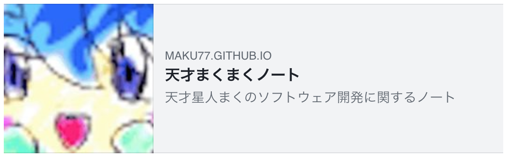

{: .center }

Open Graph のメタ情報として、どのような HTML タグを記述すればよいかは、下記のサイトを参考にしてください。

- 参考: [Facebook や Twitter でシェアするときに画像や説明文が表示されるようにする (OGP: Open Graph Protocol)](https://maku.blog/p/awakw8i/)


Open Graph タグを出力するためのパーシャルテンプレート
----

ここでは、Hugo のパーシャルテンプレートで Open Graph タグを出力するようにしてみます。

#### layouts/partials/head/ogp.html

```
<meta property="og:site_name" content="{{ "{{" }} .Site.Title }}" />
<meta property="og:title" content="{{ "{{" }} .Title }}" />
<meta property="og:type" content="website" />
<meta property="og:url" content="{{ "{{" }} .Permalink }}" />
<meta property="og:locale" content="ja_JP" />

{{ "{{" }}- if .Params.image }}
  {{ "{{" }}- $imageRes := .Resources.GetMatch .Params.image -}}
  <meta property="og:image" content="{{ "{{" }} $imageRes.Permalink }}" />
{{ "{{" }}- else if .Site.Params.image }}
  <meta property="og:image" content="{{ "{{" }} .Site.Params.image | absURL }}" />
{{ "{{" }}- end }}

{{ "{{" }}- if .Description }}
  <meta property="og:description" content="{{ "{{" }} .Description }}" />
{{ "{{" }}- else if .Summary }}
  <meta property="og:description" content="{{ "{{" }} .Summary }}" />
{{ "{{" }}- else if .Site.Params.description }}
  <meta property="og:description" content="{{ "{{" }} .Site.Params.description }}" />
{{ "{{" }}- end }}

{{ "{{" }}- with .Site.Params.facebookAppId }}
  <meta property="fb:app_id" content="{{ "{{" }} . }}" />
{{ "{{" }}- end }}
```

画像 (`og:image`) や説明文 (`og:description`) などの内容は、いくつかフォールバックの仕組みを入れて、次のように出力するようにしています。

### og:image

ページバンドルとして画像ファイルを含んでいる場合、フロントマターの `image` プロパティでそのファイル名を指定することで、Open Graph の画像として表示できるようにしています。

#### フロントマターの記述例

```
---
title: "ページタイトル"
date: "2020-03-15"
image: "sample.png"
---
```

その指定がない場合は、サイトの設定ファイル (`config.toml`) の独自プロパティ `params.image` で指定した画像を使用します。

#### config.toml の記述例（抜粋）

```toml
[params]
  image = "assets/img/site-logo-large.png"
```

### og:description

ページの説明文を表す `og:description` には、下記のような優先度で見つかったものを設定します。

1. フロントマターの `description` プロパティに記述されたテキスト
2. ページ本文があれば、`.Page.Summary` で求められる要約テキスト（本文の先頭部分）
3. サイトの設定ファイル `config.toml` の独自プロパティ `params.description` に記述されたテキスト

### fb:app_id

Facebook の公式ドキュメントによると、Facebook のアプリ ID も指定しておく必要があるとされています。
Facebook のアプリ ID は、サイトの設定ファイル `config.toml` の独自プロパティ `params.facebookAppId` で指定できるようにしています。

```toml
[params]
  facebookAppId = "1234567890123456"
```


head 要素に Open Graph メタ情報を埋め込む
----

上記のように作成したパーシャルテンプレートは、各ページの `head` 要素内に出力されるようにします。
ここでは、全てのページに適用するために、[ベーステンプレート](../template/base-template.html) 内から読み込むようにしてみます。

#### layouts/_default/baseof.html の抜粋

```
<!DOCTYPE html>
<html lang="{{ "{{" }} .Site.LanguageCode }}">
<head prefix="og: http://ogp.me/ns# fb: http://ogp.me/ns/fb#">
<head>
  <meta charset="UTF-8">
  {{ "{{" }} partial "head/ogp" . }}
  ...
```

これで、Facebook や Twitter といった SNS アプリでサイトの URL が共有されたときに、アイキャッチ画像や説明文が表示されるようになります。

