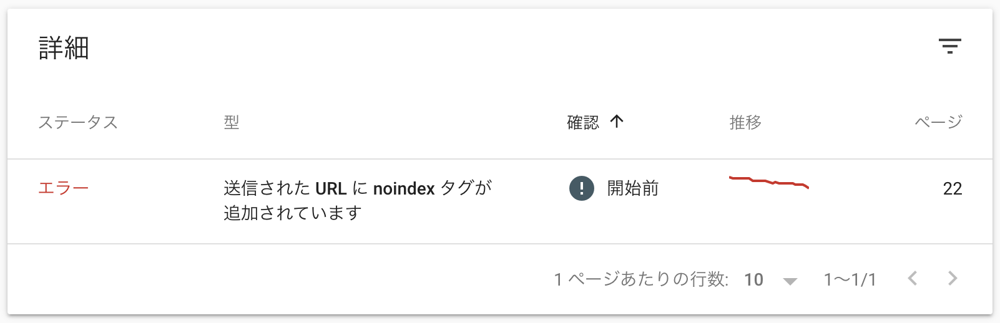

sitemap.xml と robots.txt の概要
----

Web サイトのルートに `sitemap.xml` や `robots.txt` を置くと、下記のようなヒント情報を Google などの検索エンジンに伝えることができます。

- __`sitemap.xml`__ ... サイト内のページ一覧情報を記述します。検索エンジンは、サイト全体をクロールしなくても、この情報でページのインデックス情報を作成できるようになります。ページごとに更新日時 (YYYY-MM-DD) や優先度 (0.0〜1.0) を指定できます。
- __`robots.txt`__ ... クロールしなくてもよいディレクトリやファイルを指定します。上記の `sitemap.xml` の URL を指定することもできます。

もちろん、これらのファイルを用意したところで、どこまで反映されるかは検索エンジン側の実装によりますが、SEO 対策として少しでもヒントとなる情報を与えておくのが望ましいでしょう。


sitemap.xml を作成する
----

`sitemap.xml` ファイルには、Google などの検索エンジンにインデックス登録してもらいたいページの一覧を記述します。

### sitemap.xml のデフォルト出力

Hugo はデフォルトで Web サイトのルートに、[Sitemap protocol](https://www.sitemaps.org/protocol.html) に基づいた `sitemap.xml` ファイルを出力するようになっています。
下記はデフォルト設定で出力される `sitemap.xml` の例です。

```xml
<urlset xmlns="http://www.sitemaps.org/schemas/sitemap/0.9" xmlns:xhtml="http://www.w3.org/1999/xhtml">
  <url>
    <loc>https://example.com/page1/</loc>
    <lastmod>2020-04-26T00:00:00+00:00</lastmod>
  </url>
  <url>
    <loc>https://example.com/page2/</loc>
    <lastmod>2020-04-25T00:00:00+00:00</lastmod>
  </url>
</urlset>
```

この出力は、Hugo にデフォルトで組み込まれている `sitemap.xml` テンプレートによって生成されています。
デフォルトのテンプレート定義は下記を見ると分かります。

- [Hugo’s sitemap.xml](https://gohugo.io/templates/sitemap-template/#hugos-sitemapxml)
- [gohugoio/hugo/tpl/tplimpl/embedded/templates/_default/sitemap.xml (GitHub)](https://github.com/gohugoio/hugo/blob/master/tpl/tplimpl/embedded/templates/_default/sitemap.xml)

このままで問題なければ、特に何も設定する必要はありませんが、出力内容をカスタマイズしたいときは、次のように `sitemap.xml` 用のテンプレートファイルを生成する必要があります。
Hugo はデフォルトですべてのページを `sitemap.xml` にリスト化しようとするので、Google などの検索結果に載せたくないページがある場合は、`sitemap.xml` のカスタマイズが必要です。


### sitemap.xml のカスタマイズ

下記のいずれかのテンプレートファイルを作成することで、Web サイトのルートディレクトリに出力される `sitemap.xml` の内容をカスタマイズできます。

- `layouts/sitemap.xml`
- `layouts/_default/sitemap.xml`

ここでは、下記のようにカスタマイズしてみます。

- タクソノミーリスト（あるタグのページ一覧）のページを出力しない（`/tags/*` や `/categories/*` などをリストに載せない）
- 特定の URL 以下のページを出力しない (URL が `/search/` で始まるページをリストに載せない）
- Markdown ファイルのフロントマターで `noindex: true` と記述されていたら出力しない
- セクションページの優先度を上げる（デフォルトで `priority=0.5` のところを `priority=1.0` とする。ただしフロントマターでの指定があればそちらを優先）

#### layouts/sitemap.xml

```
<urlset xmlns="http://www.sitemaps.org/schemas/sitemap/0.9" xmlns:xhtml="http://www.w3.org/1999/xhtml">
  {{ "{{" }}- range .Data.Pages }}
  {{ "{{" }}- if ne .Kind "term" }}
  {{ "{{" }}- if not (hasPrefix .RelPermalink "/search/") }}
  {{ "{{" }}- if ne .Params.noindex true }}
  <url>
    <loc>{{ "{{" }} .Permalink }}</loc>
    {{ "{{" }}- if not .Lastmod.IsZero }}
    <lastmod>{{ "{{" }} .Lastmod.Format "2006-01-02" }}</lastmod>
    {{ "{{" }}- end }}
    {{ "{{" }}- with .Sitemap.ChangeFreq }}
    <changefreq>{{ "{{" }} . }}</changefreq>
    {{ "{{" }}- end }}
    {{ "{{" }}- if ge .Sitemap.Priority 0.0 }}
    <priority>{{ "{{" }} .Sitemap.Priority }}</priority>
    {{ "{{" }}- else if eq .Kind "section" }}
    <priority>1.0</priority>
    {{ "{{" }}- end }}
  </url>
  {{ "{{" }}- end }}
  {{ "{{" }}- end }}
  {{ "{{" }}- end }}
  {{ "{{" }}- end }}
</urlset>
```

ここでは、ページ変数の `.Kind` の値を見ることで、セクションやタクソノミーリスト (`/tags/*`) のページであるかどうかを判断しています。
このあたりのページ変数がどのような値を取るかに関しては、下記の記事を参考にしてください。

- 参考: [各種ページにおいて .Kind や .IsPage、.IsNode の値がどうなるかの一覧 ｜ まくまく Hugo/Go ノート](../template/page-types.html)

### ページごとにサイトマップ出力用のパラメータを設定する

各ページの Markdown ファイルのフロントマターで、次のように `sitemap.xml` に出力する `<changefreq>` や `<priority>` 要素の値を制御することができます。
これらの値は、前述のテンプレート内で `.Sitemap.ChangeFreq`、`.Sitemap.Priority` といった変数で参照してします。

```
---
title: "ページタイトル"
date: "2020-04-26"
sitemap:
  changefreq: monthly
  priority: 0.8
---
```

### sitemap.xml のファイルパスを変更する

`sitemap.xml` はデフォルトで Web サイトのルートに出力されますが、Hugo の設定ファイルで出力パスを変更することができます。

#### config.toml

```toml
[sitemap]
  filename = "assets/my-sitemap.xml"
```

### （コラム）Google Search Console の sitemap.xml に関するエラー

`sitemap.xml` にリストアップされているにも関わらず、HTML ファイルの `<meta name="robots" content="noindex">` でインデックス登録を抑制しているようなページがあると、[Google Search Console](https://search.google.com/search-console?hl=ja) にエラーが表示されることがあります。

#### 図: 送信された URL に noindex タグが追加されています

{: .center }

これは、「`sitemap.xml` でインデックス登録しろと指定されているけど、実際にページの内容を見ると `noindex` 指定されてるのでインデックス登録しないよ。それでいいの？」という意味の警告です。
インデックス登録されたくないページは、`sitemap.xml` にもリストアップされないように設定しましょう。


robots.txt を作成する
----

Web サイトのルートに __`robots.txt`__ を配置しておくと、検索エンジンに対して、そのサイト内でクロールされたくないディレクトリやファイルを知らせることができます。
また、上記で作成した `sitemap.xml` の URL を知らせることもできます。

- 参考: [robotstxt.org](https://www.robotstxt.org/)

### robots.txt を出力するための設定

静的なファイルとして `robots.txt` を作成するのであれば、単純に Hugo プロジェクト内に `/static/robots.txt` というファイルを配置しておけば OK です（`robots.txt` が出力ディレクトリのルートにコピーされます）。
テンプレート機能を使って、動的に `robots.txt` を生成したいのであれば、設定ファイルで下記のように指定しておく必要があります。

#### config.toml

```toml
enableRobotsTXT = true
```

この設定により、下記のテンプレートファイルを使って `robots.txt` を生成してくれるようになります。

- `/layouts/robots.txt`
- `/themes/<THEME>/layouts/robots.txt`

下記のようなテンプレートを作成すると、すべての種類のクローラーに対して `sitemap.xml` の URL を知らせるための `robots.txt` を生成できます。

#### /layouts/robots.txt

```
User-agent: *
Sitemap: {{ "{{" }} .Site.BaseURL }}sitemap.xml
```

`sitemap.xml` のパスは、FQDN（完全修飾 URL）で指定しなければいけないので、上記のようにテンプレート内で `.Site.BaseURL` 変数を使って完全な URL を構築しています。


### robots.txt の Disallow ディレクティブはあまり使わない

よくある `robots.txt` の例として、`Disallow` ディレクティブを使ったクロールの防止方法が示されていたりしますが、実際に `Disallow` ディレクティブが必要になるケースはそれほど多くありません（それよりは後述の `meta` 要素を使う方が目的と合っていることが多い）。
特に、JavaScript や CSS、画像ファイルなどは、検索エンジンがページ内容を正しく処理するために必要なので、`Disallow` 指定してクロール対象から外してはいけません。


meta 要素での noindex 設定
----

特定のページを Google の検索結果に表示されないようにするには、HTML の `head` 要素内に下記のような `meta` 要素を記述するのが正解みたいです。

```html
<meta name="robots" content="noindex" />
```

`robots.txt` に下記のように指定すれば、`/search/` 以下をクロールしないように知らせることにはなるのですが、すでにインデックスされてしまったページは検索結果に表示され続けることになってしまいます。

```
User-agent: *
Disallow: /search/
```

また、クロールを防いだとしても、他のページからリンクされている場合はインデックスされてしまう可能性があります。

よって、検索エンジンに特定のページがインデックスされることを防ぐには、

1. `meta` 要素で `noindex` を指定する
2. `robots.txt` の `Disallow` は指定しない

とするのがよいようです。

参考: [noindex を使用して検索インデックス登録をブロックする - Search Console ヘルプ](https://support.google.com/webmasters/answer/93710)

> 重要: noindex ディレクティブが有効に機能するようにするために、robots.txt ファイルでページをブロックしないでください。ページが robots.txt ファイルでブロックされると、クローラは noindex ディレクティブを認識しません。そのため、たとえば他のページからリンクされていると、ページは検索結果に引き続き表示される可能性があります。

